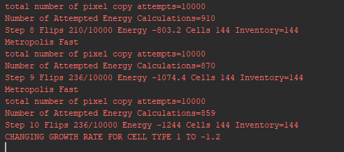
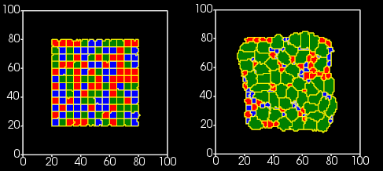

Adding Python Bindings To Steppable in DeveloperZone
======================================================

In the previous example we controled entire simulation from C++. This is perfectly fine and will give you optimal
performance. However sometimes it may make sense to add Python bindings to your module . Especially if the
functions you wil call from python will not be called many times - functions calls in Python are much slower than in C++.

In addition to this if your entire code is in C++ every change you make to the code will require compilation and
installation. This is is not a big deal but takes time and is more error prone than using well designed scripting
interface. However, do not feel that you need to use Python bindings for your newly created C++ modules. They are
optional and it is perfectly fine to operate in C++ space.

Nevertheless we would like to show you how to add and use Python bindings if you feel it will be beneficial
for your simulation.

If you remember, the first step to generate steppable code using Twedit++ is to choose whether you like to add Python
bindings or not.

|dev_zone_1|

In this first dialog box we checked ``Python Wrap`` option and therefore we already generated Python bindings. They are
stored in SWIG file in ``DeveloperZone/pyinterface/CompuCellExtraModules/CompuCellExtraModules.i``:

.. code-block:: c++

    %module ("threads"=1) CompuCellExtraModules
    %include "typemaps.i"
    %include <windows.i>

    %{
    #include "ParseData.h"
    #include "ParserStorage.h"
    #include <CompuCell3D/Simulator.h>
    #include <CompuCell3D/Potts3D/Potts3D.h>

    #include <BasicUtils/BasicClassAccessor.h>
    #include <BasicUtils/BasicClassGroup.h> //had to include it to avoid problems with template instantiation

    // ********************************************* PUT YOUR PLUGIN PARSE DATA AND PLUGIN FILES HERE *************************************************

    #include <SimpleVolume/SimpleVolumePlugin.h>

    #include <VolumeMean/VolumeMean.h>

    //AutogeneratedModules1 - DO NOT REMOVE THIS LINE IT IS USED BY TWEDIT TO LOCATE CODE INSERTION POINT
    //GrowthSteppable_autogenerated

    #include <GrowthSteppable/GrowthSteppable.h>

    // ********************************************* END OF SECTION ********************************** ************************************************

    //have to include all  export definitions for modules which are arapped to avoid problems with interpreting by swig win32 specific c++ extensions...
    #define SIMPLEVOLUME_EXPORT
    #define VOLUMEMEAN_EXPORT
    //AutogeneratedModules2 - DO NOT REMOVE THIS LINE IT IS USED BY TWEDIT TO LOCATE CODE INSERTION POINT
    //GrowthSteppable_autogenerated
    #define GROWTHSTEPPABLE_EXPORT

    #include <iostream>

    using namespace std;
    using namespace CompuCell3D;

    %}

    // C++ std::string handling
    %include "std_string.i"

    // C++ std::map handling
    %include "std_map.i"

    // C++ std::map handling
    %include "std_set.i"

    // C++ std::vector handling
    %include "std_vector.i"

    //have to include all  export definitions for modules which are arapped to avoid problems with interpreting by swig win32 specific c++ extensions...
    #define SIMPLEVOLUME_EXPORT
    #define VOLUMEMEAN_EXPORT

    //AutogeneratedModules3 - DO NOT REMOVE THIS LINE IT IS USED BY TWEDIT TO LOCATE CODE INSERTION POINT
    //GrowthSteppable_autogenerated
    #define GROWTHSTEPPABLE_EXPORT

    %include <BasicUtils/BasicClassAccessor.h>
    %include <BasicUtils/BasicClassGroup.h> //had to include it to avoid problems with template instantiation

    %include "ParseData.h"
    %include "ParserStorage.h"

    // ********************************************* PUT YOUR PLUGIN PARSE DATA AND PLUGIN FILES HERE *************************************************
    // REMEMBER TO CHANGE #include to %include

    %include <SimpleVolume/SimpleVolumePlugin.h>
    // %include <SimpleVolume/SimpleVolumeParseData.h>

    // THIS IS VERY IMORTANT STETEMENT WITHOUT IT SWIG will produce incorrect wrapper code which will compile but will not work
    using namespace CompuCell3D;

    %inline %{
       SimpleVolumePlugin * reinterpretSimpleVolumePlugin(Plugin * _plugin){
          return (SimpleVolumePlugin *)_plugin;
       }

       SimpleVolumePlugin * getSimpleVolumePlugin(){
             return (SimpleVolumePlugin *)Simulator::pluginManager.get("SimpleVolume");
        }

    %}

    %include <VolumeMean/VolumeMean.h>

    %inline %{
       VolumeMean * reinterpretVolumeMean(Steppable * _steppable){
          return (VolumeMean *)_steppable;
       }

       VolumeMean * getVolumeMeanSteppable(){
             return (VolumeMean *)Simulator::steppableManager.get("VolumeMean");
        }

    %}

    //AutogeneratedModules4 - DO NOT REMOVE THIS LINE IT IS USED BY TWEDIT TO LOCATE CODE INSERTION POINT
    //GrowthSteppable_autogenerated

    %include <GrowthSteppable/GrowthSteppable.h>
    %inline %{

     GrowthSteppable * getGrowthSteppable(){

          return (GrowthSteppable *)Simulator::steppableManager.get("GrowthSteppable");
       }

    %}

We are not going to explain how SWIG wrappers work here but if you look at the file and look for occurrences of
``GrowthSteppable`` you can see that adding your own steppable to the SWIG wrapper generator is fairly easy. On top
of that if you use Twedit++ it will generate wrapper code for you.

.. note::

    At the top of the wrapper file we find ``%module ("threads"=1) CompuCellExtraModules`` . This tells us that the Python module we develop will be called ``CompuCellExtraModules``.

Adding Python-Accessible Method To GrowthSteppable
--------------------------------------------------

If we enable compilation of ``CompuCellExtraModules`` by uncommenting line ``add_subdirectory(pyinterface)`` in
``DeveloperZone/CMakeLists.txt`` we will already get GrowthSteppable bindings that we can access from
``CompuCellExtraModules``. However, they are not particularly useful because all the functions accessible via
Python are for functions that are already being used by the C++ code and, frankly it is best to leave it like that. We
need to add additional function. A reasonable choice is a function that changes growth rate for a given cell type.

First we need to add ``void setGrowthRate(unsigned int cellType, double growthRate); `` function
to ``GrowthSteppable`` header - see below:

.. code-block:: c++

    #ifndef GROWTHSTEPPABLESTEPPABLE_H
    #define GROWTHSTEPPABLESTEPPABLE_H
    #include <CompuCell3D/CC3D.h>
    #include "GrowthSteppableDLLSpecifier.h"

    namespace CompuCell3D {

        template <class T> class Field3D;
        template <class T> class WatchableField3D;

        class Potts3D;
        class Automaton;
        class BoundaryStrategy;
        class CellInventory;
        class CellG;

      class GROWTHSTEPPABLE_EXPORT GrowthSteppable : public Steppable {

        WatchableField3D<CellG *> *cellFieldG;

        Simulator * sim;

        Potts3D *potts;

        CC3DXMLElement *xmlData;

        Automaton *automaton;

        BoundaryStrategy *boundaryStrategy;

        CellInventory * cellInventoryPtr;

        Dim3D fieldDim;

      public:

        GrowthSteppable ();

        virtual ~GrowthSteppable ();

        std::map<unsigned int, double> growthRateMap;

        // SimObject interface

        virtual void init(Simulator *simulator, CC3DXMLElement *_xmlData=0);

        virtual void extraInit(Simulator *simulator);

        // Python wrapper functions

        void setGrowthRate(unsigned int cellType, double growthRate);

        //steppable interface

        virtual void start();

        virtual void step(const unsigned int currentStep);

        virtual void finish() {}

        //SteerableObject interface

        virtual void update(CC3DXMLElement *_xmlData, bool _fullInitFlag=false);

        virtual std::string steerableName();

        virtual std::string toString();

      };

    };

    #endif

Next, we add implementation of this function in the ``GrowthSteppable.cpp``:

.. code-block:: c++

    void GrowthSteppable::setGrowthRate(unsigned int cellType, double growthRate){

        cerr<<"CHANGING GROWTH RATE FOR CELL TYPE "<<cellType<<" TO "<<growthRate<<endl;
        this->growthRateMap[cellType] = growthRate;
    }

The implementation of this function is pretty straightforward - it is a function that takes two arguments
``(unsigned int cellType`` and ``double growthRate`` and prints out message to the screen that it is about to
change growth rate for a given cell type and then assigns a growth rate to a given entry in the ``this->growthRateMap``.

Why does this function make sense to be implemented in Python? If you think about a simulation where you want to
run many simulations that need to modify growth rate at a particular MCS but you don't know which MCS it will be
you can write a simple code where you could try many time points at this you change growth rate and see if the outcome
matches your expectations. Obviously, you could do it all in c++ but then you would need to pass more parameters to
the XML making XML harder and harder to understand or you could hard-code everything in C++ but then you would need to
recompile DeveloperZone every time you run the simulation. You quickly realize that Python provides convenient platform
for handling situations like this. This is why , it makes perfect sense to add Python bindings to your C++ modules.

At this point we can recompile the DeveloperZone but before we do it it is essential that we "touch"
``DeveloperZone/pyinterface/CompuCellExtraModules/CompuCellExtraModules.i`` by e.g. add or remove empty line in this
file and re-saving it.

.. warning::

    If you add new method to header file and want this method be accessible in Python bindings you must force SWIG to re-generate bindings. One way of doing so is by "refreshing" the file but making adding (or removing) extra empty line and saving it. In the future we will write better CMake code to avoid this manual step but for now you should be aware of this limitation.

After we compiled and installed ``DeveloperZone`` modules we can rerun the simulation. Now, however, we will add Python
code where we show you how to access new C++ steppable from Python.

Here is python Steppable code (``GrowthSteppablePythonModules``):

.. code-block:: python

    from cc3d.core.PySteppables import *
    from cc3d.cpp import CompuCellExtraModules

    class GrowthSteppablePython(SteppableBasePy):

        def __init__(self,frequency=1):

            SteppableBasePy.__init__(self,frequency)
            self.growth_steppable_cpp = None

        def start(self):
            self.growth_steppable_cpp = CompuCellExtraModules.getGrowthSteppable()

        def step(self,mcs):

            if mcs == 10:
                self.growth_steppable_cpp.setGrowthRate(1, -1.2)

At the top of the file we import  ``CompuCellExtraModules``. This is the module that SWIG generated for us
In ``__init__`` constructor we create a variable that will hold a reference to the C++ ``GrowthSteppable``.
In start function we access C++ ``GrowthSteppable`` by typing:

.. code-block:: c++

    self.growth_steppable_cpp = CompuCellExtraModules.getGrowthSteppable()

If you look at the end of the ``DeveloperZone/pyinterface/CompuCellExtraModules/CompuCellExtraModules.i`` you will see
``getGrowthSteppable()`` declared there. In other words ``getGrowthSteppable()`` function will become a function of the
``CompuCellExtraModules`` and therefore we access it as ``CompuCellExtraModules.getGrowthSteppable()``.
Now, we can get creative, because we can access every publicly defined function of the C++ ``GrowthSteppable``. This is
exactly what we do in the ``step`` function. We call our newly added function

.. code-block:: python

    self.growth_steppable_cpp.setGrowthRate(1, -1.2)

This call at MCS=10 changes growth of cells of type `1` into shrinking rate.

When we run the simulation at ``mcs==10`` the text output will look as follows:

|gs_python_output|

You can see there our C++ printout being triggered by calling ``setGrowthRate`` from Python level. And the
simulation configuration at MCS 0 and 30 respectively will looks as follows:

|gs_python_simulation|

Notice that the blue cells almost disappeared. This is the result of the negative growth rate we we set by calling
``self.growth_steppable_cpp.setGrowthRate(1, -1.2)`` .

The C++ code for this example can be found in ``DeveloperZone/GrowthSteppable``, python bindings are in
``DeveloperZone/pyinterface/CompuCellExtraModules/CompuCellExtraModules.i`` and the simulation example is in
``CompuCell3D/DeveloperZone/Demos/GrowthSteppablePython``

.. |dev_zone_1| image:: images/dev_zone_1.png
   :width: 2.4in
   :height: 1.9in

