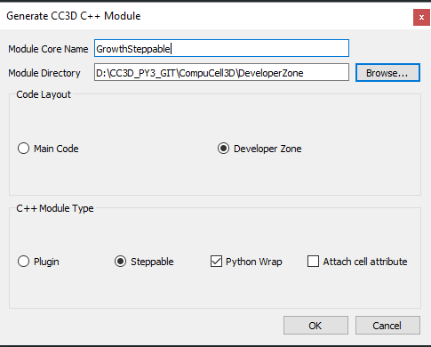
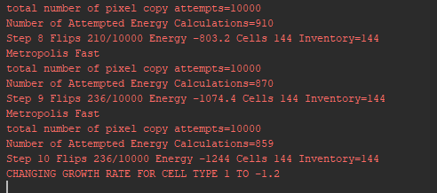
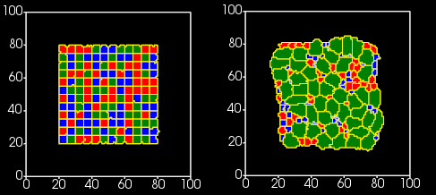

Adding Python Bindings To A DeveloperZone Steppable
====================================================

The previous DeveloperZone example controlled the simulation entirely from C++. That is often the right design when the code is performance-critical or when all parameters can be expressed cleanly in XML. Python bindings are useful when you want a small scripting interface on top of a C++ module.

The tradeoff is straightforward. C++ code is fast, but every C++ change requires recompilation and installation. Python code is easier to adjust during exploratory work, but Python calls are slower and should not be placed in inner loops that execute millions of times. A good pattern is to keep heavy numerical or lattice work in C++ and expose a few coarse-grained C++ methods to Python.

This section shows how to expose a DeveloperZone steppable to Python using the SWIG wrapper generated by Twedit++.

When Twedit++ generates a steppable, the first dialog asks whether the module should be wrapped for Python.

|dev_zone_1|

In this example the ``Python Wrap`` option is checked. Twedit++ therefore adds the module to the SWIG interface file at ``DeveloperZone/pyinterface/CompuCellExtraModules/CompuCellExtraModules.i``:

.. code-block:: c++

    %module ("threads"=1) CompuCellExtraModules
    %include "typemaps.i"
    %include <windows.i>

    %{
    #include "ParseData.h"
    #include "ParserStorage.h"
    #include <CompuCell3D/Simulator.h>
    #include <CompuCell3D/Potts3D/Potts3D.h>

    #include <BasicUtils/BasicClassAccessor.h>
    #include <BasicUtils/BasicClassGroup.h> //had to include it to avoid problems with template instantiation

    // ********************************************* PUT YOUR PLUGIN PARSE DATA AND PLUGIN FILES HERE *************************************************

    #include <SimpleVolume/SimpleVolumePlugin.h>

    #include <VolumeMean/VolumeMean.h>

    //AutogeneratedModules1 - DO NOT REMOVE THIS LINE IT IS USED BY TWEDIT TO LOCATE CODE INSERTION POINT
    //GrowthSteppable_autogenerated

    #include <GrowthSteppable/GrowthSteppable.h>

    // ********************************************* END OF SECTION ********************************** ************************************************

    //have to include all  export definitions for modules which are wrapped to avoid problems with interpreting by swig win32 specific c++ extensions...
    #define SIMPLEVOLUME_EXPORT
    #define VOLUMEMEAN_EXPORT
    //AutogeneratedModules2 - DO NOT REMOVE THIS LINE IT IS USED BY TWEDIT TO LOCATE CODE INSERTION POINT
    //GrowthSteppable_autogenerated
    #define GROWTHSTEPPABLE_EXPORT

    #include <iostream>

    using namespace std;
    using namespace CompuCell3D;

    %}

    // C++ std::string handling
    %include "std_string.i"

    // C++ std::map handling
    %include "std_map.i"

    // C++ std::map handling
    %include "std_set.i"

    // C++ std::vector handling
    %include "std_vector.i"

    //have to include all  export definitions for modules which are wrapped to avoid problems with interpreting by swig win32 specific c++ extensions...
    #define SIMPLEVOLUME_EXPORT
    #define VOLUMEMEAN_EXPORT

    //AutogeneratedModules3 - DO NOT REMOVE THIS LINE IT IS USED BY TWEDIT TO LOCATE CODE INSERTION POINT
    //GrowthSteppable_autogenerated
    #define GROWTHSTEPPABLE_EXPORT

    %include <BasicUtils/BasicClassAccessor.h>
    %include <BasicUtils/BasicClassGroup.h> //had to include it to avoid problems with template instantiation

    %include "ParseData.h"
    %include "ParserStorage.h"

    // ********************************************* PUT YOUR PLUGIN PARSE DATA AND PLUGIN FILES HERE *************************************************
    // REMEMBER TO CHANGE #include to %include

    %include <SimpleVolume/SimpleVolumePlugin.h>
    // %include <SimpleVolume/SimpleVolumeParseData.h>

    // THIS IS VERY IMPORTANT STATEMENT WITHOUT IT SWIG will produce incorrect wrapper code which will compile but will not work
    using namespace CompuCell3D;

    %inline %{
       SimpleVolumePlugin * reinterpretSimpleVolumePlugin(Plugin * _plugin){
          return (SimpleVolumePlugin *)_plugin;
       }

       SimpleVolumePlugin * getSimpleVolumePlugin(){
             return (SimpleVolumePlugin *)Simulator::pluginManager.get("SimpleVolume");
        }

    %}

    %include <VolumeMean/VolumeMean.h>

    %inline %{
       VolumeMean * reinterpretVolumeMean(Steppable * _steppable){
          return (VolumeMean *)_steppable;
       }

       VolumeMean * getVolumeMeanSteppable(){
             return (VolumeMean *)Simulator::steppableManager.get("VolumeMean");
        }

    %}

    //AutogeneratedModules4 - DO NOT REMOVE THIS LINE IT IS USED BY TWEDIT TO LOCATE CODE INSERTION POINT
    //GrowthSteppable_autogenerated

    %include <GrowthSteppable/GrowthSteppable.h>
    %inline %{

     GrowthSteppable * getGrowthSteppable(){

          return (GrowthSteppable *)Simulator::steppableManager.get("GrowthSteppable");
       }

    %}

This page does not cover SWIG internals. For this workflow, the important point is that every occurrence of ``GrowthSteppable`` marks a place where the C++ class is made visible to the wrapper generator. Twedit++ inserts most of this code automatically.

.. note::

    At the top of the wrapper file we find ``%module ("threads"=1) CompuCellExtraModules`` . This tells us that the Python module we develop will be called ``CompuCellExtraModules``.

Adding A Python-Accessible Method To GrowthSteppable
------------------------------------------------------

If ``DeveloperZone/CMakeLists.txt`` builds ``pyinterface`` by including ``add_subdirectory(pyinterface)``, the generated ``CompuCellExtraModules`` Python module can already return a ``GrowthSteppable`` object. The default public methods are mostly lifecycle methods used by CC3D itself, so we will add a small method designed specifically for Python scripting. A useful example is a method that changes the growth rate for a given cell type.

First we need to add ``void setGrowthRate(unsigned int cellType, double growthRate); `` function
to ``GrowthSteppable`` header - see below:

.. code-block:: c++

    #ifndef GROWTHSTEPPABLESTEPPABLE_H
    #define GROWTHSTEPPABLESTEPPABLE_H
    #include <CompuCell3D/CC3D.h>
    #include "GrowthSteppableDLLSpecifier.h"

    namespace CompuCell3D {

        template <class T> class Field3D;
        template <class T> class WatchableField3D;

        class Potts3D;
        class Automaton;
        class BoundaryStrategy;
        class CellInventory;
        class CellG;

      class GROWTHSTEPPABLE_EXPORT GrowthSteppable : public Steppable {

        WatchableField3D<CellG *> *cellFieldG;

        Simulator * sim;

        Potts3D *potts;

        CC3DXMLElement *xmlData;

        Automaton *automaton;

        BoundaryStrategy *boundaryStrategy;

        CellInventory * cellInventoryPtr;

        Dim3D fieldDim;

      public:

        GrowthSteppable ();

        virtual ~GrowthSteppable ();

        std::map<unsigned int, double> growthRateMap;

        // SimObject interface

        virtual void init(Simulator *simulator, CC3DXMLElement *_xmlData=0);

        virtual void extraInit(Simulator *simulator);

        // Python wrapper functions

        void setGrowthRate(unsigned int cellType, double growthRate);

        //steppable interface

        virtual void start();

        virtual void step(const unsigned int currentStep);

        virtual void finish() {}

        //SteerableObject interface

        virtual void update(CC3DXMLElement *_xmlData, bool _fullInitFlag=false);

        virtual std::string steerableName();

        virtual std::string toString();

      };

    };

    #endif

Next, we add implementation of this function in the ``GrowthSteppable.cpp``:

.. code-block:: c++

    void GrowthSteppable::setGrowthRate(unsigned int cellType, double growthRate){

        cerr<<"CHANGING GROWTH RATE FOR CELL TYPE "<<cellType<<" TO "<<growthRate<<endl;
        this->growthRateMap[cellType] = growthRate;
    }

The implementation takes a cell type and a growth rate, prints a diagnostic message, and updates the corresponding entry in ``growthRateMap``.

This is a good Python-facing method because it changes one high-level model parameter without moving expensive lattice work into Python. For example, you may want to test many MCS values at which growth switches sign. Encoding all of those experiments in XML can make the XML hard to read, and hard-coding them in C++ requires repeated recompilation. A Python call gives you a convenient control layer while the steppable still performs its core work in C++.

At this point you can recompile DeveloperZone. Before rebuilding, force SWIG to regenerate the wrapper by touching ``DeveloperZone/pyinterface/CompuCellExtraModules/CompuCellExtraModules.i``. Adding or removing one blank line and saving the file is enough.

.. warning::

    If you add a method to a wrapped C++ header and want that method available from Python, force SWIG to regenerate the bindings. The simple manual method is to refresh the ``.i`` file by adding or removing a blank line and saving it.

After we compiled and installed ``DeveloperZone`` modules we can rerun the simulation. Now, however, we will add Python
code where we show you how to access new C++ steppable from Python.

Here is the Python steppable code (``GrowthSteppablePythonModules``):

.. code-block:: python

    from cc3d.core.PySteppables import *
    from cc3d.cpp import CompuCellExtraModules

    class GrowthSteppablePython(SteppableBasePy):

        def __init__(self,frequency=1):

            SteppableBasePy.__init__(self,frequency)
            self.growth_steppable_cpp = None

        def start(self):
            self.growth_steppable_cpp = CompuCellExtraModules.getGrowthSteppable()

        def step(self,mcs):

            if mcs == 10:
                self.growth_steppable_cpp.setGrowthRate(1, -1.2)

At the top of the file we import ``CompuCellExtraModules``, the module generated by SWIG. In ``__init__`` we create an instance variable that will hold a reference to the C++ ``GrowthSteppable``. In ``start`` we retrieve the C++ steppable:

.. code-block:: c++

    self.growth_steppable_cpp = CompuCellExtraModules.getGrowthSteppable()

If you look at the end of the ``DeveloperZone/pyinterface/CompuCellExtraModules/CompuCellExtraModules.i`` you will see
``getGrowthSteppable()`` declared there. In other words ``getGrowthSteppable()`` function will become a function of the
``CompuCellExtraModules`` and therefore we access it as ``CompuCellExtraModules.getGrowthSteppable()``.
Now, we can get creative, because we can access every publicly defined function of the C++ ``GrowthSteppable``. This is
exactly what we do in the ``step`` function. We call our newly added function

.. code-block:: python

    self.growth_steppable_cpp.setGrowthRate(1, -1.2)

At MCS 10 this call changes the growth rate for type ``1`` cells to a negative value, making those cells shrink.

When we run the simulation at ``mcs==10`` the text output will look as follows:

|gs_python_output|

You can see there our C++ printout being triggered by calling ``setGrowthRate`` from Python level. And the
simulation configuration at MCS 0 and 30 respectively look as follows:

|gs_python_simulation|

Notice that the blue cells almost disappear. This is the result of the negative growth rate set by ``self.growth_steppable_cpp.setGrowthRate(1, -1.2)``.

The C++ code for this example can be found in ``DeveloperZone/GrowthSteppable``, Python bindings are in
``DeveloperZone/pyinterface/CompuCellExtraModules/CompuCellExtraModules.i`` and the simulation example is in
``CompuCell3D/DeveloperZone/Demos/GrowthSteppablePython``

