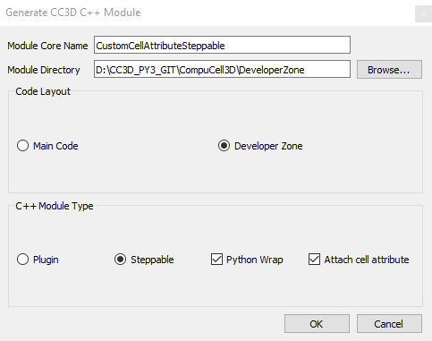
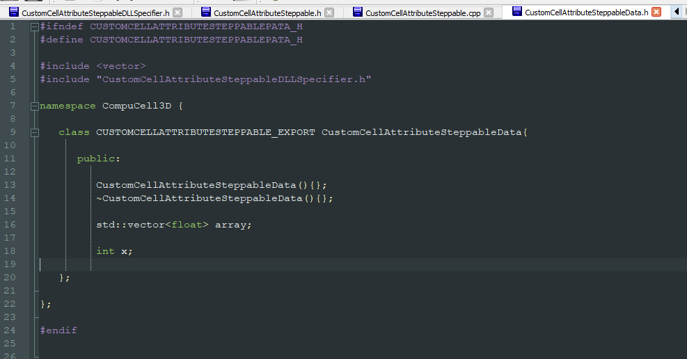

Attaching Custom Attributes To Cells
====================================

Cells in CompuCell3D are represented by ``CellG`` class - see ``CompuCell3D/core/CompuCell3D/Potts3D/Cell.h``

.. code-block:: c++

    #ifndef CELL_H
    #define CELL_H


    #ifndef PyObject_HEAD
    struct _object; //forward declare
    typedef _object PyObject; //type redefinition
    #endif

    class BasicClassGroup;

    namespace CompuCell3D {

      /**
       * A Potts3D cell.
       */

       class CellG{
       public:
          typedef unsigned char CellType_t;
          CellG():
            volume(0),
            targetVolume(0.0),
            lambdaVolume(0.0),
            surface(0),
            targetSurface(0.0),
            lambdaSurface(0.0),
            clusterSurface(0.0),
            targetClusterSurface(0.0),
            lambdaClusterSurface(0.0),
            type(0),
            xCM(0),yCM(0),zCM(0),
            xCOM(0),yCOM(0),zCOM(0),
            xCOMPrev(0),yCOMPrev(0),zCOMPrev(0),
            iXX(0), iXY(0), iXZ(0), iYY(0), iYZ(0), iZZ(0),
            lX(0.0),
            lY(0.0),
            lZ(0.0),
            lambdaVecX(0.0),
            lambdaVecY(0.0),
            lambdaVecZ(0.0),
            flag(0),
            id(0),
            clusterId(0),
            fluctAmpl(-1.0),
            lambdaMotility(0.0),
            biasVecX(0.0),
            biasVecY(0.0),
            biasVecZ(0.0),
            connectivityOn(false),
            extraAttribPtr(0),
            pyAttrib(0)


          {}
          long volume;
          float targetVolume;
          float lambdaVolume;
          double surface;
          float targetSurface;
          float angle;
          float lambdaSurface;
          double clusterSurface;
          float targetClusterSurface;
          float lambdaClusterSurface;
          unsigned char type;
          unsigned char subtype;
          double xCM,yCM,zCM; // numerator of center of mass expression (components)
          double xCOM,yCOM,zCOM; // numerator of center of mass expression (components)
          double xCOMPrev,yCOMPrev,zCOMPrev; // previous center of mass
          double iXX, iXY, iXZ, iYY, iYZ, iZZ; // tensor of inertia components
          float lX,lY,lZ; //orientation vector components - set by MomentsOfInertia Plugin - read only
          float ecc; // cell eccentricity
          float lambdaVecX,lambdaVecY,lambdaVecZ; // external potential lambda vector components
          unsigned char flag;
          float averageConcentration;
          long id;
          long clusterId;
          double fluctAmpl;
          double lambdaMotility;
          double biasVecX;
          double biasVecY;
          double biasVecZ;
          bool connectivityOn;
          BasicClassGroup *extraAttribPtr;

          PyObject *pyAttrib;
       };


      class Cell {
      };

      class CellPtr{
       public:
       Cell * cellPtr;
      };
    };
    #endif

As you can see CellG has a number of "standard" attributes. But very often you would like to add new attributes. For
example you would like to keep last 50 center of mass positions of each cell to be able to plot recent cell trajectory.
How would you do this? A simple approach would be to attach *e.g.* ``std::queue`` to the ``CellG`` class. This is a
valid approach but it has one major disadvantage. It will require you to recompile almost entire C++ code because
``CellG`` class is a core class that is used by virtually every single CompuCell3D module. Also, if you would like to
share the code with your colleague he would also need to recompile his or her copy of CC3D. Hence while this simple
approach would certainly work it it is not the most convenient way of adding attributes.
What about Python then? Yes, adding new attribute in Python is very simple:

.. code-block:: python

    cell.dict['cell_x_positions'] = [0.0]*50
    cell.dict['cell_y_positions'] = [0.0]*50
    cell.dict['cell_z_positions'] = [0.0]*50

Here, we added 3 attributes each one representing last 50 positions x, y, or z coordinates of center of mass. We
initialized them to be 0.0 hence the code ``[0.0]*50``. In Python when you multiply list by an integer it will return
a list that is contains multiple copies of the list you originally multiplied (in our case we will get a list
with 50 zeros).

Python approach would certainly work, but what if, for efficiency reasons, you want to stay in C++ world. There is a
solution for this that scales nicely i.e. it does not require recompilation of entire code and it allows to attach
any C++ class as a cell attribute. This is what we will teaching you next.

Constructing Steppable with Custom Class Attached to Each Cell
--------------------------------------------------------------

We begin the usual way - open Twedit++, fo to ``CC3D C++`` menu and choose ``Generate New Module...``` from the
menu. There, as before we fill out steppable (we call it ``CustomCellAttributeSteppable``) details -
making sure to check ``Developer Zone`` radio button, but in addition to this we also check ``Attach Cell Attribute``
check box. This ensures that the code that Twedit++ generates contains code that will inform CC3D cell factory
object to attach additional cell attribute.

|custom_attrs_01|

We press ``OK`` button and the steppables code with additional attribute
will get generated and the code will open in Twedit++ tabs:

|custom_attrs_02|

The class shown in the editor window will be used during cell construction to create object of this class
and attach it to each cell. In other words, once the steppable we have just created gets loaded it will tell CC3D
to attach to each cell an object of class ``CustomCellAttributeSteppableData``

.. code-block:: c++

    #ifndef CUSTOMCELLATTRIBUTESTEPPABLEPATA_H
    #define CUSTOMCELLATTRIBUTESTEPPABLEPATA_H

    #include <vector>
    #include "CustomCellAttributeSteppableDLLSpecifier.h"

    namespace CompuCell3D {

       class CUSTOMCELLATTRIBUTESTEPPABLE_EXPORT CustomCellAttributeSteppableData{

          public:

             CustomCellAttributeSteppableData(){};
             ~CustomCellAttributeSteppableData(){};

             std::vector<float> array;

             int x;

       };

    };

    #endif

If we look into ``CustomCellAttributeSteppable`` ``init`` function (this function is called during steppable
initialization) we can see a line ``potts->getCellFactoryGroupPtr()->registerClass(&customCellAttributeSteppableDataAccessor);``
This line is responsible for telling cell factory object that each new cell should have an object of type
``CustomCellAttributeSteppableData`` attached.

.. code-block:: c++

    void CustomCellAttributeSteppable::init(Simulator *simulator, CC3DXMLElement *_xmlData) {

      xmlData=_xmlData;

      potts = simulator->getPotts();

      cellInventoryPtr=& potts->getCellInventory();

      sim=simulator;

      cellFieldG = (WatchableField3D<CellG *> *)potts->getCellFieldG();

      fieldDim=cellFieldG->getDim();

      potts->getCellFactoryGroupPtr()->registerClass(&customCellAttributeSteppableDataAccessor);

      simulator->registerSteerableObject(this);

      update(_xmlData,true);

    }

How do we know that ``CustomCellAttributeSteppableData`` is the class whose objects will get attached to
each cell? We look into steppable header file and see the following line:
``BasicClassAccessor<CustomCellAttributeSteppableData> customCellAttributeSteppableDataAccessor; ``.

This line creates special accessor object that given a pointer to a cell it will fetch attached object of
type ``CustomCellAttributeSteppableData``. The exact details of how this is done are beyond the scope of this
manual but if you follow the pattern you will be able to attach arbitrary C++ objects to cc3d cells.
The pattern is as follows:

1. Add BasicAccessor member to your module - steppable or a plugin - ``BasicClassAccessor<ClassYouWantToAttach>``.
In our case we add ``BasicClassAccessor<CustomCellAttributeSteppableData> customCellAttributeSteppableDataAccessor; ``.

2. Add a function that accessess a pointer to this BasicAccessor member - in our case we add (see code below)
``BasicClassAccessor<CustomCellAttributeSteppableData> * getCustomCellAttributeSteppableDataAccessorPtr(){return & customCellAttributeSteppableDataAccessor;}``

3. Register BasicAccessor object with cell factory (we do it in the ``init`` function) of the steppable or plugin -
see full ``init`` function above:

``potts->getCellFactoryGroupPtr()->registerClass(&customCellAttributeSteppableDataAccessor);``


.. code-block:: c++

    #ifndef CUSTOMCELLATTRIBUTESTEPPABLESTEPPABLE_H
    #define CUSTOMCELLATTRIBUTESTEPPABLESTEPPABLE_H
    #include <CompuCell3D/CC3D.h>
    #include "CustomCellAttributeSteppableData.h"
    #include "CustomCellAttributeSteppableDLLSpecifier.h"

    namespace CompuCell3D {

      template <class T> class Field3D;
      template <class T> class WatchableField3D;

        class Potts3D;
        class Automaton;
        class BoundaryStrategy;
        class CellInventory;
        class CellG;

      class CUSTOMCELLATTRIBUTESTEPPABLE_EXPORT CustomCellAttributeSteppable : public Steppable {

        BasicClassAccessor<CustomCellAttributeSteppableData> customCellAttributeSteppableDataAccessor;

        WatchableField3D<CellG *> *cellFieldG;

        Simulator * sim;

        Potts3D *potts;

        CC3DXMLElement *xmlData;

        Automaton *automaton;

        BoundaryStrategy *boundaryStrategy;

        CellInventory * cellInventoryPtr;

        Dim3D fieldDim;

      public:

        CustomCellAttributeSteppable ();

        virtual ~CustomCellAttributeSteppable ();

        // SimObject interface

        virtual void init(Simulator *simulator, CC3DXMLElement *_xmlData=0);

        virtual void extraInit(Simulator *simulator);

        BasicClassAccessor<CustomCellAttributeSteppableData> * getCustomCellAttributeSteppableDataAccessorPtr(){return & customCellAttributeSteppableDataAccessor;}

        //steppable interface

        virtual void start();

        virtual void step(const unsigned int currentStep);

        virtual void finish() {}


        //SteerableObject interface

        virtual void update(CC3DXMLElement *_xmlData, bool _fullInitFlag=false);

        virtual std::string steerableName();

        virtual std::string toString();


      };

    };

    #endif

Now that we know basic rules of adding custom attributes to cells. Let's write a little bit of code that makes use
use of this functionality. First we will cleanup function that parses XML (we do not need any XML parsing in our)
example and then we will modify ``step`` function to store a product of cell ``id`` and current MCS in the variable
``x`` ``CustomCellAttributeSteppableData`` object (remember objects of this class will be attached to cell). We
will also store x-coordinates of 5 last center of mass positions of each cell.

Here is implementation of the ``update`` function where we remove XML parsing code since we are not doing
any XML parsing in this particular case:

.. code-block:: c++

    void CustomCellAttributeSteppable::update(CC3DXMLElement *_xmlData, bool _fullInitFlag) {


        //PARSE XML IN THIS FUNCTION

        //For more information on XML parser function please see CC3D code or lookup XML utils API

        automaton = potts->getAutomaton();

        ASSERT_OR_THROW("CELL TYPE PLUGIN WAS NOT PROPERLY INITIALIZED YET. MAKE SURE THIS IS THE FIRST PLUGIN THAT YOU SET", automaton)


            //boundaryStrategy has information aobut pixel neighbors
            boundaryStrategy = BoundaryStrategy::getInstance();

    }

The implementation of step function is a bit more involved but not by much:

.. code-block:: c++
    :linenos:

    void CustomCellAttributeSteppable::step(const unsigned int currentStep) {

        CellInventory::cellInventoryIterator cInvItr;

        CellG * cell = 0;

        for (cInvItr = cellInventoryPtr->cellInventoryBegin(); cInvItr != cellInventoryPtr->cellInventoryEnd(); ++cInvItr)

        {

            cell = cellInventoryPtr->getCell(cInvItr);

            CustomCellAttributeSteppableData * customCellAttrData = customCellAttributeSteppableDataAccessor.get(cell->extraAttribPtr);

            //storing cell id multiplied by currentStep in "x" member of the CustomCellAttributeSteppableData
            customCellAttrData->x = cell->id * currentStep;


            // storing last 5 xCOM positions in the "array" vector (part of  CustomCellAttributeSteppableData)
            std::vector<float> & vec = customCellAttrData->array;
            if (vec.size() < 5) {
                vec.push_back(cell->xCOM);
            }
            else
            {
                for (int i = 0; i < 4; ++i) {
                    vec[i] = vec[i + 1];
                }
                vec[vec.size() - 1] = cell->xCOM;
            }

        }

        //printouts
        for (cInvItr = cellInventoryPtr->cellInventoryBegin(); cInvItr != cellInventoryPtr->cellInventoryEnd(); ++cInvItr) {
            cell = cellInventoryPtr->getCell(cInvItr);
            CustomCellAttributeSteppableData * customCellAttrData = customCellAttributeSteppableDataAccessor.get(cell->extraAttribPtr);

            cerr << "cell->id=" << cell->id << " mcs = " << currentStep << " attached x variable = " << customCellAttrData->x << endl;

            cerr << "----------- up to last 5 xCOM positions ----- for cell->id " << cell->id << endl;
            for (int i = 0; i < customCellAttrData->array.size(); ++i) {
                cerr << "x_com_pos[" << i << "]=" << customCellAttrData->array[i] << endl;
            }
        }

    }

Lines ``7-11`` should be familiar. We iterate over all cells in the simulation and fetch a cell pointer from
inventory and store it in local variable ``cell``.

In line ``13`` we make use of out accessor object. Here we are actually fetching object of type
``CustomCellAttributeSteppableData`` that is attached to each cell. Note that
``customCellAttributeSteppableDataAccessor.get`` function takes as an input special pointer that is a member of
every cell object ``cell->extraAttribPtr`` and returns a poiner to the object that accessor is associated with
in our case it returns a pointer to ``CustomCellAttributeSteppableData``.

In line ``16`` we assign ``x`` variable of the object of class ``CustomCellAttributeSteppableData`` to be a product
of current cell ``id`` and current MCS.

In lines ``21-33`` we append current ``xCOM`` position of current cell to the vector ``array``. We only keep
last 5 positions and therefore in the ``else`` portion lines ``25-31`` we last 4 positions of the vector to the
"front" of the vector and write xCOM in the last position of the vector - line ``30``. Note that the ``else`` part
gets executed only if we determine that vector has already 5 elements. As you can see our attached attribute can store
variable number of elements - because we append to vector. In general we can have vectors, lists, maps, queues
of arbitrary objects. In fact instead of using ``std::vector`` it woudl be better to use queue because queue container
makes it much easier to remove and add elements  to and from the beginning and end of the container.

.. warning::

    One thing to remember that computer has a finite memory and it you keep appending you may actually exhaust all operating system memory.

.. note::

    Unlike in Python where we can store arbitrary objects in the list or dictionary, in C++ we need to declare which types we want to store. It makes C++ less flexible but you recoup this minor inflexibility in much faster speed of code execution

The full code for this example can be found in ``CompuCell3D/DeveloperZone/Demos/CustomCellAttributesCpp`` directory

Using Python scripting to modify custom C++ attributes
------------------------------------------------------

Sometimes you may end up in situation where in addition to modifying custom attributes in C++ you may want to modify
them also in Python. In this part of the tutorial we will show you how to do it. If all we want to do is to access ``x``
variable from ``CustomCellAttributeSteppableData`` we should be "pre-wired". Well, almost. You see that when we
access objects of ``CustomCellAttributeSteppableData`` class from within C++ steppable where we declared the accessor
object we simply type:

.. code-block:: c++

    CustomCellAttributeSteppableData * customCellAttrData = customCellAttributeSteppableDataAccessor.get(cell->extraAttribPtr)

However, note that ``customCellAttributeSteppableDataAccessor`` is declared in the "private" section of
``CustomCellAttributeSteppable``. Therefore,  it is not "visible" from outsides of C++ ``CustomCellAttributeSteppable``
class. At this point we have three potential solutions:

1. Make the accessor public - not ideal , this is a low-level object that should remain hidden

2. Make a a public function that returns a pointer to accessor - again, not ideal because then in Python or in other
C++ module we would need to perform a fairly complex fetching of the ``CustomCellAttributeSteppableData``

3. Declare a a public function that takes a pointer to a cell object and returns attached ``CustomCellAttributeSteppableData``
object. This solution seems like the cleanest of all three options





