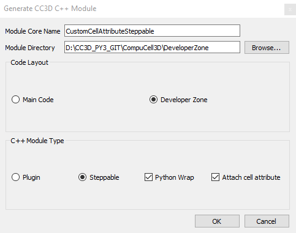
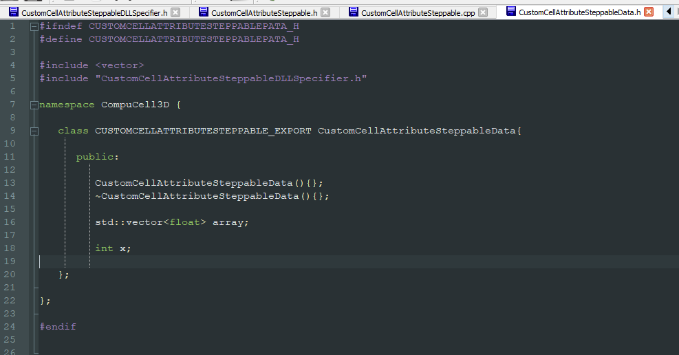
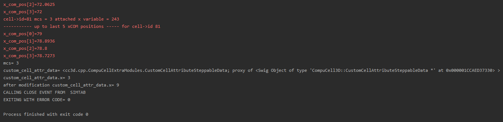
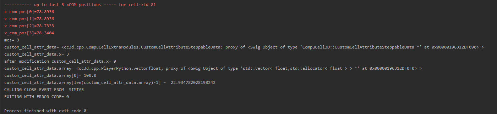
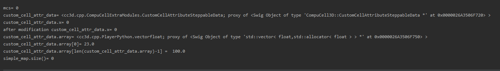
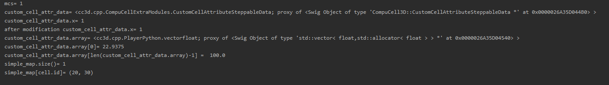

Attaching Custom Attributes To Cells
====================================

Cells in CompuCell3D are represented by the ``CellG`` class. The class is defined in ``CompuCell3D/core/CompuCell3D/Potts3D/Cell.h``:

.. code-block:: c++

    #ifndef CELL_H
    #define CELL_H

    #ifndef PyObject_HEAD
    struct _object; //forward declare
    typedef _object PyObject; //type redefinition
    #endif

    class BasicClassGroup;

    namespace CompuCell3D {

      /**
       * A Potts3D cell.
       */

       class CellG{
       public:
          typedef unsigned char CellType_t;
          CellG():
            volume(0),
            targetVolume(0.0),
            lambdaVolume(0.0),
            surface(0),
            targetSurface(0.0),
            lambdaSurface(0.0),
            clusterSurface(0.0),
            targetClusterSurface(0.0),
            lambdaClusterSurface(0.0),
            type(0),
            xCM(0),yCM(0),zCM(0),
            xCOM(0),yCOM(0),zCOM(0),
            xCOMPrev(0),yCOMPrev(0),zCOMPrev(0),
            iXX(0), iXY(0), iXZ(0), iYY(0), iYZ(0), iZZ(0),
            lX(0.0),
            lY(0.0),
            lZ(0.0),
            lambdaVecX(0.0),
            lambdaVecY(0.0),
            lambdaVecZ(0.0),
            flag(0),
            id(0),
            clusterId(0),
            fluctAmpl(-1.0),
            lambdaMotility(0.0),
            biasVecX(0.0),
            biasVecY(0.0),
            biasVecZ(0.0),
            connectivityOn(false),
            extraAttribPtr(0),
            pyAttrib(0)

          {}
          long volume;
          float targetVolume;
          float lambdaVolume;
          double surface;
          float targetSurface;
          float angle;
          float lambdaSurface;
          double clusterSurface;
          float targetClusterSurface;
          float lambdaClusterSurface;
          unsigned char type;
          unsigned char subtype;
          double xCM,yCM,zCM; // numerator of center of mass expression (components)
          double xCOM,yCOM,zCOM; // numerator of center of mass expression (components)
          double xCOMPrev,yCOMPrev,zCOMPrev; // previous center of mass
          double iXX, iXY, iXZ, iYY, iYZ, iZZ; // tensor of inertia components
          float lX,lY,lZ; //orientation vector components - set by MomentsOfInertia Plugin - read only
          float ecc; // cell eccentricity
          float lambdaVecX,lambdaVecY,lambdaVecZ; // external potential lambda vector components
          unsigned char flag;
          float averageConcentration;
          long id;
          long clusterId;
          double fluctAmpl;
          double lambdaMotility;
          double biasVecX;
          double biasVecY;
          double biasVecZ;
          bool connectivityOn;
          BasicClassGroup *extraAttribPtr;

          PyObject *pyAttrib;
       };

      class Cell {
      };

      class CellPtr{
       public:
       Cell * cellPtr;
      };
    };
    #endif

``CellG`` already contains many standard attributes, but simulations often need additional per-cell data. For example, you may want to store the last 50 center-of-mass positions for each cell so that you can plot recent trajectories.

One possible approach is to add a member such as ``std::queue`` directly to ``CellG``. That works technically, but it is usually the wrong extension point: ``CellG`` is a core class used by nearly every CC3D module, so changing it forces a broad core rebuild and makes your code harder to share.

In Python, adding cell-specific data is simple:

.. code-block:: python

    cell.dict['cell_x_positions'] = [0.0]*50
    cell.dict['cell_y_positions'] = [0.0]*50
    cell.dict['cell_z_positions'] = [0.0]*50

Here, we added 3 attributes each one representing last 50 positions x, y, or z coordinates of center of mass. We
initialized them to be 0.0 hence the code ``[0.0]*50``. In Python when you multiply list by an integer it will return
a list that is contains multiple copies of the list you originally multiplied (in our case we will get a list
with 50 zeros).

The Python approach is convenient and often sufficient. When the data must remain in C++ for performance or integration reasons, use CC3D's extra-member accessor mechanism. It attaches an instance of your own C++ class to each cell without modifying ``CellG`` itself.

Constructing A Steppable With A Custom Per-Cell Class
------------------------------------------------------

Begin in Twedit++ by choosing ``CC3D C++`` -> ``Generate New Module...``. Create a DeveloperZone steppable named ``CustomCellAttributeSteppable`` and check ``Attach Cell Attribute``. This tells Twedit++ to generate the code that registers a custom C++ data object with the CC3D cell factory.

|custom_attrs_01|

We press ``OK`` button and the steppables code with additional attribute
will get generated and the code will open in Twedit++ tabs:

|custom_attrs_02|

The generated data class is the object that will be attached to each cell. Once the steppable is loaded and initialized, CC3D creates one ``CustomCellAttributeSteppableData`` object per cell.

.. code-block:: c++

    #ifndef CUSTOMCELLATTRIBUTESTEPPABLEPATA_H
    #define CUSTOMCELLATTRIBUTESTEPPABLEPATA_H

    #include <vector>
    #include "CustomCellAttributeSteppableDLLSpecifier.h"

    namespace CompuCell3D {

       class CUSTOMCELLATTRIBUTESTEPPABLE_EXPORT CustomCellAttributeSteppableData{

          public:

             CustomCellAttributeSteppableData(){};
             ~CustomCellAttributeSteppableData(){};

             std::vector<float> array;

             int x;

       };

    };

    #endif

If we look into ``CustomCellAttributeSteppable`` ``init`` function (this function is called during steppable
initialization) we can see a line ``potts->getCellFactoryGroupPtr()->registerClass(&customCellAttributeSteppableDataAccessor);``
This line is responsible for telling cell factory object that each new cell should have an object of type
``CustomCellAttributeSteppableData`` attached.

.. code-block:: c++

    void CustomCellAttributeSteppable::init(Simulator *simulator, CC3DXMLElement *_xmlData) {

      xmlData=_xmlData;

      potts = simulator->getPotts();

      cellInventoryPtr=& potts->getCellInventory();

      sim=simulator;

      cellFieldG = (WatchableField3D<CellG *> *)potts->getCellFieldG();

      fieldDim=cellFieldG->getDim();

      ExtraMembersGroupAccessorBase *accessorPtr = &customCellAttributeSteppableDataAccessor;
      potts->getCellFactoryGroupPtr()->registerClass(accessorPtr);

      simulator->registerSteerableObject(this);

      update(_xmlData,true);

    }

The steppable header identifies the attached data type through this accessor member: ``ExtraMembersGroupAccessor<CustomCellAttributeSteppableData> customCellAttributeSteppableDataAccessor;``.

This line creates an accessor object. Given a cell pointer, the accessor fetches the attached object of
type ``CustomCellAttributeSteppableData``. The exact details of how this is done are beyond the scope of this
manual but if you follow the pattern you will be able to attach arbitrary C++ objects to cc3d cells.
The pattern is:

1. Add ExtraMembersGroupAccessor member to your module - steppable or a plugin - ``ExtraMembersGroupAccessor<ClassYouWantToAttach>``.
In our case we add ``ExtraMembersGroupAccessor<CustomCellAttributeSteppableData> customCellAttributeSteppableDataAccessor;``.

2. Add a function that accesses a pointer to this ExtraMembersGroupAccessor member - in our case we add (see code below)
``ExtraMembersGroupAccessor<CustomCellAttributeSteppableData> * getCustomCellAttributeSteppableDataAccessorPtr(){return & customCellAttributeSteppableDataAccessor;}``

3. Register ExtraMembersGroupAccessor object with cell factory (we do it in the ``init`` function) of the steppable or plugin -
see full ``init`` function above:

``potts->getCellFactoryGroupPtr()->registerClass(&customCellAttributeSteppableDataAccessor);``

.. code-block:: c++

    #ifndef CUSTOMCELLATTRIBUTESTEPPABLESTEPPABLE_H
    #define CUSTOMCELLATTRIBUTESTEPPABLESTEPPABLE_H
    #include <CompuCell3D/CC3D.h>
    #include "CustomCellAttributeSteppableData.h"
    #include "CustomCellAttributeSteppableDLLSpecifier.h"

    namespace CompuCell3D {

      template <class T> class Field3D;
      template <class T> class WatchableField3D;

        class Potts3D;
        class Automaton;
        class BoundaryStrategy;
        class CellInventory;
        class CellG;

      class CUSTOMCELLATTRIBUTESTEPPABLE_EXPORT CustomCellAttributeSteppable : public Steppable {

        ExtraMembersGroupAccessor<CustomCellAttributeSteppableData> customCellAttributeSteppableDataAccessor;

        WatchableField3D<CellG *> *cellFieldG;

        Simulator * sim;

        Potts3D *potts;

        CC3DXMLElement *xmlData;

        Automaton *automaton;

        BoundaryStrategy *boundaryStrategy;

        CellInventory * cellInventoryPtr;

        Dim3D fieldDim;

      public:

        CustomCellAttributeSteppable ();

        virtual ~CustomCellAttributeSteppable ();

        // SimObject interface

        virtual void init(Simulator *simulator, CC3DXMLElement *_xmlData=0);

        virtual void extraInit(Simulator *simulator);

        ExtraMembersGroupAccessor<CustomCellAttributeSteppableData> * getCustomCellAttributeSteppableDataAccessorPtr(){return & customCellAttributeSteppableDataAccessor;}

        //steppable interface

        virtual void start();

        virtual void step(const unsigned int currentStep);

        virtual void finish() {}

        //SteerableObject interface

        virtual void update(CC3DXMLElement *_xmlData, bool _fullInitFlag=false);

        virtual std::string steerableName();

        virtual std::string toString();

      };

    };

    #endif

Now that the registration pattern is clear, we can use the attached data. This example does not need XML parameters, so we will simplify ``update`` and then modify ``step`` to store two values in each cell's ``CustomCellAttributeSteppableData`` object: the product of cell ``id`` and current MCS in ``x``, and the last five x-coordinates of the cell center of mass.

Here is implementation of the ``update`` function where we remove XML parsing code since we are not doing
any XML parsing in this particular case:

.. code-block:: c++

    void CustomCellAttributeSteppable::update(CC3DXMLElement *_xmlData, bool _fullInitFlag) {

        //PARSE XML IN THIS FUNCTION

        //For more information on XML parser function please see CC3D code or lookup XML utils API

        automaton = potts->getAutomaton();

        ASSERT_OR_THROW("CELL TYPE PLUGIN WAS NOT PROPERLY INITIALIZED YET. MAKE SURE THIS IS THE FIRST PLUGIN THAT YOU SET", automaton)

            //boundaryStrategy has information about pixel neighbors
            boundaryStrategy = BoundaryStrategy::getInstance();

    }

The implementation of step function is a bit more involved but not by much:

.. code-block:: c++
    :linenos:

    void CustomCellAttributeSteppable::step(const unsigned int currentStep) {

        CellInventory::cellInventoryIterator cInvItr;

        CellG * cell = 0;

        for (cInvItr = cellInventoryPtr->cellInventoryBegin(); cInvItr != cellInventoryPtr->cellInventoryEnd(); ++cInvItr)

        {

            cell = cellInventoryPtr->getCell(cInvItr);

            CustomCellAttributeSteppableData * customCellAttrData = customCellAttributeSteppableDataAccessor.get(cell->extraAttribPtr);

            //storing cell id multiplied by currentStep in "x" member of the CustomCellAttributeSteppableData
            customCellAttrData->x = cell->id * currentStep;

            // storing last 5 xCOM positions in the "array" vector (part of  CustomCellAttributeSteppableData)
            std::vector<float> & vec = customCellAttrData->array;
            if (vec.size() < 5) {
                vec.push_back(cell->xCOM);
            }
            else
            {
                for (int i = 0; i < 4; ++i) {
                    vec[i] = vec[i + 1];
                }
                vec[vec.size() - 1] = cell->xCOM;
            }

        }

        //printouts
        for (cInvItr = cellInventoryPtr->cellInventoryBegin(); cInvItr != cellInventoryPtr->cellInventoryEnd(); ++cInvItr) {
            cell = cellInventoryPtr->getCell(cInvItr);
            CustomCellAttributeSteppableData * customCellAttrData = customCellAttributeSteppableDataAccessor.get(cell->extraAttribPtr);

            cerr << "cell->id=" << cell->id << " mcs = " << currentStep << " attached x variable = " << customCellAttrData->x << endl;

            cerr << "----------- up to last 5 xCOM positions ----- for cell->id " << cell->id << endl;
            for (int i = 0; i < customCellAttrData->array.size(); ++i) {
                cerr << "x_com_pos[" << i << "]=" << customCellAttrData->array[i] << endl;
            }
        }

    }

Lines ``7-11`` should be familiar. We iterate over all cells in the simulation and fetch a cell pointer from
inventory and store it in local variable ``cell``.

In line ``13`` we make use of our accessor object. Here we are actually fetching object of type
``CustomCellAttributeSteppableData`` that is attached to each cell. Note that
``customCellAttributeSteppableDataAccessor.get`` function takes as an input special pointer that is a member of
every cell object ``cell->extraAttribPtr`` and returns a pointer to the object that accessor is associated with
in our case it returns a pointer to ``CustomCellAttributeSteppableData``.

In line ``16`` we assign ``x`` variable of the object of class ``CustomCellAttributeSteppableData`` to be a product
of current cell ``id`` and current MCS.

In lines ``21-33`` we append current ``xCOM`` position of current cell to the vector ``array``. We only keep
last 5 positions and therefore in the ``else`` portion lines ``25-31`` we last 4 positions of the vector to the
"front" of the vector and write xCOM in the last position of the vector - line ``30``. Note that the ``else`` part
gets executed only if we determine that vector has already 5 elements. As you can see our attached attribute can store
variable number of elements - because we append to vector. In general we can have vectors, lists, maps, queues
of arbitrary objects. In fact instead of using ``std::vector`` it would be better to use queue because queue container
makes it much easier to remove and add elements  to and from the beginning and end of the container.

.. warning::

    One thing to remember that computer has a finite memory and it you keep appending you may actually exhaust all operating system memory.

.. note::

    Unlike in Python where we can store arbitrary objects in the list or dictionary, in C++ we need to declare which types we want to store. It makes C++ less flexible but you recoup this minor inflexibility in much faster speed of code execution

The full code for this example can be found in ``CompuCell3D/DeveloperZone/Demos/CustomCellAttributesCpp`` directory

Using Python To Modify Custom C++ Attributes
---------------------------------------------

Sometimes you want the same attached C++ data to be visible from Python. This is useful when C++ maintains the data efficiently, but Python steppables need to inspect or adjust selected values. If all we want to do is to access ``x``
variable from ``CustomCellAttributeSteppableData`` we should be "pre-wired". Well, almost. You see that when we
access objects of ``CustomCellAttributeSteppableData`` class from within C++ steppable where we declared the accessor
object we simply type:

.. code-block:: c++

    CustomCellAttributeSteppableData * customCellAttrData = customCellAttributeSteppableDataAccessor.get(cell->extraAttribPtr)

However, note that ``customCellAttributeSteppableDataAccessor`` is declared in the "private" section of
``CustomCellAttributeSteppable``. Therefore,  it is not "visible" from outside the C++ ``CustomCellAttributeSteppable``
class. At this point we have three potential solutions:

1. Make the accessor public - not ideal , this is a low-level object that should remain hidden

2. Make a public function that returns a pointer to accessor - again, not ideal because then in Python or in other
C++ module we would need to perform a fairly complex fetching of the ``CustomCellAttributeSteppableData``

3. Declare a public function that takes a pointer to a cell object and returns attached ``CustomCellAttributeSteppableData``
object. This solution seems like the cleanest of all three options

Let's modify a code and add the function that returns pointer to ``CustomCellAttributeSteppableData`` object. We first
modify header file for the steppable class:

.. code-block:: c++

  class CUSTOMCELLATTRIBUTESTEPPABLE_EXPORT CustomCellAttributeSteppable : public Steppable {

     ExtraMembersGroupAccessor<CustomCellAttributeSteppableData> customCellAttributeSteppableDataAccessor;

    WatchableField3D<CellG *> *cellFieldG;

    Simulator * sim;

    // ... we skipped part of the code here for brevity
  public:

    CustomCellAttributeSteppable ();

    virtual ~CustomCellAttributeSteppable ();

    // SimObject interface

    virtual void init(Simulator *simulator, CC3DXMLElement *_xmlData=0);

    virtual void extraInit(Simulator *simulator);

     ExtraMembersGroupAccessor<CustomCellAttributeSteppableData> * getCustomCellAttributeSteppableDataAccessorPtr(){return & customCellAttributeSteppableDataAccessor;}

    CustomCellAttributeSteppableData * getCustomCellAttribute(CellG * cell);

    // ... we skipped part of the code here for brevity

    };

Now, we add implementation of the ``getCustomCellAttribute`` function to implementation file

.. code-block:: c++

    CustomCellAttributeSteppableData * CustomCellAttributeSteppable::getCustomCellAttribute(CellG * cell) {

        CustomCellAttributeSteppableData * customCellAttrData = customCellAttributeSteppableDataAccessor.get(cell->extraAttribPtr);
        return customCellAttrData;
    }

.. note::

    Each time you modify header file for a C++ class that you are wrapping in Python . Make sure you also "refresh" SWIG ``.i`` file. It can be as simple as adding extra empty line to ``CompuCell3D\DeveloperZone\pyinterface\CompuCellExtraModules\CompuCellExtraModules.i``

At this point we should be able access ``CustomCellAttributeSteppableData`` objects from "the outside" of the steppable
class. Let us now add Python steppable where we can access ``CustomCellAttributeSteppable`` and
``CustomCellAttributeSteppableData``:

.. code-block:: python
    :linenos:

    from cc3d.core.PySteppables import *
    from cc3d.cpp import CompuCellExtraModules

    class CustomCellAttributePythonSteppable(SteppableBasePy):

        def __init__(self, frequency=1):
            SteppableBasePy.__init__(self, frequency)
            self.custom_attr_steppable_cpp = None

        def start(self):
            self.custom_attr_steppable_cpp = CompuCellExtraModules.getCustomCellAttributeSteppable()

        def step(self, mcs):

            print ('mcs=', mcs)

            for cell in self.cell_list:
                custom_cell_attr_data = self.custom_attr_steppable_cpp.getCustomCellAttribute(cell)
                print('custom_cell_attr_data=', custom_cell_attr_data)
                print('custom_cell_attr_data.x=', custom_cell_attr_data.x)
                custom_cell_attr_data.x = cell.id * mcs ** 2

                print('after modification custom_cell_attr_data.x=', custom_cell_attr_data.x)
                break

In line ``12`` we get access to C++ steppable object and store it in it a class variable
``self.custom_attr_steppable_cpp``. In case you are wondering where ``getCustomCellAttributeSteppable()`` comes
from, look into ``CompuCell3D\DeveloperZone\pyinterface\CompuCellExtraModules\CompuCellExtraModules.i``. This SWIG
wrapper file declares this function and it returns C++ steppable object. This function is generated automatically
by Twedit++:

.. code-block:: c++

    %inline %{

     CustomCellAttributeSteppable * getCustomCellAttributeSteppable(){

          return (CustomCellAttributeSteppable *)Simulator::steppableManager.get("CustomCellAttributeSteppable");

       }

Returning to our Python code we see that inside for loop we print to the screen the
``CustomCellAttributeSteppableData`` object (line ``20``) and also print `x` member of this object. Later we
modify and print to the screen the `x` variable of the object and we only do it for the first cell we encounter
during iteration over all cells to make output more concise (see ``break`` statement at the end of the loop)

The output looks encouraging:

|custom_attrs_03|

We can see - look at the lines:

.. code-block:: bash

    custom_cell_attr_data.x= 3
    after modification custom_cell_attr_data.x= 9

that we can access and modify `x` variable of the ``CustomCellAttributeSteppableData`` object that is
attached to each cell.

What about the ``array`` member of ``CustomCellAttributeSteppableData``. Remember, in C++ it is of type
``std::vector<float>``. Can we access it? Can we modify it? Let's us try:

.. code-block:: python
    :linenos:

    from cc3d.core.PySteppables import *
    from cc3d.cpp import CompuCellExtraModules

    class CustomCellAttributePythonSteppable(SteppableBasePy):

        def __init__(self, frequency=1):
            SteppableBasePy.__init__(self, frequency)
            self.custom_attr_steppable_cpp = None

        def start(self):
            self.custom_attr_steppable_cpp = CompuCellExtraModules.getCustomCellAttributeSteppable()

        def step(self, mcs):
            print('mcs=', mcs)

            for cell in self.cell_list:
                custom_cell_attr_data = self.custom_attr_steppable_cpp.getCustomCellAttribute(cell)
                print('custom_cell_attr_data=', custom_cell_attr_data)
                print('custom_cell_attr_data.x=', custom_cell_attr_data.x)

                custom_cell_attr_data.x = cell.id * mcs ** 2

                print('after modification custom_cell_attr_data.x=', custom_cell_attr_data.x)

                print('custom_cell_attr_data.array=', custom_cell_attr_data.array)
                print('custom_cell_attr_data.array[0]=', custom_cell_attr_data.array[0])

                if len(custom_cell_attr_data.array) < 5:
                    custom_cell_attr_data.array.push_back(100.0)
                print('custom_cell_attr_data.array[len(custom_cell_attr_data.array)-1] = ',
                    custom_cell_attr_data.array[len(custom_cell_attr_data.array)-1])

                break

In lines ``26-27`` we print the type of ``custom_cell_attr_data.array`` as well as the first element.
Later, in lines ``29-32`` we are appending elements to the vector using ``push_back`` C++ function (because ``array``
is a C++ object wrapped in Python). Notice that we are doing double append for first cell. First append
(``push_back``) happens in C++ and in Python we are doing a second one. This , somewhat artificial example shows
how to access and modify custom attributes from C++ and from Python in a single simulation.

Here is the output:

|custom_attrs_04|

Adding A Complex Attached Attribute Type And Accessing It From Python
~~~~~~~~~~~~~~~~~~~~~~~~~~~~~~~~~~~~~~~~~~~~~~~~~~~~~~~~~~~~~~~~~~~~~~~~~

So far simple values worked well. We were able to access simple type variables (`x`), STL vectors ``array``. So,
perhaps we can try adding something more complex to the ``CustomCellAttributeSteppableData``, for example
let us add ``std::map<long int, std::vector<int> >`` which is C++ dictionary (map) that uses long integers as
keys and stores vectors of type integer:

.. code-block:: c++

    #ifndef CUSTOMCELLATTRIBUTESTEPPABLEPATA_H
    #define CUSTOMCELLATTRIBUTESTEPPABLEPATA_H

    #include <vector>
    #include "CustomCellAttributeSteppableDLLSpecifier.h"

    namespace CompuCell3D {

       class CUSTOMCELLATTRIBUTESTEPPABLE_EXPORT CustomCellAttributeSteppableData{

          public:

             CustomCellAttributeSteppableData(){};
             ~CustomCellAttributeSteppableData(){};

             std::vector<float> array;
             std::map<long int, std::vector<int> > simple_map;

             int x;

       };

    };

    #endif

After we recompile (remember to refresh ``CompuCellExtraModules.i``) and try running the following Python code:

.. code-block:: python
    :linenos:

    from cc3d.core.PySteppables import *
    from cc3d.cpp import CompuCellExtraModules

    class CustomCellAttributePythonSteppable(SteppableBasePy):

        def __init__(self, frequency=1):
            SteppableBasePy.__init__(self, frequency)
            self.custom_attr_steppable_cpp = None

        def start(self):
            self.custom_attr_steppable_cpp = CompuCellExtraModules.getCustomCellAttributeSteppable()

        def step(self, mcs):
            print('mcs=', mcs)

            for cell in self.cell_list:
                custom_cell_attr_data = self.custom_attr_steppable_cpp.getCustomCellAttribute(cell)
                print('custom_cell_attr_data=', custom_cell_attr_data)
                print('custom_cell_attr_data.x=', custom_cell_attr_data.x)

                custom_cell_attr_data.x = cell.id * mcs ** 2

                print('after modification custom_cell_attr_data.x=', custom_cell_attr_data.x)

                print('custom_cell_attr_data.array=', custom_cell_attr_data.array)
                print('custom_cell_attr_data.array[0]=', custom_cell_attr_data.array[0])

                if len(custom_cell_attr_data.array) < 5:
                    custom_cell_attr_data.array.push_back(100.0)
                print('custom_cell_attr_data.array[len(custom_cell_attr_data.array)-1] = ',
                    custom_cell_attr_data.array[len(custom_cell_attr_data.array)-1])

                simple_map = custom_cell_attr_data.simple_map

                print('simple_map.size()=', simple_map.size())

we will get an error when we try to get number of elements stored in the map (should be 0):

.. code-block:: bash

    Traceback (most recent call last):
      File "D:\CC3D_PY3_GIT\cc3d\CompuCellSetup\sim_runner.py", line 77, in run_cc3d_project
        exec(code, globals(), locals())
      File "D:\CC3D_PY3_GIT\CompuCell3D\DeveloperZone\Demos\CustomCellAttributesPython\Simulation\CustomCellAttributesPython.py", line 6, in <module>
        CompuCellSetup.run()
      File "D:\CC3D_PY3_GIT\cc3d\CompuCellSetup\simulation_setup.py", line 117, in run
        main_loop_fcn(simulator, simthread=simthread, steppable_registry=steppable_registry)
      File "D:\CC3D_PY3_GIT\cc3d\CompuCellSetup\simulation_setup.py", line 583, in main_loop_player
        steppable_registry.step(cur_step)
      File "D:\CC3D_PY3_GIT\cc3d\core\SteppableRegistry.py", line 169, in step
        steppable.step(_mcs)
      File "D:\CC3D_PY3_GIT\CompuCell3D\DeveloperZone\Demos\CustomCellAttributesPython\Simulation\CustomCellAttributesPythonModules.py", line 36, in step
        print('simple_map.size()=', simple_map.size())
    AttributeError: 'SwigPyObject' object has no attribute 'size'

Why the error? Simply put we did not tell SWIG about the complex types we are using for member ``simple_map``.
You may ask how come before when we had ``std::vector<int> array;`` things worked. They worked because elsewhere
in the CompuCell3D main Python wrapper we told SWIG about template ``std::vector<int>``. However now that we are
dealing with ``std::map<long int, std::vector<int> > simple_map;`` we need to tell SWIG how to make those object
available. It is actually quite easy to do. We add the following lines to ``CompuCellExtraModules.i``:

.. code-block::

    %template (vector_int) std::vector<int>;
    %template (map_long_vector_int)std::map<long int, std::vector<int> >;

For each template we are using in the our extra attribute we give it a name (e.g. ``vector_int``) and list its
type - ``%template (vector_int) std::vector<int>;``

After this fix when we try to run the earlier Python code we would get the following output:

|custom_attrs_05|

As we can see the size of the map comes up as zero because we did not put any elements in it. Let's add a
code that puts something in the map:

.. code-block:: python
    :linenos:

    from cc3d.core.PySteppables import *
    from cc3d.cpp import CompuCellExtraModules

    class CustomCellAttributePythonSteppable(SteppableBasePy):

        def __init__(self, frequency=1):
            SteppableBasePy.__init__(self, frequency)
            self.custom_attr_steppable_cpp = None

        def start(self):
            self.custom_attr_steppable_cpp = CompuCellExtraModules.getCustomCellAttributeSteppable()

        def step(self, mcs):
            print('mcs=', mcs)

            for cell in self.cell_list:
                custom_cell_attr_data = self.custom_attr_steppable_cpp.getCustomCellAttribute(cell)
                print('custom_cell_attr_data=', custom_cell_attr_data)
                print('custom_cell_attr_data.x=', custom_cell_attr_data.x)

                custom_cell_attr_data.x = cell.id * mcs ** 2

                print('after modification custom_cell_attr_data.x=', custom_cell_attr_data.x)

                print('custom_cell_attr_data.array=', custom_cell_attr_data.array)
                print('custom_cell_attr_data.array[0]=', custom_cell_attr_data.array[0])

                if len(custom_cell_attr_data.array) < 5:
                    custom_cell_attr_data.array.push_back(100.0)
                print('custom_cell_attr_data.array[len(custom_cell_attr_data.array)-1] = ',
                      custom_cell_attr_data.array[len(custom_cell_attr_data.array) - 1])

                simple_map = custom_cell_attr_data.simple_map

                print('simple_map.size()=', simple_map.size())
                vec = CompuCellExtraModules.vector_int()
                vec.push_back(20)
                vec.push_back(30)
                simple_map[cell.id] = vec

                print('simple_map[cell.id]=', simple_map[cell.id])

                break

In line ``37`` we create a C++ vector of integers using `` CompuCellExtraModules.vector_int()`` call.
Remember, ``vector_int`` is precisely template identifier we added in SWIG ``CompuCellExtraModules.i`` file.
Now we are simply invoking constructor for this type. In the next two lines ``38-39`` we push back two integers
to the newly created vector and finally in line ``40`` we store this vector in the map that is part of the object
that is attached to a cell. To check if we can retrieve the stored vector we use code from line ``42``. The output
is as follows:

|custom_attrs_06|

Custom Cell Attribute Summary
-----------------------------

This section showed how to attach a C++ data object to each cell, update that object from C++, expose it through a Python wrapper, and handle more complex STL types by adding explicit SWIG templates.

