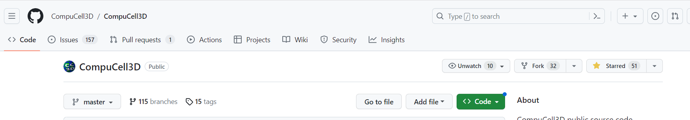
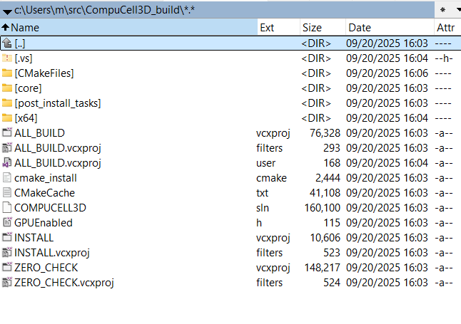
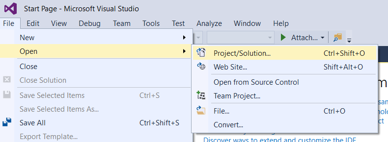
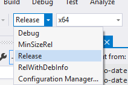
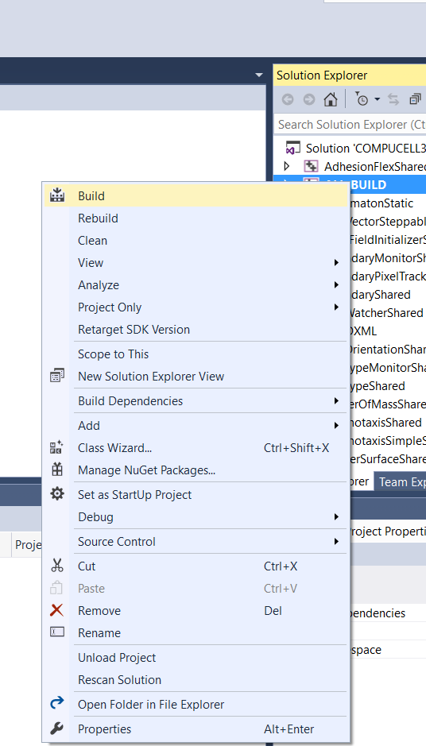
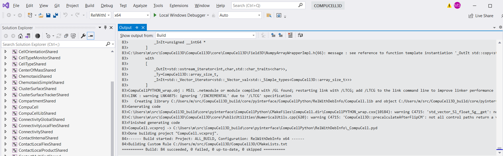
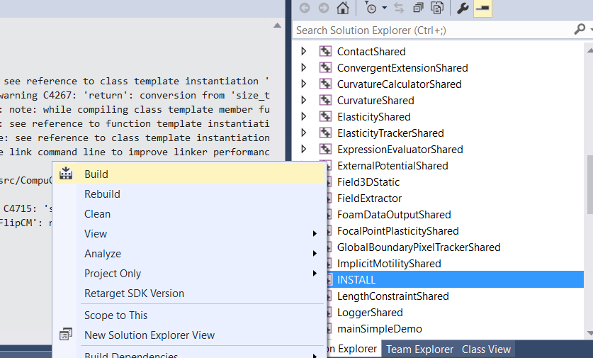
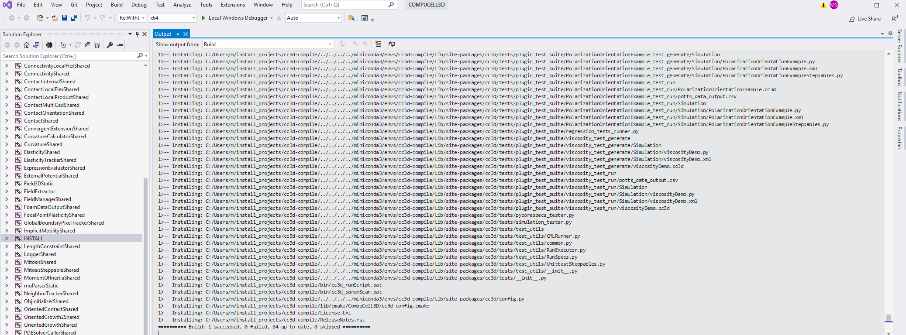

Building CompuCell3D C++ Code
=======================================
In this section we will show you how to set up compilation of CompuCell3D code on various platforms. We will start with windows

.. _My target:

Windows
~~~~~~~~

In order to compile entire CC3D code on Windows (not just the developer zone) you need to install Visual Studio 2015 Community Edition (free). Here is a reference page on how to find the relevant installation bundles. Make sure you use CommunityEdition: https://stackoverflow.com/questions/44290672/how-to-download-visual-studio-community-edition-2015-not-2017

Once you installed Visual Studio 2015 Community Edition (you may need to restart your computer after the installation is finished) you need to install Miniconda3 from heere: https://docs.conda.io/projects/miniconda/en/latest/

Once you install the latest version of Miniconda for your operating system you should install mamba into ``base`` conda environment:

.. code-block:: console

    conda install -c conda-forge mamba

Note, ``-c conda-forge`` points to ``conda-forge`` channel that is one of the most reliable repositories of conda packages.

Next fork CompuCell3D core code repository from https://github.com/CompuCell3D/CompuCell3D. Simply log in to your github account, navigate to the CompuCell3D link and click Fork button in the upper right corner of the page:

|cc3d_cpp_001|

Once you forked the code, go ahead and clone it from your repository (not from CompuCell3D repository).

To clone repository you follow command pattern below:

.. code-block:: console

    cd d:/src/
    git clone git@github.com:<your_github_name>/CompuCell3D.git

Now we are ready to start configuring CompuCell3D build. The entire process of setting up code build for CC3D is based on conda-recipe that we use to build conda packages. It might be worth looking at the content of ``D:/src/CompuCell3D/conda-recipes/`` directory , in particular at the ``D:/src/CompuCell3D/conda-recipes/bld.bat`` file. We will leverage content of this file to construct invocation of the ``cmake`` command that will set up compilation of CompuCell3D in Visual Studio 2015.

.. note::

    I assumed that my forked repository was cloned to ``D:/src/CompuCell3D``. If you cloned it to a different folder you will need to adjust paths accordingly

At this point we need to prepare conda environment that has all dependencies needed to compile CC3D. The main ones include Python and the VTK library, but there are many others so instead of listing them all here, let's leverage conda packages that we use to distribute CompuCell3D.  As a first step let us create a conda environment (let's call it ``cc3d_4413_310`` but you can call it whatever you want) and install into it CompuCell3D 4.4.1

.. code-block::

    conda create -n cc3d_4413_310 python=3.10

next lets activate newly created conda environment:

.. code-block::

    conda activate cc3d_4413_310

and let's install into it CompuCell3D:

.. code-block:: console

    mamba install -c conda-forge -c compucell3d compucell3d=4.4.1

It may take few minutes for all packages to download. Notice, we are now sourcing our packages from two conda package repositories: ``conda-forge`` and ``compucell3d``.

If you pay attention to which packages are being installed with CompuCell3D you may notice that cmake is one of them. This is handy because we will use it to configure CompuCell3D build in Visual Studio using this bundled cmake.

Open up a new file in your editor and paste the following cmake invocation

.. code-block:: batch

    cmake -S d:/src/CompuCell3D/CompuCell3D -B d:/src/CompuCell3D_build -DPython3_EXECUTABLE=c:/miniconda3/envs/cc3d_4413_310/python.exe -DNO_OPENCL=ON  -DBUILD_STANDALONE=OFF -G "Visual Studio 14 2015 Win64" -DCMAKE_INSTALL_PREFIX=D:/install_projects/cc3d_4413_310

Let us explain what each setting/flag means.

``-S`` option allows you to specify the directory that stores and entry CMakeLists.txt file. In my case it is located in ``d:/src/CompuCell3D/CompuCell3D`` where ``d:/src/CompuCell3D`` is a path to repository and inside this folder there is ``CompuCell3D`` subfolder that stores CMakeLists.txt file.

``-B`` option specifies where the build files are written to. The build files include intermediate compiler outputs but also Visual Studio project that we will open in the Visual Studio IDE.

`-G` specifies Cmake generator. CMake can generate project files for multiple IDEs and build system. Here we are specifying ``Visual Studio 14 2015 Win64`` so that CMake can generate VS 2015 project for Win64. You can check which generators are supported by typing

.. code-block:: console

    cmake --help

The next set of options all begin with ``-D``. ``-D`` is used to set variables that are defined in CMakeLists.txt files or that are standard CMake variables. Let's go over those:

``-DPython3_EXECUTABLE=c:/miniconda3/envs/cc3d_4413_310/python.exe`` - here we specify path to python executable. The ``Python3_EXECUTABLE`` is defined inside CMake package that sets up all Python related paths and we need to only specify python executable

``-DNO_OPENCL=ON`` - specifies that we do not want to build GPU diffusion solvers. This is the variable that we introduced ``-DBUILD_STANDALONE=OFF`` - this is legacy flag that determines how the output files will be arranged. If we use ``OFF`` setting plugin steppable and python bindings will be installed into miniconda environment directly. If we switch it to ``ON`` those plugins will be installed into ``D:/install_projects/cc3d_4413_310``. If you are OK with modifying your conda environment - set it to ``OFF`` if not set it to ``ON``. Still not all libraries will be moved to conda environment upon install and you will have to copy libraries (``.dll``) from ``d:/install_projects/cc3d_4413_310/bin/`` to ``c:/miniconda3/envs/cc3d_4413_310/Library/bin/``

.. note::

    You will need to do file copy operation after each compilation follwed by Install step. It is a bit of the inconvenience but we will fix it in the future release

``-DCMAKE_INSTALL_PREFIX=D:/install_projects/cc3d_4413_310`` sets standard CMake variable tha specifies installation directory.

Obviously you may need to adjust paths so that they correspond to your file system layout. If you need a template for the above command here it is:

.. code-block:: console

     cmake -S <PATH TO CompuCell3D REPO>/CompuCell3D -B <dir to store build files> -DPython3_EXECUTABLE=<python executable - from conda environment> -DNO_OPENCL=ON  -DBUILD_STANDALONE=OFF -G "Visual Studio 14 2015 Win64" -DCMAKE_INSTALL_PREFIX=<dir where compiled CompuCell3D will be written to>

After we execute the above command (with paths adjusted to your file system layout) we will get the output that looks something as follows:

.. code-block:: console

    (cc3d_4413_310) D:/src> cmake -S d:/src/CompuCell3D/CompuCell3D -B d:/src/CompuCell3D_build -DPython3_EXECUTABLE=c:/miniconda3/envs/cc3d_4413_310/python.exe -DNO_OPENCL=ON  -DBUILD_STANDALONE=OFF -G "Visual Studio 14 2015 Win64" -DCMAKE_INSTALL_PREFIX=D:/install_projects/cc3d_4413_310
    -- Selecting Windows SDK version 10.0.14393.0 to target Windows 10.0.22621.
    -- The C compiler identification is MSVC 19.0.24215.1
    -- The CXX compiler identification is MSVC 19.0.24215.1
    -- Detecting C compiler ABI info
    -- Detecting C compiler ABI info - done
    -- Check for working C compiler: C:/Program Files (x86)/Microsoft Visual Studio 14.0/VC/bin/x86_amd64/cl.exe - skipped
    -- Detecting C compile features
    -- Detecting C compile features - done
    -- Detecting CXX compiler ABI info
    -- Detecting CXX compiler ABI info - done
    -- Check for working CXX compiler: C:/Program Files (x86)/Microsoft Visual Studio 14.0/VC/bin/x86_amd64/cl.exe - skipped
    -- Detecting CXX compile features
    -- Detecting CXX compile features - done
    -- Found OpenMP_C: -openmp (found version "2.0")
    -- Found OpenMP_CXX: -openmp (found version "2.0")
    -- Found OpenMP: TRUE (found version "2.0")
    openmp c flags -openmp
    openmp cxx flags -openmp
    -- Found Python3: c:/miniconda3/envs/cc3d_4413_310/python.exe (found version "3.10.12") found components: Interpreter Development NumPy Development.Module Development.Embed
    Python3_FOUND: TRUE
    Python3_Interpreter_FOUND: TRUE
    Python3_VERSION: 3.10.12
    Python3_Development_FOUND: TRUE
    Python3_EXECUTABLE: c:/miniconda3/envs/cc3d_4413_310/python.exe
    Python3_Development_FOUND: TRUE
    Python3_INCLUDE_DIRS: C:/miniconda3/envs/cc3d_4413_310/include
    Python3_LIBRARIES: C:/miniconda3/envs/cc3d_4413_310/libs/python310.lib
    Python3_LIBRARY_RELEASE: C:/miniconda3/envs/cc3d_4413_310/libs/python310.lib
    Python3_LIBRARY_DIRS: C:/miniconda3/envs/cc3d_4413_310/libs
    Python3_RUNTIME_LIBRARY_DIRS: C:/miniconda3/envs/cc3d_4413_310
    Python3_NumPy_INCLUDE_DIRS: C:/miniconda3/envs/cc3d_4413_310/Lib/site-packages/numpy/core/include
     THIS IS COMPUCELL3D_BUILD_VERSION 1
    COMPUCELL3D_C_BUILD_VERSION is 1
    GOT VERSION AS 4.4.1
    -- Found ZLIB: C:/miniconda3/envs/cc3d_4413_310/Library/lib/z.lib (found version "1.2.13")
     PUBLIC UTILS OPEN MP FLAG-openmp
    expat library local C:/miniconda3/envs/cc3d_4413_310/Library/lib/expat.lib
    -- D:/src/CompuCell3D/CompuCell3D
    CMake Warning (dev) at core/CompuCell3D/steppables/PDESolvers/FindEigen3.cmake:73:
      Syntax Warning in cmake code at column 35

      Argument not separated from preceding token by whitespace.
    Call Stack (most recent call first):
      core/CompuCell3D/steppables/PDESolvers/CMakeLists.txt:15 (find_package)
    This warning is for project developers.  Use -Wno-dev to suppress it.

    'LOCATEDEIGENAT',C:/miniconda3/envs/cc3d_4413_310/Library/include/Eigen3
    -- Found Eigen3: C:/miniconda3/envs/cc3d_4413_310/Library/include/Eigen3 (Required is at least version "2.91.0")
    -- OpenCL disabled
    OPENMP FLAGS -openmp
    -- Found SWIG: C:/miniconda3/envs/cc3d_4413_310/Library/bin/swig.exe (found version "4.1.1")
    -- Found Python3: c:/miniconda3/envs/cc3d_4413_310/python.exe (found suitable version "3.10.12", minimum required is "3.10") found components: Interpreter Development.Module Development.Embed
    -- Looking for pthread.h
    -- Looking for pthread.h - not found
    -- Found Threads: TRUE
    -- Found GLEW: C:/miniconda3/envs/cc3d_4413_310/Library/lib/glew32.lib
    -- Found OpenGL: opengl32  found components: OpenGL
    -- Found HDF5: hdf5-shared (found version "1.14.2") found components: C HL
    -- Found utf8cpp: C:/miniconda3/envs/cc3d_4413_310/Library/include
    -- Found JsonCpp: C:/miniconda3/envs/cc3d_4413_310/Library/lib/jsoncpp.lib (found suitable version "1.9.5", minimum required is "0.7.0")
    -- Found OGG: C:/miniconda3/envs/cc3d_4413_310/Library/lib/ogg.lib
    -- Found THEORA: C:/miniconda3/envs/cc3d_4413_310/Library/lib/theora.lib
    -- Found NetCDF: C:/miniconda3/envs/cc3d_4413_310/Library/include (found version "4.9.2")
    -- Found LibPROJ: C:/miniconda3/envs/cc3d_4413_310/Library/lib/proj.lib (found version "9.2.1")
    -- Found LibXml2: C:/miniconda3/envs/cc3d_4413_310/Library/lib/xml2.lib (found version "2.11.5")
    -- Found GL2PS: C:/miniconda3/envs/cc3d_4413_310/Library/lib/gl2ps.lib (found suitable version "1.4.2", minimum required is "1.4.2")
    -- Found PNG: C:/miniconda3/envs/cc3d_4413_310/Library/lib/libpng.lib (found version "1.6.39")
    -- Found nlohmann_json: C:/miniconda3/envs/cc3d_4413_310/Library/share/cmake/nlohmann_json/nlohmann_jsonConfig.cmake (found version "3.11.2")
    -- Found SQLite3: C:/miniconda3/envs/cc3d_4413_310/Library/include (found version "3.43.0")
    -- Found Eigen3: C:/miniconda3/envs/cc3d_4413_310/Library/include/eigen3 (found version "3.4.0")
    -- Found EXPAT: C:/miniconda3/envs/cc3d_4413_310/Library/lib/expat.lib (found version "2.5.0")
    -- Found double-conversion: C:/miniconda3/envs/cc3d_4413_310/Library/lib/double-conversion.lib
    -- Found LZ4: C:/miniconda3/envs/cc3d_4413_310/Library/lib/liblz4.lib (found version "1.9.4")
    -- Found LZMA: C:/miniconda3/envs/cc3d_4413_310/Library/lib/liblzma.lib (found version "5.4.2")
    -- Found JPEG: C:/miniconda3/envs/cc3d_4413_310/Library/lib/jpeg.lib (found version "80")
    -- Found TIFF: C:/miniconda3/envs/cc3d_4413_310/Library/lib/tiff.lib (found version "4.5.1")
    -- Found Freetype: C:/miniconda3/envs/cc3d_4413_310/Library/lib/freetype.lib (found version "2.12.1")
    VTK_MAJOR_VERSION=9
    NUMPY_INCLUDE_DIR
    VTK_LIB_DIRS
    THIS IS cc3d_py_source_dir: D:/src/CompuCell3D/CompuCell3D/../cc3d
    USING EXTERNAL PYTHON
    -- Configuring done
    CMake Warning (dev) at compucell3d_cmake_macros.cmake:200 (ADD_LIBRARY):
      Policy CMP0115 is not set: Source file extensions must be explicit.  Run
      "cmake --help-policy CMP0115" for policy details.  Use the cmake_policy
      command to set the policy and suppress this warning.

      File:

        D:/src/CompuCell3D/CompuCell3D/core/CompuCell3D/steppables/PDESolvers/hpppdesolvers.h
    Call Stack (most recent call first):
      core/CompuCell3D/steppables/PDESolvers/CMakeLists.txt:187 (ADD_COMPUCELL3D_STEPPABLE)
    This warning is for project developers.  Use -Wno-dev to suppress it.

    -- Generating done
    -- Build files have been written to: D:/src/CompuCell3D_build

The line ``-- Generating done`` shows ``-- Build files have been written to: D:/src/CompuCell3D_build``.

|cc3d_cpp_002|

At this point we can open the newly generated project in the Visual Studio 2015 IDE and start compilation. In Visual Studio 2015 navigate to ``File->Open...->Project/Solution...``

|cc3d_cpp_003|

and navigate to where VS 2015 files are generated and pick ``ALL_BUILD.vcxproj``

|cc3d_cpp_004|

Once the project is loaded we set compile configration (we choose RelWithDebInfo from the pull-down menu)

|cc3d_cpp_006|

Next, from the ``Solution Explorer`` panel, right-click on ``ALL_BUILD`` and select ``Build`` from context menu

|cc3d_cpp_007|

The compilation will start and after a while (say 10-15 minutes on Windows , much faster on other platforms) you will get compilation completion screen

|cc3d_cpp_008|

Once compilation succeeded, go ahead and install all the libraries to the target dir:

Find ``INSTALL`` subproject in the ``Solution Explorer``, right-click and choose ``Build`` to install all the libraries:

|cc3d_cpp_009|

and if you take a look at teh output screen you will see that some files are installed into ``d:/install_projects/cc3d_4413_310`` and some are written directly into conda environment ``c:/miniconda3/envs/cc3d_4413_310``

|cc3d_cpp_010|

The only thing that remains now is to copy  dlls from ``d:/install_projects/cc3d_4413_310/bin/`` to ``c:/miniconda3/envs/cc3d_4413_310/Library/bin/``

At this point your conda environment will contain binaries that are coming from your compiled version of CompuCell3D.

Using newly compiled binaries with the UI
~~~~~~~~~~~~~~~~~~~~~~~~~~~~~~~~~~~~~~~~~

Follow this guide to setup PyCharm to run the Player and use your newly compiled C++ code:   or :ref:`setting up code <working_on_user_interface#running-ui-from-pycharm>`_

Reference `My target`_.

Reference `running-ui-from-pycharm`_

Reference :doc:`Potts docs <potts>`.

.. |cc3d_cpp_004| image:: images/cc3d_cpp_004.png
    :scale: 50%

