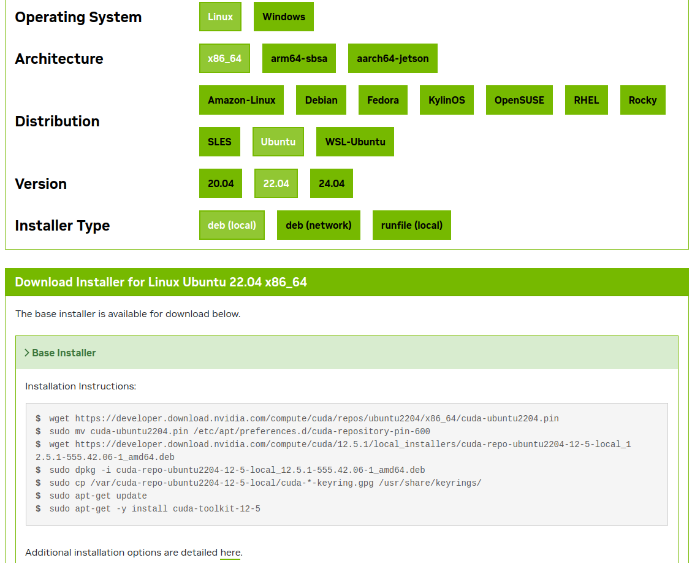

.. _My target:

Linux - Ubuntu
==============

In order to compile entire CC3D code on Linux (not just the developer zone) you need to miniconda. Once you have this tool it will take care of installing all the dependencies you need to to compie CC3D

Follow instructions from Miniconda website:
https://docs.anaconda.com/free/miniconda/

or if you prefer to stay fully open-source you can use Miniforge distribution from :

https://conda-forge.org/download/

Next let's install ``mamba`` which give you much faster package dependency resolution. Open new terminal and tun the following:

.. code-block:: console

    conda install -c conda-forge mamba


Once you have those tools you are ready to create conda environment into which we will install all the libraries and compilers that are needed for CC3D compilation. There are multiple ways to handle the installation of those prerequisites but the easiest one is to use ``environment.yaml`` files where we list all needed packages and provide this file to conda which takes care of installing them.

.. note::

    We will use ``~`` to denote home directory - in my case it resolves to ``/home/m`` but in your case it will most likely be a different folder, however because we are using an universal home folder identified - ``~`` the presented instructions will work on every linux system. We can also refer to home directory using standard linux environment variable $HOME and we will do it ine one of the commands because ``~`` will not always work in all contexts
    This is standard Linux/Unix/OSX convention
    On my computer conda is installed to ``~/miniconda3`` folder but if you are using Miniforge, it will likely be ``~/miniforge3``.
    We will place all git repositories in ``~/src-cc3d``.


First, let's clone CompuCell3D, cc3d-player5 and cc3d-twedit5 git repositories to ``~/src-cc3d``

.. code-block:: console

    mkdir -p ~/src-cc3d
    cd ~/src-cc3d
    git clone https://github.com/CompuCell3D/CompuCell3D.git
    git clone https://github.com/CompuCell3D/cc3d-player5.git
    git clone https://github.com/CompuCell3D/cc3d-twedit5.git


Next, let's create file ``~/src-cc3d/environment.yaml`` with the following content:

.. code-block:: yaml

    channels:
      - conda-forge
      - compucell3d
    dependencies:
     # compile dependencies
      - cmake=3.21
      - swig>=4
      - numpy=2.2.6
      - gcc_linux-64
      - gxx_linux-64
      - python=3.12
      - vtk=9.2
      - eigen
      - tbb-devel=2021
      - boost=1.85
    # libxcrypt dependency was discovered during actual compilation - searched pkgs sub-folders for all occurrences of crypt.h
      - libxcrypt
      - psutil
      - deprecated
      - cc3d-network-solvers>=0.3.1
    # cc3d run dependencies
      - scipy
      - pandas
      - jinja2
      - deprecated
      - psutil
      - simservice
      - notebook
      - ipywidgets
      - ipyvtklink
      - sphinx
      - graphviz
    # player dependencies
      - webcolors
      - requests
      - pyqt=5
      - pyqtgraph
    # twedit dependencies
      - chardet
      - pyqtwebkit
      - qscintilla2
      - pywin32 # [win]


Once we created ``environment.yaml`` let's ``cd`` to ``~/src-cc3d`` and create environment called ``cc3d-compile`` by running the following command:

.. code-block:: console

    cd ~/src-cc3d
    mamba env create -f environment.yaml --name cc3d-compile

The output of of the last command should look something like this

.. code-block:: console

      ...
      + xorg-xf86vidmodeproto                          2.3.1  hb9d3cd8_1005          conda-forge       26kB
      + xorg-xproto                                   7.0.31  hb9d3cd8_1008          conda-forge       73kB
      + xz                                             5.8.1  hbcc6ac9_2             conda-forge       24kB
      + xz-gpl-tools                                   5.8.1  hbcc6ac9_2             conda-forge       34kB
      + xz-tools                                       5.8.1  hb9d3cd8_2             conda-forge       96kB
      + yaml                                           0.2.5  h280c20c_3             conda-forge       85kB
      + yarl                                          1.20.1  py312h178313f_0        conda-forge      149kB
      + zeromq                                         4.3.5  h387f397_9             conda-forge      311kB
      + zipp                                          3.23.0  pyhd8ed1ab_0           conda-forge       23kB
      + zlib                                          1.2.13  h4ab18f5_6             conda-forge       93kB
      + zstandard                                     0.23.0  py312h4c3975b_3        conda-forge      489kB
      + zstd                                           1.5.6  ha6fb4c9_0             conda-forge      555kB

      Summary:

      Install: 400 packages

      Total download: 761MB

    ─────────────────────────────────────────────────────────────────────────────────────────────────────────


    Confirm changes: [Y/n]


    Downloading and Extracting Packages

    Preparing transaction: done
    Verifying transaction: done
    Executing transaction: /
    -
    done
    #
    # To activate this environment, use
    #
    #     $ conda activate cc3d_compile
    #
    # To deactivate an active environment, use
    #
    #     $ conda deactivate


After environment in installed let's activate this environment - as suggested but above printout by running:

.. code-block:: console

    conda activate cc3d-compile


At this point we are ready to configure CompuCell3D for compilation. We will be using CMake.


Let's run the following command:

.. code-block:: console

    cmake -S ~/src-cc3d/CompuCell3D/CompuCell3D -B ~/src-cc3d/CompuCell3D_build -DPython3_EXECUTABLE=$HOME/miniconda3/envs/cc3d-compile/bin/python -DNO_OPENCL=ON  -DBUILD_STANDALONE=OFF -DOPENGL_gl_LIBRARY=/usr/lib/x86_64-linux-gnu/libGL.so -DOPENGL_glx_LIBRARY=/usr/lib/x86_64-linux-gnu/libGLX.so -G "Unix Makefiles" -DCMAKE_INSTALL_PREFIX=~/src-cc3d/CompuCell3D_install

Let's explain command line arguments we used when calling ``cmake`` command


``-S`` - specifies location of the CompUCdl3D source code and the actual C++ code resides indeed  in ``~/src-cc3d/CompuCell3D/CompuCell3D``

``-B`` specifies the location of the temporary compilation files

``-DPython3_EXECUTABLE=`` specifies the location of the python interpreter that points to Python executable inside the conda environment we created (``$HOME/miniconda3/envs/cc3d-compile/bin/python``). Notice, that we had to use ``$HOME/miniconda3/envs/cc3d-compile/bin/python`` because ``~`` would not work in this context


``-DNO_OPENCL=ON `` - is a CC3D-specific setting that tells cmake to skip generating GPU diffusion solvers. Note, the support for OpenCL on OSX is/might be problematic, hence we are using morte conservative setting and skip generation of those solvers

``-DBUILD_STANDALONE=OFF`` - is a CC3D-specific setting that tells cmake to install all python packages to python interpreter directory - i.e. inside ``~/miniconda3/envs/cc3d-compile``

``-DCMAKE_INSTALL_PREFIX=`` - specifies location of installed CompuCell3D binaries

``-DOPENGL_gl_LIBRARY=/usr/lib/x86_64-linux-gnu/libGL.so`` - specifies location of OpenGL libraries

``-DOPENGL_glx_LIBRARY=/usr/lib/x86_64-linux-gnu/libGLX.so`` - - specifies location of OpenGL libraries

``-G "Unix Makefiles"`` instructs cmake to generate unix Makefiles that we will use for compilation of CompuCell3D

.. note::

    The two OpenGL options (``-DOPENGL_gl_LIBRARY=/usr/lib/x86_64-linux-gnu/libGL.so`` and ``-DOPENGL_glx_LIBRARY=/usr/lib/x86_64-linux-gnu/libGLX.so`` ) work only on Ubuntu. If you are compiling CC3D on different distribution e.g RedHat you may need to adjust those. Also if you have a better solution for finding those libraries using Cmake commands please share it with us!


After running the las t command the output should look as follows:

.. code-block:: console

    ...
    -- Found X11: /home/m/miniconda3/envs/cc3d-compile/include
    -- Looking for XOpenDisplay in /home/m/miniconda3/envs/cc3d-compile/lib/libX11.so;/home/m/miniconda3/envs/cc3d-compile/lib/libXext.so
    -- Looking for XOpenDisplay in /home/m/miniconda3/envs/cc3d-compile/lib/libX11.so;/home/m/miniconda3/envs/cc3d-compile/lib/libXext.so - found
    -- Looking for gethostbyname
    -- Looking for gethostbyname - found
    -- Looking for connect
    -- Looking for connect - found
    -- Looking for remove
    -- Looking for remove - found
    -- Looking for shmat
    -- Looking for shmat - found
    -- Looking for IceConnectionNumber in ICE
    -- Looking for IceConnectionNumber in ICE - found
    -- Found EXPAT: /home/m/miniconda3/envs/cc3d-compile/lib/libexpat.so (found version "2.5.0")
    -- Found double-conversion: /home/m/miniconda3/envs/cc3d-compile/lib/libdouble-conversion.so
    -- Found LZ4: /home/m/miniconda3/envs/cc3d-compile/lib/liblz4.so (found version "1.9.4")
    -- Found LZMA: /home/m/miniconda3/envs/cc3d-compile/lib/liblzma.so (found version "5.2.6")
    -- Found JPEG: /home/m/miniconda3/envs/cc3d-compile/lib/libjpeg.so (found version "80")
    -- Found TIFF: /home/m/miniconda3/envs/cc3d-compile/lib/libtiff.so (found version "4.6.0")
    -- Found Freetype: /home/m/miniconda3/envs/cc3d-compile/lib/libfreetype.so (found version "2.12.1")
    VTK_MAJOR_VERSION=9
    NUMPY_INCLUDE_DIR
    VTK_LIB_DIRS
    THIS IS cc3d_py_source_dir: /home/m/src-cc3d/CompuCell3D/CompuCell3D/../cc3d
    USING BUNDLE
    -- Configuring done
    CMake Warning (dev) at compucell3d_cmake_macros.cmake:200 (ADD_LIBRARY):
      Policy CMP0115 is not set: Source file extensions must be explicit.  Run
      "cmake --help-policy CMP0115" for policy details.  Use the cmake_policy
      command to set the policy and suppress this warning.

      File:

        /home/m/src-cc3d/CompuCell3D/CompuCell3D/core/CompuCell3D/steppables/PDESolvers/hpppdesolvers.h
    Call Stack (most recent call first):
      core/CompuCell3D/steppables/PDESolvers/CMakeLists.txt:187 (ADD_COMPUCELL3D_STEPPABLE)
    This warning is for project developers.  Use -Wno-dev to suppress it.

    -- Generating done
    -- Build files have been written to: /home/m/src-cc3d/CompuCell3D_build

In your case the paths will look slightly different but once you see `` -- Generating done`` it means you are ready to compile CC3D

At this point we are ready to compile CC3D:

.. code-block:: console

    cd ~/src-cc3d/CompuCell3D_build
    make -j 8

We are changing to the "build directory" where or cmake, Makefile, and transient compilation files are stored and we are running ``make`` command with 8 parallel compilation threads to speed up the compilation process. The successful compilation printout should look something like that:

.. code-block:: console

    [ 99%] Linking CXX shared module _PlayerPython.so
    [ 99%] Built target PlayerPythonNew
    16 warnings generated.
    [100%] Linking CXX shared module _CompuCell.so
    [100%] Built target CompuCell


After the compilation is done we will call ```make install`

.. code-block:: console

    make install

The installed files will be placed in ``~/src-cc3d/CompuCell3D_install`` , exactly as we specified in the ``cmake`` command - ``-DCMAKE_INSTALL_PREFIX=~/src-cc3d/CompuCell3D_install``


Using Player
-------------

NOw that the compilation is complete all we need to do is to enable the Player by creating a softlink from the cc3d-player5 repository that we cloned earlier to the ``site-packages/cc3d`` folder inside ``cc3d-compile`` conda environment:
  ``~/miniconda3/envs/cc3d-compile/lib/python3.12/site-packages/cc3d/player5``

Simply run the following:

.. code-block:: console

    ln -s ~/src-cc3d/cc3d-player5/cc3d/player5   ~/miniconda3/envs/cc3d-compile/lib/python3.12/site-packages/cc3d/player5


After this step I am ready to run previous simulation using the Player:

.. code-block::

    python -m cc3d.player5

and then we  ``File->Open...`` menu to select any ``.cc3d`` project from the ``Demos`` directory: ``~/src-cc3d/CompuCell3D/CompuCell3D/core/Demos``

Enabling GPU Solvers
--------------------

To enable GPU Solvers on your linux installation of CC3D you need to first make sure you have the right hardware on your machine.
So far, we have tested CC3D with NVidia cards and the instructions we present here assume that you also have one of the
NVidia GPUs. We have used Ubuntu Linux 22.04 to perform all installations but if you are using different version of Linux the
compilation steps should be very simular if not identical

Prerequisite
^^^^^^^^^^^^

Ensure you have correct OpenCL drivers installed. Because we have NVidia hardware we used https://developer.nvidia.com/cuda-downloads
to initiate the downloads for all required NVidia software that also includes OpenCL drivers.

.. note::

    While Ubuntu has packages that provide CUDA and openCL support we prefer to use the latest versions of NVidia software
    and therefore we are downloading packages from NVidia site


After you navigate to https://developer.nvidia.com/cuda-downloads choose linux

|gpu_001|

Next, select architecture, Distribution , Version and Installer Type as appropriate - in our case we selected Linux, x86_64, Ubuntu, 22.04,  deb (local)
and follow the instruction as shown below:

|gpu_002|

At this point you should have all NVidia CUDA and OpenCL drivers installed. To make sure CUDA Toolkit is operational you may run

.. code-block:: console

    nvidia-smi

and you should see the output displaying status of your GPU device:

.. code-block:: console

    -----------------------------------------------------------------------------------------+
    | NVIDIA-SMI 555.42.02              Driver Version: 555.42.02      CUDA Version: 12.5     |
    |-----------------------------------------+------------------------+----------------------+
    | GPU  Name                 Persistence-M | Bus-Id          Disp.A | Volatile Uncorr. ECC |
    | Fan  Temp   Perf          Pwr:Usage/Cap |           Memory-Usage | GPU-Util  Compute M. |
    |                                         |                        |               MIG M. |
    |=========================================+========================+======================|
    |   0  NVIDIA GeForce RTX 3070 ...    Off |   00000000:01:00.0  On |                  N/A |
    | N/A   51C    P8             19W /   80W |     632MiB /   8192MiB |      4%      Default |
    |                                         |                        |                  N/A |
    +-----------------------------------------+------------------------+----------------------+

    +-----------------------------------------------------------------------------------------+
    | Processes:                                                                              |
    |  GPU   GI   CI        PID   Type   Process name                              GPU Memory |
    |        ID   ID                                                               Usage      |
    |=========================================================================================|


At this point we are ready to compile CompuCell3D with the GPU solvers. This process is very similar to the "regular" CC3D compilation
but we need to do one tiny hack to make sure that the correct OpenCL library gets discovered by CMake build system during the build process

Let's first create conda environment we will use for compilation - see beginning of this section for the content of the ``environment.yaml``

.. code-block:: console

    cd ~/src-cc3d
    mamba env create -f environment.yaml --name cc3d_gpu_compile

After the environment gets created we have to manually rename all files  in ``~/miniconda3/envs/cc3d_gpu_compile/lib``
that start with ``libOpenCL`` to start with ``libopenCL-x``

.. code-block:: console

    cd ~/miniconda3/envs/cc3d_gpu_compile/lib
    mv libOpenCL.so libOpenCL-x.so
    mv libOpenCL.so.1 libOpenCL-x.so.1
    mv libOpenCL.so.1.0.0 libOpenCL-x.so.1.0.0

This will ensure that CMake will discover OpenCL libraries that we installed using NVidia CUDA tToolkit rather than those bundled
with the miniconda

Then let's activate newly prepared conda environment:

.. code-block:: console

    conda activate cc3d_gpu_compile

And let's run ``cmake`` to initiate build process

.. code-block:: console

    cmake -S ~/src-cc3d/CompuCell3D/CompuCell3D -B ~/src-cc3d/CompuCell3D_gpu_build -DPython3_EXECUTABLE=$HOME/miniconda3/envs/cc3d_gpu_compile/bin/python -DNO_OPENCL=OFF  -DBUILD_STANDALONE=OFF -DOPENGL_gl_LIBRARY=/usr/lib/x86_64-linux-gnu/libGL.so -DOPENGL_glx_LIBRARY=/usr/lib/x86_64-linux-gnu/libGLX.so -G "Unix Makefiles" -DCMAKE_INSTALL_PREFIX=~/src-cc3d/CompuCell3D_gpu_install

Here is the output of this command:

.. code-block:: console

    (cc3d_gpu_compile) m@m-lap:~/src-cc3d$ cmake -S /home/m/src-cc3d/CompuCell3D/CompuCell3D -B /home/m/src-cc3d/CompuCell3D_gpu_build -DPython3_EXECUTABLE=/home/m/miniconda3/envs/cc3d_gpu_compile/bin/python -DNO_OPENCL=OFF  -DBUILD_STANDALONE=OFF -DOPENGL_gl_LIBRARY=/usr/lib/x86_64-linux-gnu/libGL.so -DOPENGL_glx_LIBRARY=/usr/lib/x86_64-linux-gnu/libGLX.so -G "Unix Makefiles" -DCMAKE_INSTALL_PREFIX=/home/m/src-cc3d/CompuCell3D_gpu_install -DOpenCL_LIBRARIES=/usr/lib/x86_64-linux-gnu/libnvidia-opencl.so.1
    openmp c flags -fopenmp
    openmp cxx flags -fopenmp
    -- Found Python3: /home/m/miniconda3/envs/cc3d_gpu_compile/bin/python (found version "3.10.0") found components: Interpreter Development NumPy Development.Module Development.Embed
    Python3_FOUND: TRUE
    Python3_Interpreter_FOUND: TRUE
    Python3_VERSION: 3.10.0
    Python3_Development_FOUND: TRUE
    Python3_EXECUTABLE: /home/m/miniconda3/envs/cc3d_gpu_compile/bin/python
    Python3_Development_FOUND: TRUE
    Python3_INCLUDE_DIRS: /home/m/miniconda3/envs/cc3d_gpu_compile/include/python3.10
    Python3_LIBRARIES: /home/m/miniconda3/envs/cc3d_gpu_compile/lib/libpython3.10.so
    Python3_LIBRARY_RELEASE: /home/m/miniconda3/envs/cc3d_gpu_compile/lib/libpython3.10.so
    Python3_LIBRARY_DIRS: /home/m/miniconda3/envs/cc3d_gpu_compile/lib
    Python3_RUNTIME_LIBRARY_DIRS: /home/m/miniconda3/envs/cc3d_gpu_compile/lib
    Python3_NumPy_INCLUDE_DIRS: /home/m/miniconda3/envs/cc3d_gpu_compile/lib/python3.10/site-packages/numpy/core/include
    Python3_LIBRARY_DIRS /home/m/miniconda3/envs/cc3d_gpu_compile/lib
    Python3_SABI_LIBRARY_DIRS
    Python3_SITEARCH /home/m/miniconda3/envs/cc3d_gpu_compile/lib/python3.10/site-packages
    PYTHON_BASE_DIR/home/m/miniconda3/envs/cc3d_gpu_compile
     THIS IS COMPUCELL3D_BUILD_VERSION 0
    COMPUCELL3D_C_BUILD_VERSION is 0
    GOT VERSION AS 4.6.0
     PUBLIC UTILS OPEN MP FLAG-fopenmp
    expat library local /home/m/miniconda3/envs/cc3d_gpu_compile/lib/libexpat.so
    -- /home/m/src-cc3d/CompuCell3D/CompuCell3D
    CMake Warning (dev) at core/CompuCell3D/steppables/PDESolvers/FindEigen3.cmake:73:
      Syntax Warning in cmake code at column 35

      Argument not separated from preceding token by whitespace.
    Call Stack (most recent call first):
      core/CompuCell3D/steppables/PDESolvers/CMakeLists.txt:15 (find_package)
    This warning is for project developers.  Use -Wno-dev to suppress it.

    -- /home/m/src-cc3d/CompuCell3D/CompuCell3D/core/Eigen
    -- Looking for OpenCL...
    FOUND OPEN CL
    -- OpenCL headers found at /home/m/miniconda3/envs/cc3d_gpu_compile/include
    -- OpenCL library: /usr/local/cuda/lib64/libOpenCL.so
    OPENMP FLAGS -fopenmp
    -- Found Python3: /home/m/miniconda3/envs/cc3d_gpu_compile/bin/python (found suitable version "3.10.0", minimum required is "3.10") found components: Interpreter Development.Module Development.Embed
    VTK_MAJOR_VERSION=9
    NUMPY_INCLUDE_DIR
    VTK_LIB_DIRS
    THIS IS cc3d_py_source_dir: /home/m/src-cc3d/CompuCell3D/CompuCell3D/../cc3d
    USING EXTERNAL PYTHON
    -- Configuring done
    CMake Warning (dev) at compucell3d_cmake_macros.cmake:200 (ADD_LIBRARY):
      Policy CMP0115 is not set: Source file extensions must be explicit.  Run
      "cmake --help-policy CMP0115" for policy details.  Use the cmake_policy
      command to set the policy and suppress this warning.

      File:

        /home/m/src-cc3d/CompuCell3D/CompuCell3D/core/CompuCell3D/steppables/PDESolvers/hpppdesolvers.h
    Call Stack (most recent call first):
      core/CompuCell3D/steppables/PDESolvers/CMakeLists.txt:187 (ADD_COMPUCELL3D_STEPPABLE)
    This warning is for project developers.  Use -Wno-dev to suppress it.

    -- Generating done
    -- Build files have been written to: /home/m/src-cc3d/CompuCell3D_gpu_build


.. note::

    It may happen that during cmake run command you may get an error about version of the Boost library (which VTK needs).
    In this case you should make a not of the Boost version that is suggested and install it int your environment. For example,
    if cmake output suggests to install boost version ``1.85`` we run the following

    .. code-block:: console

        conda activate cc3d_gpu_compile
        conda install -c conda-forge boost=1.85


    and then repeat ``cmake`` command above.

If we look at the OpenCL section of the output:

.. code-block:: console

    FOUND OPEN CL
    -- OpenCL headers found at /home/m/miniconda3/envs/cc3d_gpu_compile/include
    -- OpenCL library: /usr/local/cuda/lib64/libOpenCL.so


We see that the correct OpenCL library was identified ``/usr/local/cuda/lib64/libOpenCL.so``. If we look closed the ``/usr/local/cuda/lib64/libOpenCL.so`` is a soft-link to ``/usr/local/cuda/lib64/libOpenCL.so``


.. code-block:: console

    (cc3d_gpu_compile) m@m-lap:~/src-cc3d$ ls -la /usr/local/cuda/lib64/libOpenCL.so
    lrwxrwxrwx 1 root root 14 Apr 15 20:57 /usr/local/cuda/lib64/libOpenCL.so -> libOpenCL.so.1


Once cmake prepares CC3D build we go to ``~/src-cc3d/CompuCell3D_gpu_build`` - see last line of the cmake output:

.. code-block:: console

    -- Generating done
    -- Build files have been written to: /home/m/src-cc3d/CompuCell3D_gpu_build

and run make and make install commands:

.. code-block:: console

    cd ~/src-cc3d/CompuCell3D_gpu_build
    make -j 8
    make install

at this point CC3D ith GPU solvers should be ready and if you want player just run

.. code-block:: console

    ln -s ~/src-cc3d/cc3d-player5/cc3d/player5   ~/miniconda3/envs/cc3d_gpu_compile/lib/python3.12/site-packages/cc3d/player5

.. code-block::

    python -m cc3d.player


Benchmarking
^^^^^^^^^^^^

When we run ``SteppableDemos/DiffusionSolverFE_OpenCL/DiffusionSolverFE_OpenCL_3D/DiffusionSolverFE_OpenCL_3D.cc3d`` project
that uses GPU diffusion solver for 100 MCS here is the benchmarking report

.. code-block:: console

                Total Steppable Time:        0.00 ( 0.0%)
    Compiled Code (C++) Run Time:        1.44 (70.3%)
                      Other Time:        0.61 (29.6%)

Running the same simulation but without GPU acceleration gives the following runtime:

.. code-block:: console

            Total Steppable Time:        0.00 ( 0.0%)
    Compiled Code (C++) Run Time:       28.84 (98.0%)
                      Other Time:        0.60 ( 2.0%

As we can see we get approx 20x speedup for the diffusion constant of ``1.0`` . the speedups are greater for larger diffusion constants but in general the larger diffusion constant the longer the solver will run regardless if it is GPU or CPU solver

Even if we try using CPU multiprocessign by adding the following stub to ``SteppableDemos/DiffusionSolverFE_OpenCL/DiffusionSolverFE_OpenCL_3D/DiffusionSolverFE_OpenCL_3D/DiffusionSolverFE_OpenCL_3D.xml``

.. code-block:: xml

     <Metadata>
       <NumberOfProcessors>16</NumberOfProcessors>
       <NonParallelModule Name="Potts"/>
    </Metadata>

We still are getting slower performance that with the GPU but significantly faster than with just a single CPU:

.. code-block:: console

            Total Steppable Time:        0.00 ( 0.0%)
    Compiled Code (C++) Run Time:        6.39 (91.4%)
                      Other Time:        0.60 ( 8.6%)


In general, when benchmarking it is a good idea to keep those comparisons as fair as possible. We know that the power of GPU comes from many computational cores so, in that spirit, it seems fair to compare massively-multi-core GPU with multi-CPU implementation of a given algorithm - in this case the diffusion solver. As we have shown above, while GPU results in much shorter run-times than CPU, the performance gap can be narrowed by using multiple CPUs.


