.. _My target:

Windows
=======

In order to compile entire CC3D code on Windows (not just the developer zone) you need to install Visual Studio 2015 Community Edition (free). Here is a reference page on how to find the relevant installation bundles. Make sure you use CommunityEdition: https://stackoverflow.com/questions/44290672/how-to-download-visual-studio-community-edition-2015-not-2017

You can also install Visual Studio 2019 from Microsoft Store. Both of those frameworks should work fine when it comes to compilation of CC3D code. One thing to remember that is you want to recompile the code it is often a good idea to close and reopen Visual Studio because otherwise compilations may take a long time and your IDE may even freeze - no matter how fast your computer is. If you are using Visual Studio 2026, see :ref:`visual_studio_2026_windows_build`.

|cc3d_cpp_001a|

Once you installed Visual Studio 2015 Community Edition or Visual Studio 2019 Community Edition  (you may need to restart your computer after the installation is finished) you need to install Miniconda3 from heere: https://docs.conda.io/projects/miniconda/en/latest/

Once you install the latest version of Miniconda for your operating system you should install mamba into ``base`` conda environment:

.. code-block:: console

    conda install -c conda-forge mamba

Note, ``-c conda-forge`` points to ``conda-forge`` channel that is one of the most reliable repositories of conda packages.

.. note::

    If you have CompuCell3D installed on your Computer. you may want to temporarily move it to a different folder to avoid clashes with conda installed inside CompuCell3D folder. Use either windows explorer or if you prefer to use command line (Win + R → cmd → Enter) run the following

    .. code-block:: console

        ren "C:\CompuCell3D" "CompuCell3D_1"

Let's start by cloning CompuCell3D repository. To do so, we run the following commands

.. code-block:: console

    cd %USERPROFILE%
    mkdir src
    cd src
    git clone https://github.com/CompuCell3D/CompuCell3D.git

At this point you should have the entire CompuCell3D repository stored inside ``src`` directory located in your home folder - we use standard windows environment variable to refer to home folder ``%USERPROFILE%``

.. note::

    If you would like to develop custom CompuCell3D module that you would like to contribute to CompuCell3D repository, you might want to fork CompuCell3D repository to your github account and do all the work there. Once you are done, you would open pull request from your fork of CompuCell3D repository to official CompuCell3d repository hosted by us.
    To fork CompuCell3D core code repository from https://github.com/CompuCell3D/CompuCell3D,  simply log in to your github account, navigate to the CompuCell3D link and click Fork button in the upper right corner of the page:

    |cc3d_cpp_001|

    Once you forked the code, go ahead and clone it from your repository (not from CompuCell3D repository).

    To clone repository you follow command pattern below:

    .. code-block:: console

        cd %USERPROFILE%
        mkdir src
        cd src
        git clone git@github.com:<your_github_name>/CompuCell3D.git

Now we are ready to start configuring CompuCell3D build. The entire process of setting up code build for CC3D is based on conda-recipe that we use to build conda packages. It might be worth looking at the content of ``%USERPROFILE%/src/CompuCell3D/conda-recipes/`` directory , in particular at the ``%USERPROFILE%/src/CompuCell3D/conda-recipes/bld.bat`` file. We will leverage content of this file to construct invocation of the ``cmake`` command that will set up compilation of CompuCell3D in Visual Studio 2019.

.. note::

    I assume that CompuCell3D repository was cloned to ``%USERPROFILE%/src/CompuCell3D``. If you cloned it to a different folder you will need to adjust paths accordingly

At this point we need to prepare conda environment that has all dependencies needed to compile CC3D. The main ones include Python and the VTK library, but there are many others so instead of listing them all here, let's leverage conda packages that we use to distribute CompuCell3D. Those key packages that are required to compile CC3D are stored in the conda environment file below. Copy the content of this file ave it as env310.yaml. I saved mine to ``%USERPROFILE%/src/env-cc3d.yaml``

.. code-block:: yaml

    name: cc3d-compile
    channels:
      - conda-forge
      - compucell3d
    dependencies:
      - python=3.12
      - numpy=2.2.6
      - vtk=9.2
      - eigen>=3.4,<3.5
      - tbb-devel=2021
      - boost=1.85
      - cmake=3.28
      - swig=4
      - psutil
      - deprecated
      - cc3d-network-solvers>=0.3.1
      - scipy
      - pandas
      - jinja2
      - lxml
      - simservice
      - notebook
      - ipywidgets
      - ipyvtklink
      - sphinx
      - graphviz
      - qscintilla2
      - webcolors
      - requests
      - pyqt=5
      - pyqtgraph
      - pyqtwebkit
      - chardet
      - fipy

Notice, the first line ``name: cc3d-compile`` specifies the name oft the conda environment this file will create - it will be called ``cc3d-compile``

Next two lines specify conda channels (repositories) from which the packages listed in the file will be downloaded from

.. code-block:: yaml

    channels:
      - conda-forge
      - compucell3d

Here we list conda packages repositories. conda-forge is by far the most popular and package-rich conda package repository and compucell3d is the repository that stores dependencies needed to install or build compucell3d. The ``dependencies`` section lists all packages needed to build core C++ Compucell3D code. Notice, we specify particular Python version ``3.12`` . It is important to know which version of Python you are building packages for otherwise you may see unexpected runtime surprises so always pay attention to nuances like this.

Let's use this file to actually create conda environment. Open miniconda console and run the following command:

.. code-block:: console

    cd %USERPROFILE%/src
    mamba env create -f %USERPROFILE%/src/env-cc3d.yaml

the terminal output will look similar to the one below:

|cc3d_cpp_001b|

and after everything is installed we will get the prompt to activate newly created conda environment conda

|cc3d_cpp_001c|

.. note::

    if you are having troubles running mamba - for example if you get permission error you may need to perform conda creation in the Administrator mode or adjust permissions for your entire miniconda installation

Let's activate the newly created conda environment (from now on you should be able to use regular console, not the one that runs in the Administrator mode). 
This works best if you run from a Visual Studio developer command prompt such as *x64 Native Tools Command Prompt for VS 2019* as opposed to the Miniforge or Miniconda prompt. 

.. code-block:: console

    conda activate cc3d-compile

We are ready to call ``cmake`` to configure CC3D C++ code compilation. 
Open up a new file in your editor and paste the following cmake invocation. If you are using Visual Studio 2019 (recommended version) the code snippet looks as follows:

.. code-block:: batch

    cmake -S %USERPROFILE%/src/CompuCell3D/CompuCell3D -B %USERPROFILE%/src/CompuCell3D_build -DPython3_EXECUTABLE=c:\miniconda3\envs\cc3d-compile\python.exe -DNO_OPENCL=ON  -DBUILD_STANDALONE=OFF -G "Visual Studio 16 2019" -DCMAKE_INSTALL_PREFIX=%USERPROFILE%/install_projects/cc3d-compile

For Visual Studio 2015 you would use

.. code-block:: batch

    cmake -S %USERPROFILE%/src/CompuCell3D/CompuCell3D -B %USERPROFILE%/src/CompuCell3D_build -DPython3_EXECUTABLE=c:\miniconda3\envs\cc3d-compile\python.exe -DNO_OPENCL=ON  -DBUILD_STANDALONE=OFF -G "Visual Studio 14 2015 Win64" -DCMAKE_INSTALL_PREFIX=%USERPROFILE%/install_projects/cc3d-compile

For Visual Studio 2026 you should use the updated conda environment and generator described in :ref:`visual_studio_2026_windows_build`.

the difference is for the ``-G`` option. Let's see below what each option means

**GPU Solvers**

If you would like to enable GPU solvers we recommend that you use Visual Studio 2019 and the cmake command would look as follows

.. code-block:: batch

    cmake -S %USERPROFILE%/src/CompuCell3D/CompuCell3D -B %USERPROFILE%/src/CompuCell3D_build -DPython3_EXECUTABLE=c:\miniconda3\envs\cc3d-compile\python.exe -DNO_OPENCL=OFF  -DBUILD_STANDALONE=OFF -G "Visual Studio 16 2019" -DCMAKE_INSTALL_PREFIX=%USERPROFILE%/install_projects/cc3d-compile

The only difference here is the ``-DNO_OPENCL=OFF`` option that tells Cmake system to include OpenCL modules.

.. note::

    In order for GPU solvers to work you need to have a computer with a GPU and install GPU Toolkit.
    For example if you have a computer with NVidia RTX 30x0 or 40x0 card you would install Nvidia CUDA toolkit
    and this would be sufficient to get your GPU solvers compiled and running on your machine. Simply navigate to
    https://developer.nvidia.com/cuda-downloads:

    |gpu_001|

    select Windows and fill the details for Architecture, Version and Installer Type of your Windows -
    in our case we selected windows, x86_64, 11, exe (local) and follow the instruction given on the download page

    |gpu_002|

Let us explain what each setting/flag means.

``-S`` option allows you to specify the directory that stores and entry CMakeLists.txt file. In my case it is located in ``%USERPROFILE%\src\CompuCell3D\CompuCell3D`` where ``%USERPROFILE%\src\CompuCell3D`` is a path to repository and inside this folder there is ``CompuCell3D`` subfolder that stores CMakeLists.txt file.

``-B`` option specifies where the build files are written to. The build files include intermediate compiler outputs but also Visual Studio project that we will open in the Visual Studio IDE.

``-G`` specifies Cmake generator. CMake can generate project files for multiple IDEs and build system. Here we are specifying ``Visual Studio 14 2015 Win64`` so that CMake can generate VS 2015 project for Win64. For Visual Studio 2019 you use ``Visual Studio 16 2019`` . To get the list of all available Cmake generators type the following:

.. code-block:: console

    cmake --help

The next set of options all begin with ``-D``. ``-D`` is used to set variables that are defined in CMakeLists.txt files or that are standard CMake variables. Let's go over those:

``-DPython3_EXECUTABLE=c:\miniconda3\envs\cc3d-compile\python.exe`` - here we specify path to python executable. The ``Python3_EXECUTABLE`` is defined inside CMake package that sets up all Python related paths and we need to only specify python executable

``-DNO_OPENCL=ON`` - specifies that we do not want to build GPU diffusion solvers. Change it to ``OFF`` and the we you will build GPU solvers.

``-DBUILD_STANDALONE=OFF`` - this is a flag that determines how the output files will be arranged. If we use ``OFF`` setting plugin steppable and python bindings will be installed into miniconda environment directly - this is the recommended approach.

.. note::

    You will need to do file copy operation after each compilation followed by Install step. It is a bit of the inconvenience but we will fix it in the future release

``-DCMAKE_INSTALL_PREFIX=%USERPROFILE%\install_projects\cc3d-compile`` sets standard CMake variable tha specifies installation directory.

Obviously you may need to adjust paths so that they correspond to your file system layout. If you need a template for the above command here it is:

.. code-block:: console

     cmake -S <PATH TO CompuCell3D REPO>\CompuCell3D -B <dir to store build files> -DPython3_EXECUTABLE=<python executable - from conda environment> -DNO_OPENCL=ON  -DBUILD_STANDALONE=OFF -G "Visual Studio 16 2019" -DCMAKE_INSTALL_PREFIX=<dir where compiled CompuCell3D will be written to>

After we execute the above command (with paths adjusted to your file system layout) we will get the output that looks something as follows:

.. code-block:: console

    (cc3d-compile) C:\Users\m\src>cmake -S %USERPROFILE%/src/CompuCell3D/CompuCell3D -B %USERPROFILE%/src/CompuCell3D_build -DPython3_EXECUTABLE=c:\miniconda3\envs\cc3d-compile\python.exe -DNO_OPENCL=ON  -DBUILD_STANDALONE=OFF -G "Visual Studio 16 2019" -DCMAKE_INSTALL_PREFIX=%USERPROFILE%/install_projects/cc3d-compile
    -- Selecting Windows SDK version 10.0.19041.0 to target Windows 10.0.26100.
    -- The C compiler identification is MSVC 19.29.30157.0
    -- The CXX compiler identification is MSVC 19.29.30157.0
    -- Detecting C compiler ABI info
    -- Detecting C compiler ABI info - done
    -- Check for working C compiler: C:/Program Files (x86)/Microsoft Visual Studio/2019/Community/VC/Tools/MSVC/14.29.30133/bin/Hostx64/x64/cl.exe - skipped
    -- Detecting C compile features
    -- Detecting C compile features - done
    -- Detecting CXX compiler ABI info
    -- Detecting CXX compiler ABI info - done
    -- Check for working CXX compiler: C:/Program Files (x86)/Microsoft Visual Studio/2019/Community/VC/Tools/MSVC/14.29.30133/bin/Hostx64/x64/cl.exe - skipped
    -- Detecting CXX compile features
    -- Detecting CXX compile features - done
    -- Found OpenMP_C: -openmp (found version "2.0")
    -- Found OpenMP_CXX: -openmp (found version "2.0")
    -- Found OpenMP: TRUE (found version "2.0")
    openmp c flags -openmp
    openmp cxx flags -openmp
    -- Found Python3: c:\miniconda3\envs\cc3d-compile\python.exe (found version "3.12.2") found components: Interpreter Development NumPy Development.Module Development.Embed
    Python3_FOUND: TRUE
    Python3_Interpreter_FOUND: TRUE
    Python3_VERSION: 3.12.2
    Python3_Development_FOUND: TRUE
    Python3_EXECUTABLE: c:\miniconda3\envs\cc3d-compile\python.exe
    Python3_Development_FOUND: TRUE
    Python3_INCLUDE_DIRS: C:/miniconda3/envs/cc3d-compile/include
    Python3_LIBRARIES: C:/miniconda3/envs/cc3d-compile/libs/python312.lib
    Python3_LIBRARY_RELEASE: C:/miniconda3/envs/cc3d-compile/libs/python312.lib
    Python3_LIBRARY_DIRS: C:/miniconda3/envs/cc3d-compile/libs
    Python3_RUNTIME_LIBRARY_DIRS: C:/miniconda3/envs/cc3d-compile
    Python3_NumPy_INCLUDE_DIRS: C:/miniconda3/envs/cc3d-compile/Lib/site-packages/numpy/_core/include
    Python3_LIBRARY_DIRS C:/miniconda3/envs/cc3d-compile/libs
    Python3_SABI_LIBRARY_DIRS
    Python3_SITEARCH c:\miniconda3\envs\cc3d-compile\Lib\site-packages
    PYTHON_BASE_DIRc:/miniconda3/envs/cc3d-compile
     THIS IS COMPUCELL3D_BUILD_VERSION 0
    COMPUCELL3D_C_BUILD_VERSION is 0
    GOT VERSION AS 4.7.0
    -- Found ZLIB: C:/miniconda3/envs/cc3d-compile/Library/lib/z.lib (found version "1.3.1")
     PUBLIC UTILS OPEN MP FLAG-openmp
    expat library local C:/miniconda3/envs/cc3d-compile/Library/lib/expat.lib
    -- C:/Users/m/src/CompuCell3D/CompuCell3D
    CMake Warning (dev) at core/CompuCell3D/steppables/PDESolvers/FindEigen3.cmake:73:
      Syntax Warning in cmake code at column 35

      Argument not separated from preceding token by whitespace.
    Call Stack (most recent call first):
      core/CompuCell3D/steppables/PDESolvers/CMakeLists.txt:15 (find_package)
    This warning is for project developers.  Use -Wno-dev to suppress it.

    'LOCATEDEIGENAT',C:/miniconda3/envs/cc3d-compile/Library/include/Eigen3
    -- Found Eigen3: C:/miniconda3/envs/cc3d-compile/Library/include/Eigen3 (Required is at least version "2.91.0")
    -- OpenCL disabled
    OPENMP FLAGS -openmp
    -- Found SWIG: C:/miniconda3/envs/cc3d-compile/Library/bin/swig.exe (found version "4.3.1")
    -- Found Python3: c:\miniconda3\envs\cc3d-compile\python.exe (found suitable version "3.12.2", minimum required is "3.12") found components: Interpreter Development.Module Development.Embed
    -- Performing Test CMAKE_HAVE_LIBC_PTHREAD
    -- Performing Test CMAKE_HAVE_LIBC_PTHREAD - Failed
    -- Looking for pthread_create in pthreads
    -- Looking for pthread_create in pthreads - not found
    -- Looking for pthread_create in pthread
    -- Looking for pthread_create in pthread - not found
    -- Found Threads: TRUE
    -- Found GLEW: C:/miniconda3/envs/cc3d-compile/Library/lib/glew32.lib
    -- Found OpenGL: opengl32  found components: OpenGL
    -- Found HDF5: hdf5-shared (found version "1.14.3") found components: C HL
    -- Found utf8cpp: C:/miniconda3/envs/cc3d-compile/Library/include
    -- Found JsonCpp: C:/miniconda3/envs/cc3d-compile/Library/lib/jsoncpp.lib (found suitable version "1.9.5", minimum required is "0.7.0")
    -- Found OGG: C:/miniconda3/envs/cc3d-compile/Library/lib/ogg.lib
    -- Found THEORA: C:/miniconda3/envs/cc3d-compile/Library/lib/theora.lib
    -- Found NetCDF: C:/miniconda3/envs/cc3d-compile/Library/include (found version "4.9.2")
    -- Found LibPROJ: C:/miniconda3/envs/cc3d-compile/Library/lib/proj.lib (found version "9.3.1")
    -- Found LibXml2: C:/miniconda3/envs/cc3d-compile/Library/lib/xml2.lib (found version "2.13.8")
    -- Found GL2PS: C:/miniconda3/envs/cc3d-compile/Library/lib/gl2ps.lib (found suitable version "1.4.2", minimum required is "1.4.2")
    -- Found PNG: C:/miniconda3/envs/cc3d-compile/Library/lib/libpng.lib (found version "1.6.50")
    -- Found nlohmann_json: C:/miniconda3/envs/cc3d-compile/Library/share/cmake/nlohmann_json/nlohmann_jsonConfig.cmake (found version "3.12.0")
    -- Found SQLite3: C:/miniconda3/envs/cc3d-compile/Library/include (found version "3.50.4")
    -- Found Eigen3: C:/miniconda3/envs/cc3d-compile/Library/include/eigen3 (found version "3.4.0")
    -- Found EXPAT: C:/miniconda3/envs/cc3d-compile/Library/lib/expat.lib (found version "2.5.0")
    -- Found double-conversion: C:/miniconda3/envs/cc3d-compile/Library/lib/double-conversion.lib
    -- Found LZ4: C:/miniconda3/envs/cc3d-compile/Library/lib/liblz4.lib (found version "1.9.4")
    -- Found LZMA: C:/miniconda3/envs/cc3d-compile/Library/lib/lzma.lib (found version "5.8.1")
    -- Found JPEG: C:/miniconda3/envs/cc3d-compile/Library/lib/jpeg.lib (found version "80")
    -- Found TIFF:  (found version "4.7.1")
    -- Found Freetype: C:/miniconda3/envs/cc3d-compile/Library/lib/freetype.lib (found version "2.14.1")
    VTK_MAJOR_VERSION=9
    NUMPY_INCLUDE_DIR
    VTK_LIB_DIRS
    THIS IS cc3d_py_source_dir: C:/Users/m/src/CompuCell3D/CompuCell3D/../cc3d
    USING EXTERNAL PYTHON
    -- Configuring done (19.8s)
    CMake Warning (dev) at compucell3d_cmake_macros.cmake:200 (ADD_LIBRARY):
      Policy CMP0115 is not set: Source file extensions must be explicit.  Run
      "cmake --help-policy CMP0115" for policy details.  Use the cmake_policy
      command to set the policy and suppress this warning.

      File:

        C:/Users/m/src/CompuCell3D/CompuCell3D/core/CompuCell3D/steppables/PDESolvers/hpppdesolvers.h
    Call Stack (most recent call first):
      core/CompuCell3D/steppables/PDESolvers/CMakeLists.txt:187 (ADD_COMPUCELL3D_STEPPABLE)
    This warning is for project developers.  Use -Wno-dev to suppress it.

    -- Generating done (1.6s)
    -- Build files have been written to: C:/Users/m/src/CompuCell3D_build

The line ``-- Generating done`` shows ``-- Build files have been written to:  C:/Users/m/src/CompuCell3D_build``.

|cc3d_cpp_002|

At this point we can open the newly generated project in the Visual Studio 2015 IDE and start compilation. In Visual Studio 2015 navigate to ``File->Open...->Project/Solution...``

|cc3d_cpp_003|

and navigate to where VS 2015 files are generated and pick ``ALL_BUILD.vcxproj``

|cc3d_cpp_004|

Once the project is loaded we set compile configration (we choose ``Release`` from the pull-down menu). ``RelWithDebInfo`` may work as well but occasionally you may get compilation or run-time errors.

|cc3d_cpp_006|

Next, from the ``Solution Explorer`` panel, right-click on ``ALL_BUILD`` and select ``Build`` from context menu

|cc3d_cpp_007|

The compilation will start and after a while (say 10-15 minutes on Windows , much faster on other platforms) you will get compilation completion screen

|cc3d_cpp_008|

Once compilation succeeded, go ahead and install all the libraries to the target dir:

Find ``INSTALL`` subproject in the ``Solution Explorer``, right-click and choose ``Build`` to install all the libraries:

|cc3d_cpp_009|

and if you take a look at the output screen you will see that some files are installed into ``c:\Users\m\install_projects\cc3d-compile`` and some are written directly into conda environment ``c:\miniconda3\envs\cc3d-compile``

|cc3d_cpp_010|

.. note::

    If you are getting permission issues during installation , you may need to allow write permissions for conda ``C:/miniconda3/envs/cc3d-compile`` folder.

At this point your newly compiled CC3D should be ready to use

Manually installing Player and Twedit ++
~~~~~~~~~~~~~~~~~~~~~~~~~~~~~~~~~~~~~~~~~

Once you installed CC3D to miniconda environment ``cc3d_4413_310`` all that you need to get Player and Twedit working with yor new environment is
to clone those repos

.. code-block:: console

    cd %USERPROFILE%\src
    git clone https://github.com/CompuCell3D/cc3d-player5.git
    git clone https://github.com/CompuCell3D/cc3d-twedit5.git

and copy ``%USERPROFILE%\src\cc3d-player5\cc3d\player5`` folder to ``c:\miniconda3\envs\cc3d-compile\Lib\site-packages\cc3d\player5\``. Similarly, copy
and copy ``%USERPROFILE%\src\cc3d-player5\cc3d\player5`` folder to ``c:\miniconda3\envs\cc3d-compile\Lib\site-packages\cc3d\player5\``. Similarly, copy
``%USERPROFILE%\src\cc3d-twedit5\cc3d\twedit5`` folder to ``c:\miniconda3\envs\cc3d-compile\Lib\site-packages\cc3d\twedit5\``

To copy, run those commands

.. code-block:: console

    xcopy "%USERPROFILE%\src\cc3d-player5\cc3d\player5" "C:\miniconda3\envs\cc3d-compile\Lib\site-packages\cc3d\player5" /E /I /Y

    xcopy "%USERPROFILE%\src\cc3d-twedit5\cc3d\twedit5" "C:\miniconda3\envs\cc3d-compile\Lib\site-packages\cc3d\twedit5" /E /I /Y

.. _running-newly-compiled-cc3d:

Running Newly Compiled CC3D
~~~~~~~~~~~~~~~~~~~~~~~~~~~

At this point you can open Player or Twedit through Miniconda prompt (make sure you are still in the cc3d-compile environment)

.. code-block:: console

    conda activate cc3d-compile
    python -m cc3d.player5

Using newly compiled binaries with the UI
~~~~~~~~~~~~~~~~~~~~~~~~~~~~~~~~~~~~~~~~~

Follow this guide to setup PyCharm to run the Player and use your newly compiled C++ code  - :doc:`Running Player and Twedit++ from PyCharm <working_on_user_interface>`.

.. _visual_studio_2026_windows_build:

Visual Studio 2026
~~~~~~~~~~~~~~~~~~

The workflow for Visual Studio 2026 is very similar to the Visual Studio 2019 workflow described above. The main differences are the conda environment definition and the CMake generator. As before, we assume that your CompuCell3D repository is located in ``%USERPROFILE%/src/CompuCell3D``. If you use a different location, adjust the paths accordingly.

.. note::

    Support for Visual Studio 2026 is experimental. We tested this workflow and it works, but it requires a conda environment with different versions of some packages:  ``cmake=4.2.3``, ``vtk=9.3.1``, and ``boost=1.85``. We found that creating this environment using the shorter recipe style shown earlier may not work reliably, so below we provide a complete environment blueprint. This is the main reason we currently treat Visual Studio 2026 compilation support as experimental.

To keep this setup separate from the Visual Studio 2019 build, create a new environment file, for example ``%USERPROFILE%/src/env-cc3d-2026.yaml``, with the following content:

.. code-block:: yaml

    name: cc3d-compile-2026
    channels:
      - conda-forge
      - compucell3d
    dependencies:
      - _python_abi3_support=1.0=hd8ed1ab_2
      - aiohappyeyeballs=2.6.1=pyhd8ed1ab_0
      - aiohttp=3.13.5=py312h6b91d65_0
      - aiosignal=1.4.0=pyhd8ed1ab_0
      - alabaster=1.0.0=pyhd8ed1ab_1
      - annotated-doc=0.0.4=pyhcf101f3_0
      - anyio=4.13.0=pyhcf101f3_0
      - aom=3.9.1=he0c23c2_0
      - argon2-cffi=25.1.0=pyhd8ed1ab_0
      - argon2-cffi-bindings=25.1.0=py312he06e257_2
      - arrow=1.4.0=pyhcf101f3_0
      - asttokens=3.0.1=pyhd8ed1ab_0
      - async-lru=2.3.0=pyhcf101f3_0
      - attrs=26.1.0=pyhcf101f3_0
      - babel=2.18.0=pyhcf101f3_1
      - backports.zstd=1.3.0=py312h06d0912_0
      - beautifulsoup4=4.14.3=pyha770c72_0
      - bleach=6.3.0=pyhcf101f3_1
      - bleach-with-css=6.3.0=hbca2aae_1
      - blosc=1.21.6=h85f69ea_0
      - boost=1.85.0=h7e22eef_4
      - brotli=1.2.0=h2d644bc_1
      - brotli-bin=1.2.0=hfd05255_1
      - brotli-python=1.2.0=py312hc6d9e41_1
      - bzip2=1.0.8=h0ad9c76_9
      - ca-certificates=2026.4.22=h4c7d964_0
      - cached-property=1.5.2=hd8ed1ab_1
      - cached_property=1.5.2=pyha770c72_1
      - cairo=1.18.0=h91e5215_2
      - cc3d-network-solvers=0.3.1=py312h1d48e73_2
      - cc3dext_maboss=0.3.0=py312h0a80cce_1
      - certifi=2026.4.22=pyhd8ed1ab_0
      - cffi=2.0.0=py312he06e257_1
      - chardet=7.4.3=pyhcf101f3_0
      - charset-normalizer=3.4.7=pyhd8ed1ab_0
      - click=8.3.2=pyh6dadd2b_0
      - cmake=4.2.3=hdcbee5b_1
      - colorama=0.4.6=pyhd8ed1ab_1
      - comm=0.2.3=pyhe01879c_0
      - contourpy=1.3.3=py312h78d62e6_4
      - cpython=3.12.13=py312hd8ed1ab_0
      - cycler=0.12.1=pyhcf101f3_2
      - dav1d=1.2.1=hcfcfb64_0
      - debugpy=1.8.20=py312ha1a9051_0
      - decorator=5.2.1=pyhd8ed1ab_0
      - defusedxml=0.7.1=pyhd8ed1ab_0
      - deprecated=1.3.1=pyhd8ed1ab_1
      - docutils=0.22.4=pyhd8ed1ab_0
      - double-conversion=3.3.1=he0c23c2_0
      - eigen=3.4.0=h5112557_2
      - exceptiongroup=1.3.1=pyhd8ed1ab_0
      - executing=2.2.1=pyhd8ed1ab_0
      - expat=2.7.5=hac47afa_0
      - ffmpeg=6.1.2=gpl_h9673905_705
      - fipy=4.0.2=pyhd8ed1ab_0
      - font-ttf-dejavu-sans-mono=2.37=hab24e00_0
      - font-ttf-inconsolata=3.000=h77eed37_0
      - font-ttf-source-code-pro=2.038=h77eed37_0
      - font-ttf-ubuntu=0.83=h77eed37_3
      - fontconfig=2.14.2=hbde0cde_0
      - fonts-conda-ecosystem=1=0
      - fonts-conda-forge=1=hc364b38_1
      - fonttools=4.62.1=py312h05f76fc_0
      - fqdn=1.5.1=pyhd8ed1ab_1
      - freetype=2.14.3=h57928b3_0
      - fribidi=1.0.16=hfd05255_0
      - frozenlist=1.7.0=py312hfdf67e6_0
      - getopt-win32=0.1=h6a83c73_3
      - gl2ps=1.4.2=h26c196c_2
      - glew=2.1.0=h39d44d4_2
      - glib=2.80.2=h0df6a38_0
      - glib-tools=2.80.2=h2f9d560_0
      - graphite2=1.3.14=hac47afa_2
      - graphviz=9.0.0=h51cb2cd_1
      - gst-plugins-base=1.24.5=hb0a98b8_0
      - gstreamer=1.24.5=h5006eae_0
      - gts=0.7.6=h6b5321d_4
      - h11=0.16.0=pyhcf101f3_1
      - h2=4.3.0=pyhcf101f3_0
      - harfbuzz=9.0.0=h81778c3_0
      - hdf4=4.2.15=h5557f11_7
      - hdf5=1.14.3=nompi_hb2c4d47_109
      - hpack=4.1.0=pyhd8ed1ab_0
      - httpcore=1.0.9=pyh29332c3_0
      - httpx=0.28.1=pyhd8ed1ab_0
      - hyperframe=6.1.0=pyhd8ed1ab_0
      - icu=73.2=h63175ca_0
      - idna=3.13=pyhcf101f3_0
      - imagesize=2.0.0=pyhd8ed1ab_0
      - importlib-metadata=8.8.0=pyhcf101f3_0
      - importlib_resources=7.1.0=pyhd8ed1ab_0
      - ipycanvas=0.14.3=pyhcf101f3_0
      - ipyevents=2.0.4=pyhbbac1ac_0
      - ipykernel=7.2.0=pyh6dadd2b_1
      - ipython=9.13.0=pyhe2676ad_0
      - ipython_genutils=0.2.0=pyhd8ed1ab_2
      - ipython_pygments_lexers=1.1.1=pyhd8ed1ab_0
      - ipyvtklink=0.2.3=pyhd8ed1ab_0
      - ipywidgets=7.8.5=pyhd8ed1ab_0
      - isoduration=20.11.0=pyhd8ed1ab_1
      - jedi=0.19.2=pyhd8ed1ab_1
      - jinja2=3.1.6=pyhcf101f3_1
      - json5=0.14.0=pyhd8ed1ab_0
      - jsoncpp=1.9.5=h2d74725_1
      - jsonpointer=3.1.1=pyhcf101f3_0
      - jsonschema=4.26.0=pyhcf101f3_0
      - jsonschema-specifications=2025.9.1=pyhcf101f3_0
      - jsonschema-with-format-nongpl=4.26.0=hcf101f3_0
      - jupyter-lsp=2.3.1=pyhcf101f3_0
      - jupyter_client=8.8.0=pyhcf101f3_0
      - jupyter_core=5.9.1=pyh6dadd2b_0
      - jupyter_events=0.12.1=pyhcf101f3_0
      - jupyter_server=2.17.0=pyhcf101f3_0
      - jupyter_server_terminals=0.5.4=pyhcf101f3_0
      - jupyterlab=4.5.6=pyhd8ed1ab_0
      - jupyterlab_pygments=0.3.0=pyhd8ed1ab_2
      - jupyterlab_server=2.28.0=pyhcf101f3_0
      - jupyterlab_widgets=1.1.11=pyhd8ed1ab_0
      - kiwisolver=1.5.0=py312h78d62e6_0
      - krb5=1.21.3=hdf4eb48_0
      - lark=1.3.1=pyhd8ed1ab_0
      - lcms2=2.18=hf2c6c5f_0
      - lerc=4.1.0=hd936e49_0
      - libaec=1.1.5=haf901d7_0
      - libblas=3.9.0=35_h5709861_mkl
      - libboost=1.85.0=h444863b_4
      - libboost-devel=1.85.0=h91493d7_4
      - libboost-headers=1.85.0=h57928b3_4
      - libboost-python=1.85.0=py312hbaa7e33_4
      - libboost-python-devel=1.85.0=py312h7e22eef_4
      - libbrotlicommon=1.2.0=hfd05255_1
      - libbrotlidec=1.2.0=hfd05255_1
      - libbrotlienc=1.2.0=hfd05255_1
      - libcblas=3.9.0=35_h2a3cdd5_mkl
      - libclang13=22.1.4=default_ha2db4b5_0
      - libcurl=8.18.0=h43ecb02_0
      - libdeflate=1.25=h51727cc_0
      - libexpat=2.7.5=hac47afa_0
      - libffi=3.5.2=h3d046cb_0
      - libfreetype=2.14.3=h57928b3_0
      - libfreetype6=2.14.3=hdbac1cb_0
      - libgd=2.3.3=h312136b_9
      - libglib=2.80.2=h0df6a38_0
      - libhwloc=2.11.2=default_hc8275d1_1000
      - libiconv=1.18=hc1393d2_2
      - libintl=0.22.5=h5728263_3
      - libintl-devel=0.22.5=h5728263_3
      - libjpeg-turbo=3.1.4.1=hfd05255_0
      - liblapack=3.9.0=35_hf9ab0e9_mkl
      - liblzma=5.8.3=hfd05255_0
      - liblzma-devel=5.8.3=hfd05255_0
      - libnetcdf=4.9.2=nompi_h008f77d_116
      - libogg=1.3.5=h2466b09_1
      - libopus=1.6.1=h6a83c73_0
      - libpng=1.6.58=h7351971_0
      - libsodium=1.0.20=hc70643c_0
      - libsqlite=3.53.0=hf5d6505_0
      - libssh2=1.11.1=h9aa295b_0
      - libtheora=1.1.1=hc70643c_1006
      - libtiff=4.7.1=h8f73337_1
      - libuv=1.51.0=hfd05255_1
      - libvorbis=1.3.7=h5112557_2
      - libwebp=1.6.0=h4d5522a_0
      - libwebp-base=1.6.0=h4d5522a_0
      - libxcb=1.16=h013a479_1
      - libxml2=2.13.9=h741aa76_0
      - libxslt=1.1.43=h25c3957_0
      - libzip=1.11.2=h3135430_0
      - libzlib=1.3.2=hfd05255_2
      - llvm-openmp=22.1.4=h4fa8253_0
      - loguru=0.7.3=pyh7428d3b_0
      - lxml=6.0.2=py312hc85b015_0
      - lz4-c=1.9.4=hcfcfb64_0
      - m2w64-dlfcn=1.1.1=1
      - m2w64-gcc-libgfortran=5.3.0=6
      - m2w64-gcc-libs=5.3.0=7
      - m2w64-gcc-libs-core=5.3.0=7
      - m2w64-gmp=6.1.0=2
      - m2w64-libwinpthread-git=5.0.0.4634.697f757=2
      - markdown-it-py=4.0.0=pyhd8ed1ab_0
      - markupsafe=3.0.3=py312h05f76fc_1
      - matplotlib-base=3.10.9=py312h0ebf65c_0
      - matplotlib-inline=0.2.1=pyhd8ed1ab_0
      - mdurl=0.1.2=pyhd8ed1ab_1
      - mistune=3.2.0=pyhcf101f3_0
      - mkl=2024.2.2=h57928b3_16
      - msgpack-python=1.1.2=py312hf90b1b7_1
      - msys2-conda-epoch=20160418=1
      - multidict=6.7.1=py312h05f76fc_0
      - munkres=1.1.4=pyhd8ed1ab_1
      - nbclient=0.10.4=pyhd8ed1ab_0
      - nbconvert-core=7.17.1=pyhcf101f3_0
      - nbformat=5.10.4=pyhd8ed1ab_1
      - nest-asyncio=1.6.0=pyhd8ed1ab_1
      - nlohmann_json=3.12.0=h5112557_1
      - notebook=7.5.5=pyhcf101f3_0
      - notebook-shim=0.2.4=pyhd8ed1ab_1
      - numpy=2.2.6=py312h3150e54_0
      - openh264=2.4.1=h63175ca_0
      - openjpeg=2.5.4=h0e57b4f_0
      - openssl=3.6.2=hf411b9b_0
      - overrides=7.7.0=pyhd8ed1ab_1
      - packaging=26.1=pyhc364b38_0
      - pandas=3.0.2=py312h95189c4_0
      - pandocfilters=1.5.0=pyhd8ed1ab_0
      - pango=1.54.0=hbb871f6_1
      - parso=0.8.6=pyhcf101f3_0
      - pcre2=10.43=h17e33f8_0
      - pillow=10.4.0=py312h381445a_1
      - pip=26.0.1=pyh8b19718_0
      - pixman=0.46.4=h5112557_1
      - platformdirs=4.9.6=pyhcf101f3_0
      - ply=3.11=pyhd8ed1ab_3
      - proj=9.3.1=he13c7e8_0
      - prometheus_client=0.25.0=pyhd8ed1ab_0
      - prompt-toolkit=3.0.52=pyha770c72_0
      - propcache=0.3.1=py312h31fea79_0
      - psutil=7.2.2=py312he5662c2_0
      - pthread-stubs=0.4=hcd874cb_1001
      - pthreads-win32=2.9.1=h2466b09_4
      - pugixml=1.14=h63175ca_0
      - pure_eval=0.2.3=pyhd8ed1ab_1
      - pycparser=2.22=pyh29332c3_1
      - pygments=2.20.0=pyhd8ed1ab_0
      - pyparsing=3.3.2=pyhcf101f3_0
      - pyqt=5.15.9=py312he09f080_5
      - pyqt5-sip=12.12.2=py312h53d5487_5
      - pyqtgraph=0.14.0=pyhd8ed1ab_0
      - pyqtwebkit=5.15.9=py312hca0710b_2
      - pysocks=1.7.1=pyh09c184e_7
      - python=3.12.2=h2628c8c_0_cpython
      - python-dateutil=2.9.0.post0=pyhe01879c_2
      - python-fastjsonschema=2.21.2=pyhe01879c_0
      - python-gil=3.12.13=hd8ed1ab_0
      - python-json-logger=2.0.7=pyhd8ed1ab_0
      - python-tzdata=2026.2=pyhd8ed1ab_0
      - python_abi=3.12=8_cp312
      - pywin32=311=py312h829343e_1
      - pywinpty=2.0.15=py312h275cf98_1
      - pyyaml=6.0.3=py312h05f76fc_1
      - pyzmq=27.1.0=py312h343a6d4_2
      - qhull=2020.2=hc790b64_5
      - qscintilla2=2.14.1=py312hca0710b_0
      - qt-main=5.15.8=h06adc49_22
      - qt6-main=6.7.2=h913a85e_3
      - qtwebkit=5.212=h4d8ddc9_16
      - referencing=0.37.0=pyhcf101f3_0
      - requests=2.33.1=pyhcf101f3_1
      - rfc3339-validator=0.1.4=pyhd8ed1ab_1
      - rfc3986-validator=0.1.1=pyh9f0ad1d_0
      - rfc3987-syntax=1.1.0=pyhe01879c_1
      - rich=15.0.0=pyhcf101f3_0
      - roman-numerals=4.1.0=pyhd8ed1ab_0
      - rpds-py=0.30.0=py312hdabe01f_0
      - send2trash=2.1.0=pyh6dadd2b_1
      - setuptools=82.0.1=pyh332efcf_0
      - shellingham=1.5.4=pyhd8ed1ab_2
      - simservice=0.1.1=pyhd8ed1ab_0
      - sip=6.7.12=py312h53d5487_0
      - six=1.17.0=pyhe01879c_1
      - snappy=1.2.2=h7fa0ca8_1
      - sniffio=1.3.1=pyhd8ed1ab_2
      - snowballstemmer=3.0.1=pyhd8ed1ab_0
      - soupsieve=2.8.3=pyhd8ed1ab_0
      - sphinx=9.1.0=pyhd8ed1ab_0
      - sphinxcontrib-applehelp=2.0.0=pyhd8ed1ab_1
      - sphinxcontrib-devhelp=2.0.0=pyhd8ed1ab_1
      - sphinxcontrib-htmlhelp=2.1.0=pyhd8ed1ab_1
      - sphinxcontrib-jsmath=1.0.1=pyhd8ed1ab_1
      - sphinxcontrib-qthelp=2.0.0=pyhd8ed1ab_1
      - sphinxcontrib-serializinghtml=1.1.10=pyhd8ed1ab_1
      - sqlite=3.53.0=hdb435a2_0
      - stack_data=0.6.3=pyhd8ed1ab_1
      - svt-av1=2.2.1=he0c23c2_0
      - swig=4.2.1=hb8d0685_0
      - tbb=2021.13.0=h62715c5_1
      - tbb-devel=2021.13.0=h47441b3_1
      - terminado=0.18.1=pyh6dadd2b_1
      - tinycss2=1.4.0=pyhd8ed1ab_0
      - tk=8.6.13=h6ed50ae_3
      - toml=0.10.2=pyhcf101f3_3
      - tomli=2.4.1=pyhcf101f3_0
      - tornado=6.5.5=py312he06e257_0
      - traitlets=5.14.3=pyhd8ed1ab_1
      - typer=0.24.2=pyhcf101f3_0
      - typing-extensions=4.15.0=h396c80c_0
      - typing_extensions=4.15.0=pyhcf101f3_0
      - typing_utils=0.1.0=pyhd8ed1ab_1
      - tzdata=2025c=hc9c84f9_1
      - ucrt=10.0.26100.0=h57928b3_0
      - unicodedata2=17.0.1=py312he06e257_0
      - uri-template=1.3.0=pyhd8ed1ab_1
      - urllib3=2.6.3=pyhd8ed1ab_0
      - utfcpp=4.09=h57928b3_0
      - vc=14.3=h41ae7f8_34
      - vc14_runtime=14.44.35208=h818238b_34
      - vcomp14=14.44.35208=h818238b_34
      - vs2015_runtime=14.44.35208=h38c0c73_34
      - vtk=9.3.1=qt_py312h31e1f40_201
      - vtk-base=9.3.1=qt_py312h0ad9dcb_201
      - wcwidth=0.6.0=pyhd8ed1ab_0
      - webcolors=25.10.0=pyhd8ed1ab_0
      - webencodings=0.5.1=pyhd8ed1ab_3
      - websocket-client=1.9.0=pyhd8ed1ab_0
      - wheel=0.47.0=pyhd8ed1ab_0
      - widgetsnbextension=3.6.10=pyhd8ed1ab_0
      - win32_setctime=1.2.0=pyhd8ed1ab_0
      - win_inet_pton=1.1.0=pyh7428d3b_8
      - winpty=0.4.3=4
      - wrapt=2.1.2=py312he06e257_0
      - wslink=2.5.6=pyhd8ed1ab_0
      - x264=1!164.3095=h8ffe710_2
      - x265=3.5=h2d74725_3
      - xorg-kbproto=1.0.7=hcd874cb_1002
      - xorg-libice=1.1.1=hcd874cb_0
      - xorg-libsm=1.2.4=hcd874cb_0
      - xorg-libx11=1.8.9=h0076a8d_1
      - xorg-libxau=1.0.11=hcd874cb_0
      - xorg-libxdmcp=1.1.3=hcd874cb_0
      - xorg-libxext=1.3.4=hcd874cb_2
      - xorg-libxpm=3.5.17=hcd874cb_0
      - xorg-libxt=1.3.0=hcd874cb_1
      - xorg-xextproto=7.3.0=hcd874cb_1003
      - xorg-xproto=7.0.31=hcd874cb_1007
      - xz=5.8.3=hb6c8415_0
      - xz-tools=5.8.3=hfd05255_0
      - yaml=0.2.5=h6a83c73_3
      - yarl=1.23.0=py312h05f76fc_0
      - zeromq=4.3.5=h5bddc39_9
      - zipp=3.23.1=pyhcf101f3_0
      - zlib=1.3.2=hfd05255_2
      - zstd=1.5.7=h534d264_6
      - pip:
          - scipy==1.17.1

Create the environment using:

.. code-block:: console

    cd %USERPROFILE%/src
    mamba env create -f %USERPROFILE%/src/env-cc3d-2026.yaml

and activate it:

.. code-block:: console

    conda activate cc3d-compile-2026

Once the environment is active, configure the build with CMake:

.. code-block:: batch

    cmake -S %USERPROFILE%/src/CompuCell3D/CompuCell3D -B %USERPROFILE%/src/CompuCell3D_build -DPython3_EXECUTABLE=%CONDA_PREFIX%\python.exe -DNO_OPENCL=ON -DBUILD_STANDALONE=OFF -G "Visual Studio 18 2026" -A x64 -DCMAKE_INSTALL_PREFIX=%USERPROFILE%/install_projects/cc3d-compile-2026

Compared to the Visual Studio 2019 setup, the important differences are the environment name ``cc3d-compile-2026``, the use of ``%CONDA_PREFIX%\python.exe`` to point to the active conda environment, the ``Visual Studio 18 2026`` generator, and the explicit ``-A x64`` flag.

If you need a reusable template, use:

.. code-block:: console

    cmake -S <PATH TO CompuCell3D REPO>\CompuCell3D -B <dir to store build files> -DPython3_EXECUTABLE=%CONDA_PREFIX%\python.exe -DNO_OPENCL=ON -DBUILD_STANDALONE=OFF -G "Visual Studio 18 2026" -A x64 -DCMAKE_INSTALL_PREFIX=<dir where compiled CompuCell3D will be written to>

After configuration finishes, open the generated solution in Visual Studio 2026, build ``ALL_BUILD`` using the ``Release`` configuration, and then build ``INSTALL`` exactly as described earlier for the Visual Studio 2015/2019 workflow.

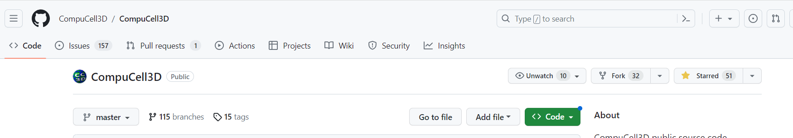

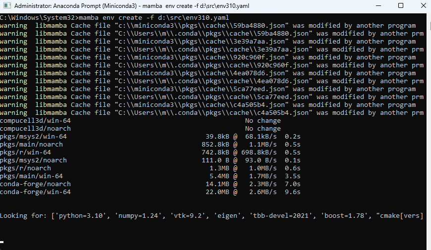

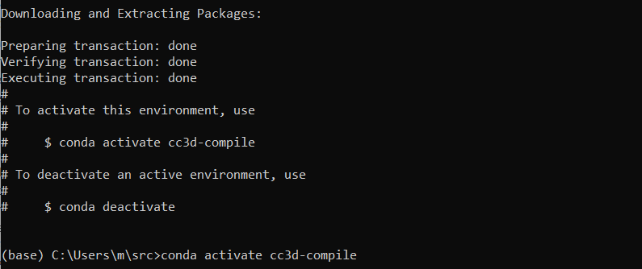

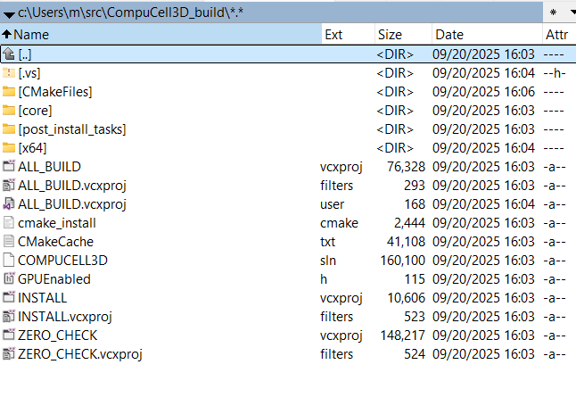

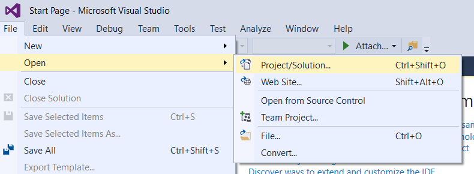

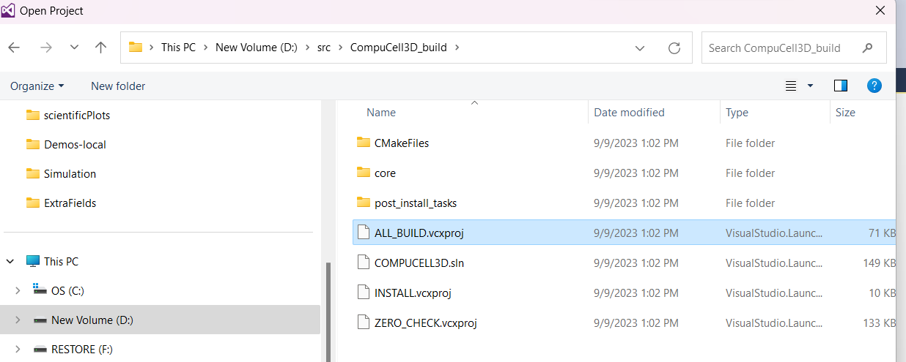

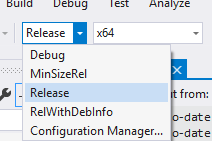

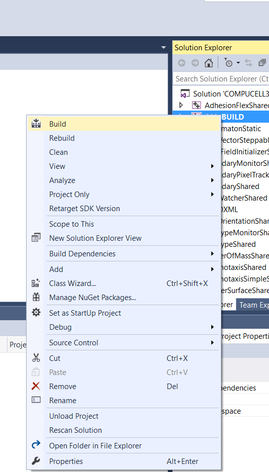

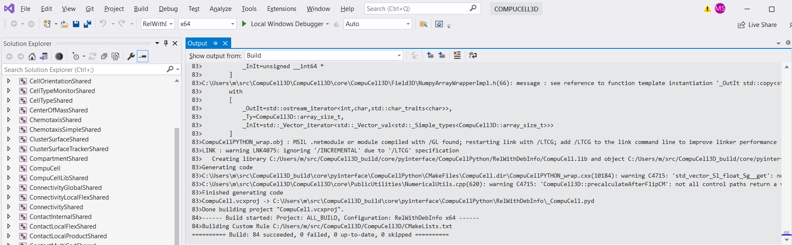

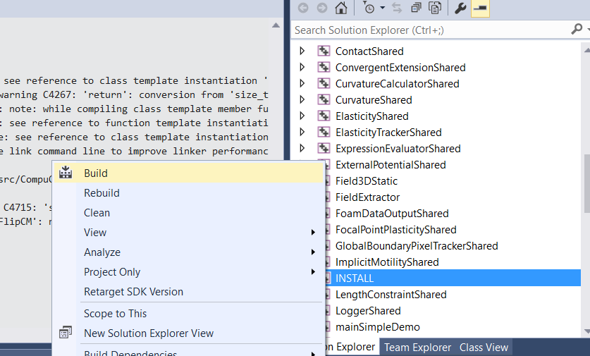

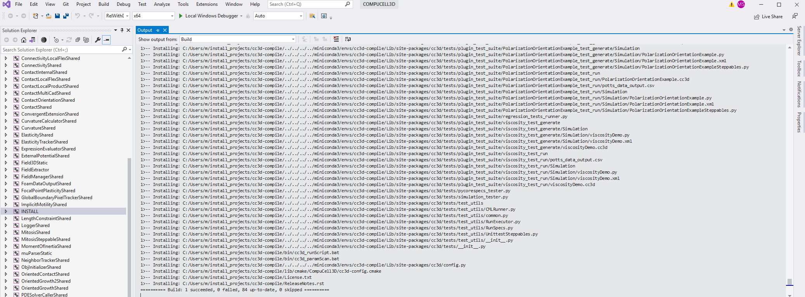

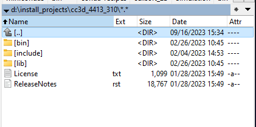

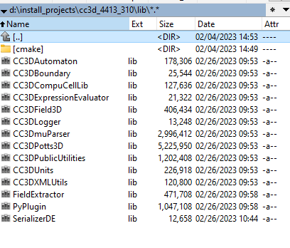

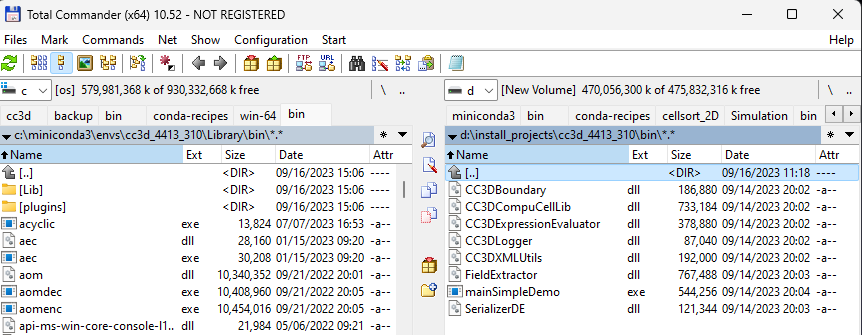

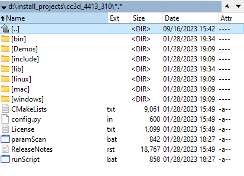

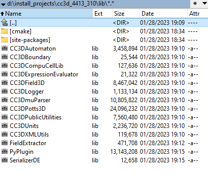

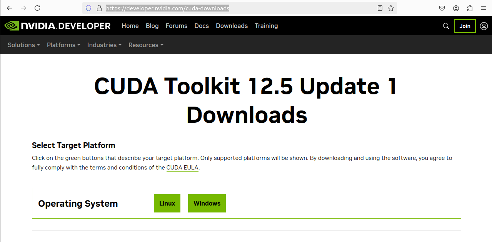

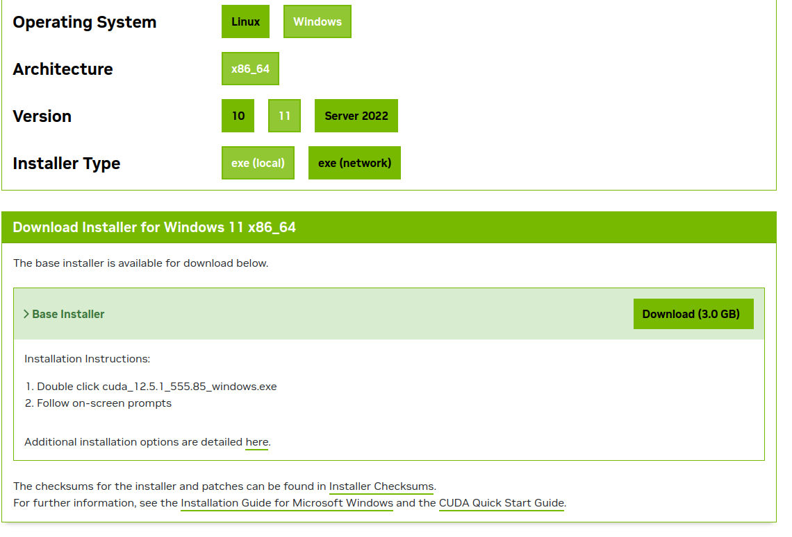

