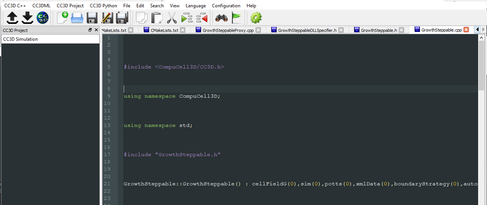
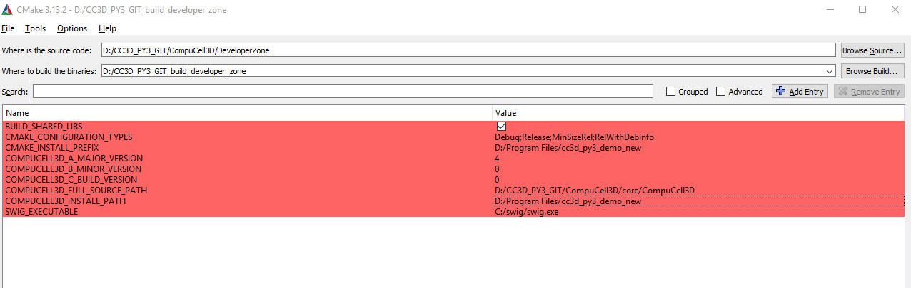
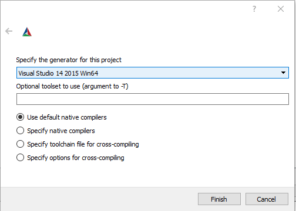
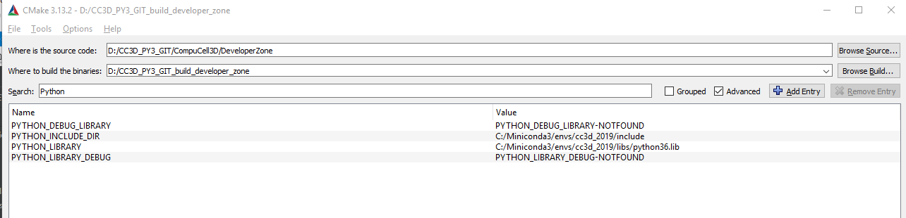
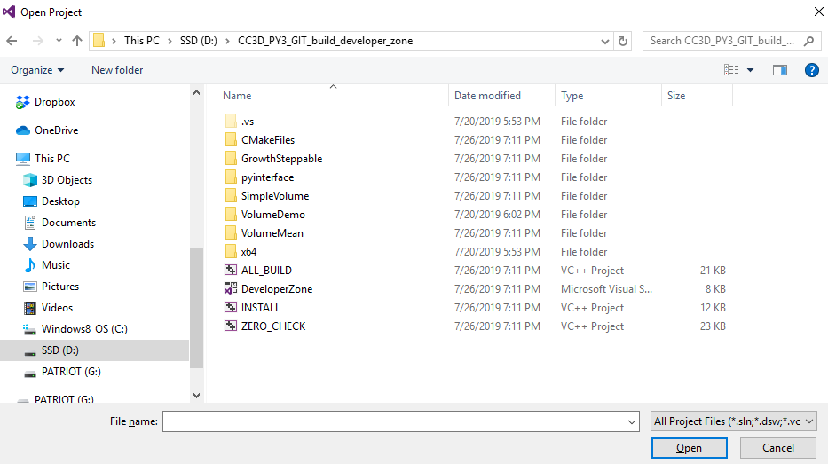
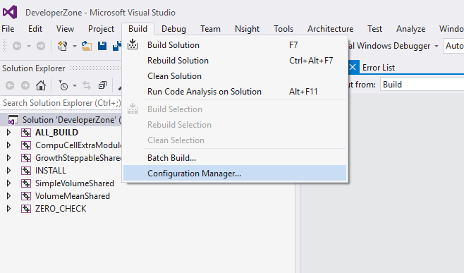
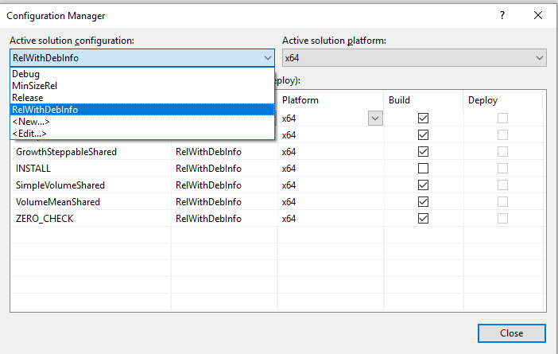
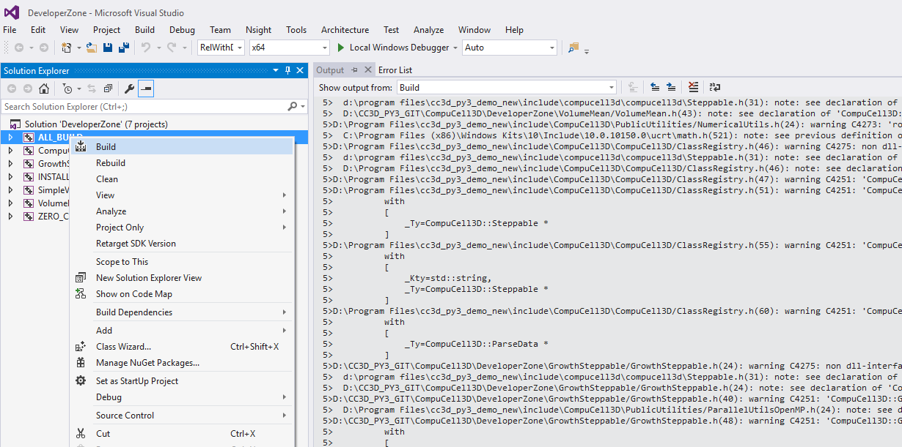
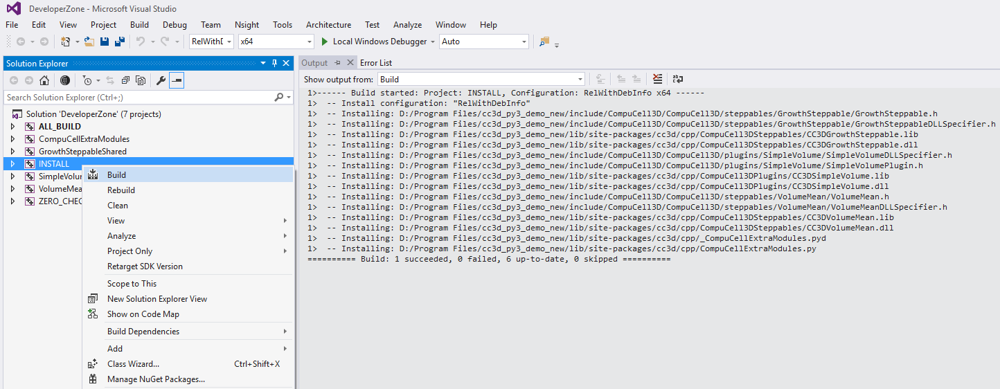
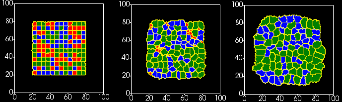

Building A Growth Steppable In DeveloperZone
=============================================

DeveloperZone lets you build C++ plugins and steppables without adding them to the main CC3D source tree. This is useful when you are developing an extension module, testing an idea, or distributing custom C++ code separately from core CC3D.

This example uses Windows paths and assumes that the CC3D repository is cloned to ``D:\CC3D_PY3_GIT\CompuCell3D``. On Linux and macOS the same source layout applies, but the build generator and compiler commands differ.

To add a steppable in DeveloperZone, open Twedit++ and choose ``CC3D C++`` -> ``Generate New Module...``.

|dev_zone_1|

Set ``Module Directory`` to ``D:\CC3D_PY3_GIT\CompuCell3D\DeveloperZone``. This is the important difference from generating a core steppable, where the module directory would be a folder under ``CompuCell3D/core/CompuCell3D/steppables``.

This example also checks ``Python Wrap`` so that later sections can show how XML and Python can both control the C++ steppable. Python wrapping is optional. If your module only needs XML configuration and C++ execution, you can leave it disabled.

After you click ``OK``, Twedit++ generates template steppable code:

|dev_zone_2|

Next, copy the growth logic from the earlier core-code example into the DeveloperZone module. Only the modified files are shown here:
``GrowthSteppable.h``:

.. code-block:: cpp
    :linenos:

    #ifndef GROWTHSTEPPABLESTEPPABLE_H
    #define GROWTHSTEPPABLESTEPPABLE_H
    #include <CompuCell3D/CC3D.h>
    #include "GrowthSteppableDLLSpecifier.h"

    namespace CompuCell3D {

        template <class T> class Field3D;

        template <class T> class WatchableField3D;

        class Potts3D;

        class Automaton;

        class BoundaryStrategy;

        class CellInventory;

        class CellG;

      class GROWTHSTEPPABLE_EXPORT GrowthSteppable : public Steppable {

        WatchableField3D<CellG *> *cellFieldG;

        Simulator * sim;

        Potts3D *potts;

        CC3DXMLElement *xmlData;

        Automaton *automaton;

        BoundaryStrategy *boundaryStrategy;

        CellInventory * cellInventoryPtr;

        Dim3D fieldDim;

      public:

        GrowthSteppable ();

        virtual ~GrowthSteppable ();

        std::map<unsigned int, double> growthRateMap;

        // SimObject interface

        virtual void init(Simulator *simulator, CC3DXMLElement *_xmlData=0);

        virtual void extraInit(Simulator *simulator);

        //steppable interface

        virtual void start();

        virtual void step(const unsigned int currentStep);

        virtual void finish() {}

        //SteerableObject interface

        virtual void update(CC3DXMLElement *_xmlData, bool _fullInitFlag=false);

        virtual std::string steerableName();

        virtual std::string toString();

      };

    };

    #endif

and ``GrowthSteppable.cpp``

.. code-block:: cpp
    :linenos:
    :emphasize-lines: 12,15-18

    #include <CompuCell3D/CC3D.h>
    using namespace CompuCell3D;
    using namespace std;
    #include "GrowthSteppable.h"

    GrowthSteppable::GrowthSteppable() :
    cellFieldG(0),sim(0),potts(0),xmlData(0),
    boundaryStrategy(0),automaton(0),cellInventoryPtr(0){}

    GrowthSteppable::~GrowthSteppable() {

    }

    void GrowthSteppable::init(Simulator *simulator, CC3DXMLElement *_xmlData) {

      xmlData=_xmlData;

      potts = simulator->getPotts();

      cellInventoryPtr=& potts->getCellInventory();

      sim=simulator;

      cellFieldG = (WatchableField3D<CellG *> *)potts->getCellFieldG();

      fieldDim=cellFieldG->getDim();

      simulator->registerSteerableObject(this);

      update(_xmlData,true);
    }

    void GrowthSteppable::extraInit(Simulator *simulator){

    }

    void GrowthSteppable::start(){

        CellInventory::cellInventoryIterator cInvItr;
        CellG * cell = 0;

        for (cInvItr = cellInventoryPtr->cellInventoryBegin(); cInvItr != cellInventoryPtr->cellInventoryEnd(); ++cInvItr)
        {

            cell = cellInventoryPtr->getCell(cInvItr);
            cell->targetVolume = 25.0;
            cell->lambdaVolume = 2.0;
        }
    }

    void GrowthSteppable::step(const unsigned int currentStep){

        CellInventory::cellInventoryIterator cInvItr;

        CellG * cell=0;

       if (currentStep > 100)
           return;

        std::map<unsigned int, double>::iterator mitr;

        for(cInvItr=cellInventoryPtr->cellInventoryBegin() ; cInvItr !=cellInventoryPtr->cellInventoryEnd() ;++cInvItr )
        {

            cell=cellInventoryPtr->getCell(cInvItr);

            mitr = this->growthRateMap.find((unsigned int)cell->type);

            if (mitr != this->growthRateMap.end()){
                cell->targetVolume += mitr->second;
            }

        }

    }

    void GrowthSteppable::update(CC3DXMLElement *_xmlData, bool _fullInitFlag){

        automaton = potts->getAutomaton();

        ASSERT_OR_THROW("CELL TYPE PLUGIN WAS NOT PROPERLY INITIALIZED YET. MAKE SURE THIS IS THE FIRST PLUGIN THAT YOU SET", automaton)

        set<unsigned char> cellTypesSet;

        CC3DXMLElementList growthVec = _xmlData->getElements("GrowthRate");

        for (int i = 0; i < growthVec.size(); ++i) {
            unsigned int cellType = growthVec[i]->getAttributeAsUInt("CellType");
            double growthRateTmp = growthVec[i]->getAttributeAsDouble("Rate");
            this->growthRateMap[cellType] = growthRateTmp;
        }

        //boundaryStrategy has information about pixel neighbors
        boundaryStrategy=BoundaryStrategy::getInstance();

    }

    std::string GrowthSteppable::toString(){

       return "GrowthSteppable";
    }

    std::string GrowthSteppable::steerableName(){

       return toString();
    }

The ``update`` function parses XML entries with the following ``GrowthSteppable`` syntax:

.. code-block:: xml

    <Steppable Type="GrowthSteppable">
        <GrowthRate CellType="1" Rate="1.3"/>
        <GrowthRate CellType="2" Rate="1.7"/>
    </Steppable>

.. note::

    Starting with CC3D ``4.3.0``, DeveloperZone compilation setup is generated automatically for supported compilers. Follow :doc:`configuring_developer_zone` for the current setup procedure.

After generating the module and editing the two files above, configure and build DeveloperZone. The screenshots below use CMake GUI and Visual Studio on Windows. On Linux and macOS the configuration inputs are similar, but the build step uses the platform compiler from the conda environment.

|dev_zone_3|

First we point to the folder where ``DeveloperZone`` is (``Where the source code is``). In our case it is
``D:\CC3D_PY3_GIT\CompuCell3D\DeveloperZone``  and location for our Visual Studio project  ``D:/CC3D_PY3_GIT_build_developer_zone`` (see ``Where to build the binaries``)

Then we after click ``Configure`` CMake will display the following dialog:

|dev_zone_3b|

Make sure to select ``Visual Studio 14 2015 Win64`` (we assume we are using 64-bit version of CC3D). If you are using
32-bit version then you would select ``Visual Studio 14 2015``

Next, we set ``CMAKE_INSTALL_PREFIX`` and ``COMPUCELL3D_INSTALL_PATH`` to the folder where CC3D is installed -
``D:\Program Files\cc3d_py3_demo_new`` .

We also set where main CC3D code-base is ``COMPUCELL3D_FULL_SOURCE_PATH`` ``D:/CC3D_PY3_GIT/CompuCell3D/core/CompuCell3D``
Next, we set version number (`4`,  `0`, `0`).  We are almost done but since ``DeveloperZone`` also compiles Python module
we must set Python paths as follows (you need to specify Python include directory and Python library path):

|dev_zone_3a|

.. note::

    It is perfectly fine to compile ``DeveloperZone`` modules without using Python. If this is what you would like to do, just comment out line  ``add_subdirectory(pyinterface)`` in ``DeveloperZone/CMakeLists.txt``

After we configured all paths in CMake GUI we press ``Configure`` button and then ``Generate`` button. The
VisualStudio Project will be placed in ``D:/CC3D_PY3_GIT_build_developer_zone`` (see
``Where to build the binaries`` at the top of CMake GUI). We will open it next and
will show you how to compile plugins and steppables in the ``DeveloperZone``

Compiling DeveloperZone In Visual Studio
------------------------------------------

Now that we created Visual Studio project for Developer Zone we will show you how to set up compilation.
We open up Visual Studio and navigate to ``File->Open->Project/Solution...`` and in the File Open Dialog we go to
``D:/CC3D_PY3_GIT_build_developer_zone`` and select ``ALL_BUILD.vcxproj``

|dev_zone_4|

After ``DeveloperZone`` Visual Studio project gets loaded we go to ``Build->Configuration Manager...`` and from the
pull down menu ``Active Solution Configuration`` (at the top of the dialog box) we select ``RelWithDebInfo``:

|dev_zone_5|

|dev_zone_6|

Next, to start compilation, we right-click on ``ALL_BUILD`` and from the context menu select ``Build``:

|dev_zone_7|

Notice that there are additional modules in addition to our ``GrowthSteppable``. Take a looks at those. They show
how to write simple modules (plugins or steppables).

After the compilation finished and there are no errors, we right-click at ``INSTALL`` subproject and from the context
menu we select ``Build``. This will install our newly created ``GrowthSteppable`` in the CC3D installation directory
that we specified during CMake configuration (``D:/Program Files/cc3d_py3_demo_new``)

|dev_zone_8|

At this point we can build a simulation that will use newly created ``GrowthSteppable``

Using The DeveloperZone Steppable In A Simulation
~~~~~~~~~~~~~~~~~~~~~~~~~~~~~~~~~~~~~~~~~~~~~~~~~

After the C++ code compiles and installs, using the new steppable in a simulation is simple. Add the following XML block to any simulation where cells of type ``1`` should increase target volume by ``1.3`` pixels per MCS and cells of type ``2`` should increase target volume by ``1.7`` pixels per MCS:

.. code-block:: xml

    <Steppable Type="GrowthSteppable">
        <GrowthRate CellType="1" Rate="1.3"/>
        <GrowthRate CellType="2" Rate="1.7"/>
    </Steppable>

.. note::

    The XML name of a steppable or plugin comes from the label registered in its proxy file, not necessarily from the C++ class name. In this example ``GrowthSteppableProxy.cpp`` registers ``growthSteppableProxy("GrowthSteppable", ...)``, so the XML uses ``<Steppable Type="GrowthSteppable">``. If the proxy registered ``"MyGrowthSteppable"`` instead, the XML would need to use ``<Steppable Type="MyGrowthSteppable">``.

Here are the results of the simulation at MCS 0, 20, and 40:

|gs_cpp|

The simulation contains three cell types, but the XML specifies growth rates for only two of them. The type without an explicit growth rate is squeezed by growing neighbors and disappears by MCS 40. Green cells become larger than blue cells because they use the larger growth rate.

Because this steppable modifies ``targetVolume`` directly, the simulation must load the ``Volume`` plugin. Here we use the local-flex form, ``<Plugin Name="Volume"/>``, which loads the plugin without global XML parameters. The per-cell ``targetVolume`` and ``lambdaVolume`` values are assigned in C++ code:

.. code-block:: xml

    <CompuCell3D Revision="20190604" Version="4.0.0">

       <Potts>

          <!-- Basic properties of CPM (GGH) algorithm -->
          <Dimensions x="100" y="100" z="1"/>
          <Steps>100000</Steps>
          <Temperature>10.0</Temperature>
          <NeighborOrder>1</NeighborOrder>
       </Potts>

       <Plugin Name="CellType">

          <!-- Listing all cell types in the simulation -->
          <CellType TypeId="0" TypeName="Medium"/>
          <CellType TypeId="1" TypeName="A"/>
          <CellType TypeId="2" TypeName="B"/>
          <CellType TypeId="3" TypeName="C"/>
       </Plugin>

       <Plugin Name="Volume"/>

       <Plugin Name="CenterOfMass">

          <!-- Module tracking center of mass of each cell -->
       </Plugin>

       <Plugin Name="Contact">
          <!-- Specification of adhesion energies -->
          <Energy Type1="Medium" Type2="Medium">10.0</Energy>
          <Energy Type1="Medium" Type2="A">10.0</Energy>
          <Energy Type1="Medium" Type2="B">10.0</Energy>
          <Energy Type1="Medium" Type2="C">10.0</Energy>
          <Energy Type1="A" Type2="A">10.0</Energy>
          <Energy Type1="A" Type2="B">10.0</Energy>
          <Energy Type1="A" Type2="C">10.0</Energy>
          <Energy Type1="B" Type2="B">10.0</Energy>
          <Energy Type1="B" Type2="C">10.0</Energy>
          <Energy Type1="C" Type2="C">10.0</Energy>
          <NeighborOrder>4</NeighborOrder>
       </Plugin>

       <Steppable Type="UniformInitializer">

          <!-- Initial layout of cells in the form of rectangular slab -->
          <Region>
             <BoxMin x="20" y="20" z="0"/>
             <BoxMax x="80" y="80" z="1"/>
             <Gap>0</Gap>
             <Width>5</Width>
             <Types>A,B,C</Types>
          </Region>
       </Steppable>

        <Steppable Type="GrowthSteppable">
            <GrowthRate CellType="1" Rate="1.3"/>
            <GrowthRate CellType="2" Rate="1.7"/>
        </Steppable>

    </CompuCell3D>

.. note::

    ``GrowthSteppable`` is listed after ``UniformInitializer`` on purpose. CC3D calls steppables in the order in which they appear in XML. If ``GrowthSteppable`` ran first, its ``start`` function would iterate over an empty cell inventory because ``UniformInitializer`` would not have created cells yet.

.. note::

    The growth rates ``1.3`` and ``1.7`` are intentionally high for illustration. Real simulations usually need smaller rates so cells can equilibrate on the lattice.

Full simulation can be downloaded here :download:`zip <archives/GrowthSteppableSimulationCpp.zip>` and full code for
``GrowthSteppable`` is here :download:`zip <archives/GrowthSteppable-code-cpp.zip>`. You can also access both example
and C++ code by going directly to ``CompuCell3D/DeveloperZone``

.. |dev_zone_1| image:: images/dev_zone_1.png
   :width: 2.4in
   :height: 1.9in

