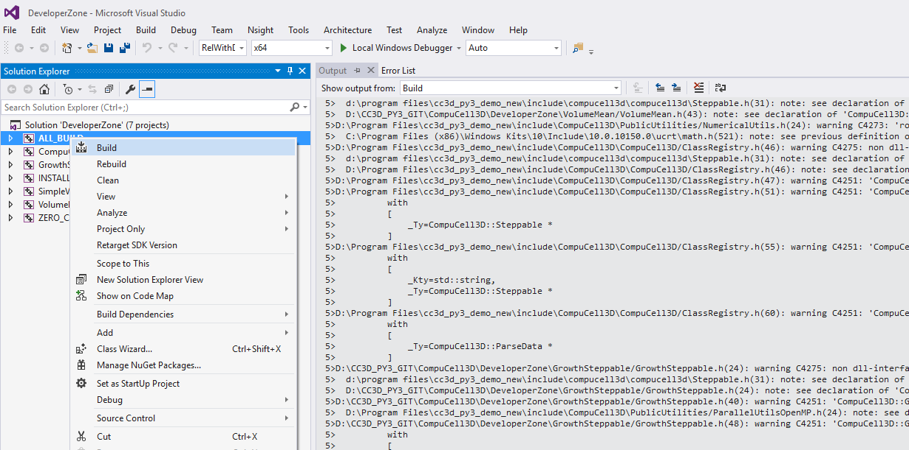

Building Growth Steppable In the Developer Zone folder
======================================================

Quite often you will want to build a steppable in a "non-intrusive" way *i.e.* without adding it to the main
CC3D code-base. The way to do it is to utilize functionality of ``DeveloperZone``.

This time we will use Windows system and our  CC3D git repository is cloned to ``D:\CC3D_PY3_GIT\CompuCell3D``

To add a steppable or plugin in the DeveloperZone you open up Twedit and from ``CC3D C++`` menu select
``Generate New Module...``.

|dev_zone_1|

Notice that in the ``Module Directory`` in the dialog box we put ``D:\CC3D_PY3_GIT\CompuCell3D\DeveloperZone``.
Previously we put there a path to the Steppable folder in the main CC3D Code base (give where our repository is cloned
this path would be ``D:\CC3D_PY3_GIT\CompuCell3D\core\CompuCell3D\steppables\``)

Notice that we also checked ``Python Wrap`` option to generate Python bindings. We will show you how you ca
be creative here and leverage both XML and Python as a way to pass parameters to the Steppable. As you
remember you do not have to generate Python bindings and it is perfectly OK to to stick with C++ and XML.

After we press ``OK`` button Twedit++ will generate , a template Steppable code:

|dev_zone_2|

Now we copy code from our earlier example into appropriate files - we are only showing files that we modified:
``GrowthSteppable.h`` :

.. code-block:: cpp
    :linenos:

    #ifndef GROWTHSTEPPABLESTEPPABLE_H
    #define GROWTHSTEPPABLESTEPPABLE_H
    #include <CompuCell3D/CC3D.h>
    #include "GrowthSteppableDLLSpecifier.h"

    namespace CompuCell3D {

        template <class T> class Field3D;

        template <class T> class WatchableField3D;

        class Potts3D;

        class Automaton;

        class BoundaryStrategy;

        class CellInventory;

        class CellG;

      class GROWTHSTEPPABLE_EXPORT GrowthSteppable : public Steppable {

        WatchableField3D<CellG *> *cellFieldG;

        Simulator * sim;

        Potts3D *potts;

        CC3DXMLElement *xmlData;

        Automaton *automaton;

        BoundaryStrategy *boundaryStrategy;

        CellInventory * cellInventoryPtr;

        Dim3D fieldDim;

      public:

        GrowthSteppable ();

        virtual ~GrowthSteppable ();

        std::map<unsigned int, double> growthRateMap;

        // SimObject interface

        virtual void init(Simulator *simulator, CC3DXMLElement *_xmlData=0);

        virtual void extraInit(Simulator *simulator);

        //steppable interface

        virtual void start();

        virtual void step(const unsigned int currentStep);

        virtual void finish() {}

        //SteerableObject interface

        virtual void update(CC3DXMLElement *_xmlData, bool _fullInitFlag=false);

        virtual std::string steerableName();

        virtual std::string toString();

      };

    };

    #endif

and ``GrowthSteppable.cpp``

.. code-block:: cpp
    :linenos:
    :emphasize-lines: 12,15-18

    #include <CompuCell3D/CC3D.h>
    using namespace CompuCell3D;
    using namespace std;
    #include "GrowthSteppable.h"

    GrowthSteppable::GrowthSteppable() :
    cellFieldG(0),sim(0),potts(0),xmlData(0),
    boundaryStrategy(0),automaton(0),cellInventoryPtr(0){}

    GrowthSteppable::~GrowthSteppable() {

    }

    void GrowthSteppable::init(Simulator *simulator, CC3DXMLElement *_xmlData) {

      xmlData=_xmlData;

      potts = simulator->getPotts();

      cellInventoryPtr=& potts->getCellInventory();

      sim=simulator;

      cellFieldG = (WatchableField3D<CellG *> *)potts->getCellFieldG();

      fieldDim=cellFieldG->getDim();

      simulator->registerSteerableObject(this);

      update(_xmlData,true);
    }

    void GrowthSteppable::extraInit(Simulator *simulator){

    }

    void GrowthSteppable::start(){

        CellInventory::cellInventoryIterator cInvItr;
        CellG * cell = 0;

        for (cInvItr = cellInventoryPtr->cellInventoryBegin(); cInvItr != cellInventoryPtr->cellInventoryEnd(); ++cInvItr)
        {

            cell = cellInventoryPtr->getCell(cInvItr);
            cell->targetVolume = 25.0;
            cell->lambdaVolume = 2.0;
        }
    }

    void GrowthSteppable::step(const unsigned int currentStep){

        CellInventory::cellInventoryIterator cInvItr;

        CellG * cell=0;

       if (currentStep > 100)
           return;

        std::map<unsigned int, double>::iterator mitr;

        for(cInvItr=cellInventoryPtr->cellInventoryBegin() ; cInvItr !=cellInventoryPtr->cellInventoryEnd() ;++cInvItr )
        {

            cell=cellInventoryPtr->getCell(cInvItr);

            mitr = this->growthRateMap.find((unsigned int)cell->type);

            if (mitr != this->growthRateMap.end()){
                cell->targetVolume += mitr->second;
            }

        }

    }

    void GrowthSteppable::update(CC3DXMLElement *_xmlData, bool _fullInitFlag){

        automaton = potts->getAutomaton();

        ASSERT_OR_THROW("CELL TYPE PLUGIN WAS NOT PROPERLY INITIALIZED YET. MAKE SURE THIS IS THE FIRST PLUGIN THAT YOU SET", automaton)

        set<unsigned char> cellTypesSet;

        CC3DXMLElementList growthVec = _xmlData->getElements("GrowthRate");

        for (int i = 0; i < growthVec.size(); ++i) {
            unsigned int cellType = growthVec[i]->getAttributeAsUInt("CellType");
            double growthRateTmp = growthVec[i]->getAttributeAsDouble("Rate");
            this->growthRateMap[cellType] = growthRateTmp;
        }

        //boundaryStrategy has information about pixel neighbors
        boundaryStrategy=BoundaryStrategy::getInstance();

    }

    std::string GrowthSteppable::toString(){

       return "GrowthSteppable";
    }

    std::string GrowthSteppable::steerableName(){

       return toString();
    }

As you can see based on the previous discussion the ``update`` function where we parse XML is designed to
handle the following syntax for the GrowthSteppable:

.. code-block:: xml

    <Steppable Type="GrowthSteppable">
        <GrowthRate CellType="1" Rate="1.3"/>
        <GrowthRate CellType="2" Rate="1.7"/>
    </Steppable>

After we generated plugin code and added our modification to those two files, we are ready to begin compilation.
We will show how to compile code on Windows. Compilation on Linux system is analogous up to CMake configuration
part but then instead of using Visual Studion you will type ``make`` and ``make install`` in the terminal. For now
let's stick with Windows compilation. After Twedit++ generated new files in the ``Developer Zone`` we need to use
CMake tool (GUI - as we will go here, or console based tool) to configure our compilation. This is how CMake
configuration looks in our case

|dev_zone_3|

First we point to the folder where ``DeveloperZone`` is (``Where the source code is``). In our case it is
``D:\CC3D_PY3_GIT\CompuCell3D\DeveloperZone``  and location for our Visual Studio project  ``D:/CC3D_PY3_GIT_build_developer_zone`` (see ``Where to build the binaries``)

Then we after click ``Configure`` CMake will display the following dialog:

|dev_zone_3b|

Make sure to select ``Visual Studio 14 2015 Win64`` (we assume we are using 64-bit version of CC3D). If you are using
32-bit version then you would select ``Visual Studio 14 2015``

Next, we set ``CMAKE_INSTALL_PREFIX`` and ``COMPUCELL3D_INSTALL_PATH`` to the folder where CC3D is installed -
``D:\Program Files\cc3d_py3_demo_new`` .

We also set where main CC3D code-base is ``COMPUCELL3D_FULL_SOURCE_PATH`` ``D:/CC3D_PY3_GIT/CompuCell3D/core/CompuCell3D``
Next, we set version number (`4`,  `0`, `0`).  We are almost done but since ``DeveloperZone`` also compiles Python module
we must set Python paths as follows (you need to specify Python include directory and Python library path):

|dev_zone_3a|

.. note::

    It is perfectly fine to compile ``DeveloperZone`` modules without using Python. If this is what you would like to do, just comment out line  ``add_subdirectory(pyinterface)`` in ``DeveloperZone/CMakeLists.txt``

After we configured all paths in CMake GUI we press ``Configure`` button and then ``Generate`` button. The
VisualStudio Project will be placed in ``D:/CC3D_PY3_GIT_build_developer_zone`` (see
``Where to build the binaries`` at the top of CMake GUI). We will open it next and
will show you how to compile plugins and steppables in the ``DeveloperZone``

Compiling ``DeveloperZone`` in Visual Studio
---------------------------------------------

Now that we created Visual Studio project for Developer Zone we will show you how to set up compilation.
We open up Visual Studio and navigate to ``File->Open->Project/Solution...`` and in the File Open Dialog we go to
``D:/CC3D_PY3_GIT_build_developer_zone`` and select ``ALL_BUILD.vcxproj``

|dev_zone_4|

After ``DeveloperZone`` Visual Studio project gets loaded we go to ``Build->Configuration Manager...`` and from the
pull down menu ``Active Solution Configuration`` (at the top of the dialog box) we select ``RelWithDebInfo``:

|dev_zone_5|

|dev_zone_6|

Next, to start compilation, we right-click on ``ALL_BUILD`` and from the context menu select ``Build``:

|dev_zone_7|

Notice that there are additional modules in addition to our ``GrowthSteppable``. Take a looks at those. They show
how to write simple modules (plugins or steppables).

After the compilation finished and there are no errors, we right-click at ``INSTALL`` subproject and from the context
menu we select ``Build``. This will install our newly created ``GrowthSteppable`` in the CC3D installation directory
that we specified during CMake configuration (``D:/Program Files/cc3d_py3_demo_new``)

|dev_zone_8|

At this point we can build a simulation that will use newly created ``GrowthSteppable``

Using DeveloperZone steppable in the simulation
~~~~~~~~~~~~~~~~~~~~~~~~~~~~~~~~~~~~~~~~~~~~~~~~

Writing C++ code and compiling it was a hard-part of the project. Using newly created steppable in the simulation is
easy. In fact all we need to do is to add

.. code-block:: xml

    <Steppable Type="GrowthSteppable">
        <GrowthRate CellType="1" Rate="1.3"/>
        <GrowthRate CellType="2" Rate="1.7"/>
    </Steppable>

to any simulation where we want cell of type `1` to increase target volume at 1.3 pixels/MCS rate and for cells of type 2
the growth would be 1.7.

.. note::

    The name of the steppable or plugin that we reference from XML is not based on module name but on the label encoded in the proxy file. In our case ``GrowthSteppableProxy.cpp`` has the following line ``growthSteppableProxy("GrowthSteppable", ...`` and there we have label ``GrowthSteppable`` that we use in XML. If we changed this label to e.g. `growthSteppableProxy("MyGrowthSteppable", ...`` then we would need to change first line of XML for GrowthSteppable to ``<Steppable Type="GrowthSteppable">``

Here are the results of the simulation at MCS 0, 20, and 40:

|gs_cpp|

As you can see there are 3 cell types here but we specified growth rates for two of them As a result "red" cells are
getting squashed by growing neighbors and at MCS 40 they disappear. Also notice that green cells are bigger than blue
ones. This is what we expect when we have different growth rates.

Since we are modifying target volume we must use ``Volume`` plugin where we control all parameters for each cell individually - we use "local flex" version of Volume constraint ``<Plugin Name="Volume"/>`` where we only load ``Volume`` plugin but dont pass any parameters to it. Those parameters ``targetVolume`` ``lambdaVolume`` are set in C++ code:

.. code-block:: xml

    <CompuCell3D Revision="20190604" Version="4.0.0">

       <Potts>

          <!-- Basic properties of CPM (GGH) algorithm -->
          <Dimensions x="100" y="100" z="1"/>
          <Steps>100000</Steps>
          <Temperature>10.0</Temperature>
          <NeighborOrder>1</NeighborOrder>
       </Potts>

       <Plugin Name="CellType">

          <!-- Listing all cell types in the simulation -->
          <CellType TypeId="0" TypeName="Medium"/>
          <CellType TypeId="1" TypeName="A"/>
          <CellType TypeId="2" TypeName="B"/>
          <CellType TypeId="3" TypeName="C"/>
       </Plugin>

       <Plugin Name="Volume"/>

       <Plugin Name="CenterOfMass">

          <!-- Module tracking center of mass of each cell -->
       </Plugin>

       <Plugin Name="Contact">
          <!-- Specification of adhesion energies -->
          <Energy Type1="Medium" Type2="Medium">10.0</Energy>
          <Energy Type1="Medium" Type2="A">10.0</Energy>
          <Energy Type1="Medium" Type2="B">10.0</Energy>
          <Energy Type1="Medium" Type2="C">10.0</Energy>
          <Energy Type1="A" Type2="A">10.0</Energy>
          <Energy Type1="A" Type2="B">10.0</Energy>
          <Energy Type1="A" Type2="C">10.0</Energy>
          <Energy Type1="B" Type2="B">10.0</Energy>
          <Energy Type1="B" Type2="C">10.0</Energy>
          <Energy Type1="C" Type2="C">10.0</Energy>
          <NeighborOrder>4</NeighborOrder>
       </Plugin>

       <Steppable Type="UniformInitializer">

          <!-- Initial layout of cells in the form of rectangular slab -->
          <Region>
             <BoxMin x="20" y="20" z="0"/>
             <BoxMax x="80" y="80" z="1"/>
             <Gap>0</Gap>
             <Width>5</Width>
             <Types>A,B,C</Types>
          </Region>
       </Steppable>

        <Steppable Type="GrowthSteppable">
            <GrowthRate CellType="1" Rate="1.3"/>
            <GrowthRate CellType="2" Rate="1.7"/>
        </Steppable>

    </CompuCell3D>

.. note::

    We placed ``GrowthSteppable`` last. This is not coincidence. We must place it after steppable that creates cells ``UniformInitializer``. If we reversed the order of those two steppables GrowthSteppable would be called first and in particular its ``start`` function would be called before ``UniformInitializer`` function and as a result the code that is supposed to set initaial volume constraint parameters from ``GrowthSteppable`` (``start`` function) woudl iterate over empty cell inventory. Therefore, listing ``UniformInitializer`` before ``GrowthSteppable`` is the rihght thing to to. Simply put order of appearances of steppables in the XML determines the order in which CC3D will call them

.. note::

    Specified growth rates of 1.3 and 1.7 are very high and we used them for illustration purposes. In your simulation you should much smaller rates to allow cells on the lattice to "equilibrate"

Full simulation can be downloaded here :download:`zip <archives/GrowthSteppableSimulationCpp.zip>` and full code for
``GrowthSteppable`` is here :download:`zip <archives/GrowthSteppable-code-cpp.zip>`.

.. |dev_zone_1| image:: images/dev_zone_1.png
   :width: 2.4in
   :height: 1.9in

.. |dev_zone_2| image:: images/dev_zone_2.png
   :width: 6.0in
   :height: 2.5in

.. |dev_zone_6| image:: images/dev_zone_6.png
   :width: 3.5in
   :height: 2.2in

