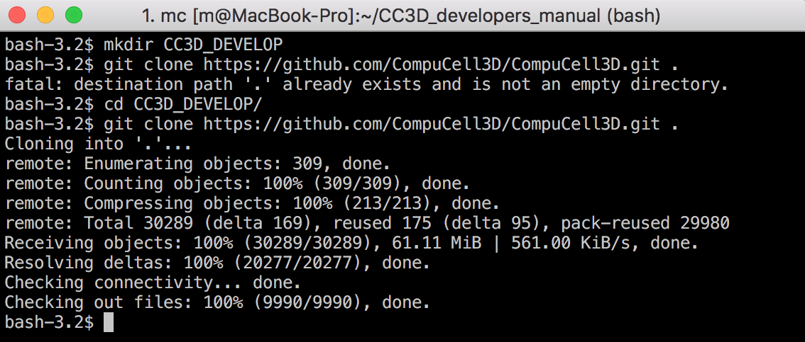
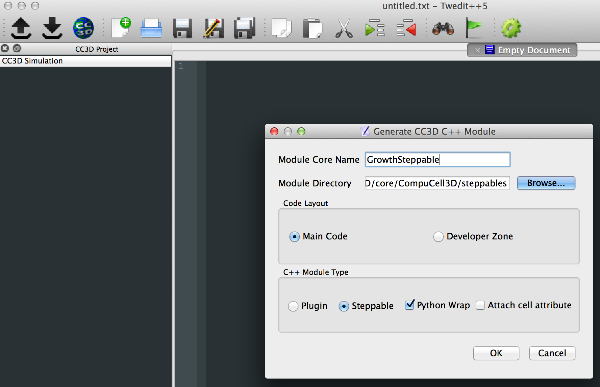
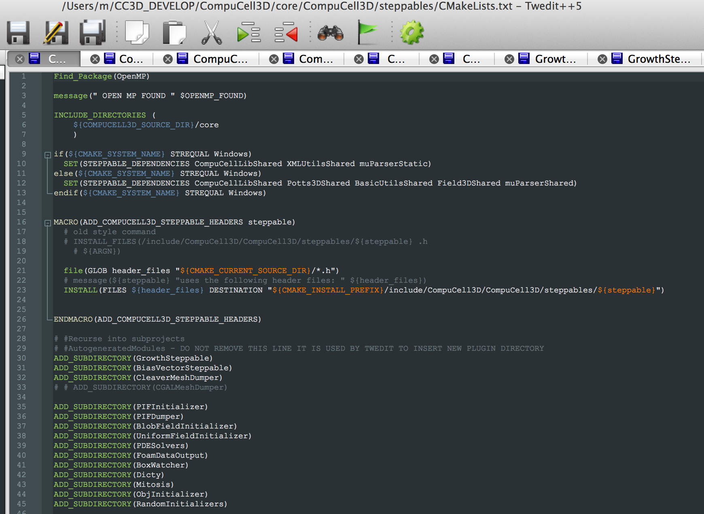

Building Steppable
==================

It is probably best to start discussing extension of CC3D by showing a relatively sinple example of a steppable written in C++.
In typical scenario steppables are written in Python. There are three main reasons for that **1)** No compilation is required.
**2)** The code is more compact and easier to write than C++. **3)** Python has a rich set of libraries that make scientific computation
easily accessible.
However, writing a steppable in C++ is not that much more difficult, as you will see shortly, and you are almost guaranteed
that your code will run orders of magnitude faster.
Let me rephrase this last sentence - a **typical** code written in C++ is orders of magnitude faster than equivalent code written in
pure Python. Since most of the steppable code consists of iterating over all cells and adjusting their attributes, C++ will
perform this task much faster.

Getting started
---------------

Before you start developing CC3D C++ extension modules, you need to clone CC3D repository.

.. code-block:: console

    mkdir CC3D_DEVELOP
    cd CC3D_DEVELOP
    git clone https://github.com/CompuCell3D/CompuCell3D.git .

It is optional to checkout a particular branch of CC3D, but most often you will work with ``master`` branch. If ,
however, you want to checkout a branch - you woudl type something like this:

.. code-block:: console

    git checkout 4.0.0

|git_setup|

At this point you have complete code in ``CC3D_DEVELOP`` directory. And in addition

Now we open Twedit++ - you need to have "standard" installation of CC3D on your machine available - and go to ``CC3D C++`` menu and choose ``Generate New Module...`` entry and fill out the dialog box:

|twedit_steppable_wizard|

This is exactly what we did:

#. We specify a name of a steppable as ``GrowthSteppable``
#. We specify the location of when steppable code is stored ``/Users/m/CC3D_DEVELOP/CompuCell3D/core/CompuCell3D/steppables``. Note, that we point to the cloned CC3D repository that we originally stored in ``CC3D_DEVELOP`` subdirectory. It happens that the path to this repository is ``/Users/m/CC3D_DEVELOP``.
#. We select **Steppable** radio in the  **C++ Module Type** panel. We also check ``Python Wrap`` checkbox to allow generation of Python bindings of this steppable.

When we press ``OK`` button Twedit++ will generate a complete set of template files that could be compiled as-is and the steppable will run. Obviously our goal is to modify template file to generate steppable w want. In current implementation of CC3D Twedit++ generates or modifies approximately 10 files.

|twedit_generated_steppable|

As you can see in the ``CMakeLists.txt`` file Twedit++ modified this file and added
line ``ADD_SUBDIRECTORY(GrowthSteppable)``

Now, let us focus on modifying template files and creating a steppable (``GrowthSteppable``)
we specify growth rate in the XMl and allow modification of this rate from Python.

Let's first examine the header of the ``GrowthSteppable`` class:

.. code-block:: c++

    #ifndef GROWTHSTEPPABLESTEPPABLE_H
    #define GROWTHSTEPPABLESTEPPABLE_H

    #include <CompuCell3D/CC3D.h>
    #include "GrowthSteppableDLLSpecifier.h"

    namespace CompuCell3D {

      template <class T> class Field3D;

      template <class T> class WatchableField3D;

        class Potts3D;
        class Automaton;
        class BoundaryStrategy;
        class CellInventory;
        class CellG;

      class GROWTHSTEPPABLE_EXPORT GrowthSteppable : public Steppable {

        WatchableField3D<CellG *> *cellFieldG;

        Simulator * sim;

        Potts3D *potts;

        CC3DXMLElement *xmlData;

        Automaton *automaton;

        BoundaryStrategy *boundaryStrategy;

        CellInventory * cellInventoryPtr;

        Dim3D fieldDim;

      public:

        GrowthSteppable ();

        virtual ~GrowthSteppable ();

        // SimObject interface

        virtual void init(Simulator *simulator, CC3DXMLElement *_xmlData=0);

        virtual void extraInit(Simulator *simulator);

        //steppable interface

        virtual void start();

        virtual void step(const unsigned int currentStep);

        virtual void finish() {}

        //SteerableObject interface

        virtual void update(CC3DXMLElement *_xmlData, bool _fullInitFlag=false);

        virtual std::string steerableName();

         virtual std::string toString();

      };

    };

    #endif

Each steppable defines ``virtual void start()``, ``virtual void step(const unsigned int currentStep)`` and ``virtual void finish()`` functions. They have exactly the same role
as analogous functions in Python scripting. The oly differentce is that C++ steppables will be called **before** Python steppables

Let us check the generated implementation file of the Steppable (the ``.cpp`` file):

.. code-block:: c++

    #include <CompuCell3D/CC3D.h>
    using namespace CompuCell3D;
    using namespace std;
    #include "GrowthSteppable.h"
    GrowthSteppable::GrowthSteppable() : cellFieldG(0),sim(0),potts(0),xmlData(0),boundaryStrategy(0),automaton(0),cellInventoryPtr(0){}

    GrowthSteppable::~GrowthSteppable() {

    }

    void GrowthSteppable::init(Simulator *simulator, CC3DXMLElement *_xmlData) {

      xmlData=_xmlData;

      potts = simulator->getPotts();

      cellInventoryPtr=& potts->getCellInventory();

      sim=simulator;

      cellFieldG = (WatchableField3D<CellG *> *)potts->getCellFieldG();

      fieldDim=cellFieldG->getDim();

      simulator->registerSteerableObject(this);

      update(_xmlData,true);

    }

    void GrowthSteppable::extraInit(Simulator *simulator){

        //PUT YOUR CODE HERE
    }

    void GrowthSteppable::start(){

      //PUT YOUR CODE HERE

    }

    void GrowthSteppable::step(const unsigned int currentStep){

        //REPLACE SAMPLE CODE BELOW WITH YOUR OWN

        CellInventory::cellInventoryIterator cInvItr;

        CellG * cell=0;

        cerr<<"currentStep="<<currentStep<<endl;

        for(cInvItr=cellInventoryPtr->cellInventoryBegin() ; cInvItr !=cellInventoryPtr->cellInventoryEnd() ;++cInvItr )

        {

            cell=cellInventoryPtr->getCell(cInvItr);

            cerr<<"cell.id="<<cell->id<<" vol="<<cell->volume<<endl;

        }

    }

    void GrowthSteppable::update(CC3DXMLElement *_xmlData, bool _fullInitFlag){

        //PARSE XML IN THIS FUNCTION

        //For more information on XML parser function please see CC3D code or lookup XML utils API

        automaton = potts->getAutomaton();

        ASSERT_OR_THROW("CELL TYPE PLUGIN WAS NOT PROPERLY INITIALIZED YET. MAKE SURE THIS IS THE FIRST PLUGIN THAT YOU SET", automaton)

       set<unsigned char> cellTypesSet;

        CC3DXMLElement * exampleXMLElem=_xmlData->getFirstElement("Example");

        if (exampleXMLElem){

            double param=exampleXMLElem->getDouble();

            cerr<<"param="<<param<<endl;

            if(exampleXMLElem->findAttribute("Type")){

                std::string attrib=exampleXMLElem->getAttribute("Type");

                // double attrib=exampleXMLElem->getAttributeAsDouble("Type"); //in case attribute is of type double

                cerr<<"attrib="<<attrib<<endl;

            }

        }

        //boundaryStrategy has information aobut pixel neighbors

        boundaryStrategy=BoundaryStrategy::getInstance();

    }

    std::string GrowthSteppable::toString(){

       return "GrowthSteppable";

    }

    std::string GrowthSteppable::steerableName(){

       return toString();

    }

The ``step`` function the first function we will modify. In its current implementation the
generated ``step`` function already contains helpful code. Let's take a look:

.. code-block:: c++

        void GrowthSteppable::step(const unsigned int currentStep){

        CellInventory::cellInventoryIterator cInvItr;

        CellG * cell=0;

        cerr<<"currentStep="<<currentStep<<endl;

        for(cInvItr=cellInventoryPtr->cellInventoryBegin() ; cInvItr !=cellInventoryPtr->cellInventoryEnd() ;++cInvItr )

        {

            cell = cellInventoryPtr->getCell(cInvItr);

            cerr << "cell.id=" << cell->id << " vol=" << cell->volume << endl;

        }

    }

The ``for`` loop iterates over inventory of cells and prints cell id and cell volume.
To iterate over cell inventory we are using ``cellInventoryPtr`` which is a pointer to
``CellInventory`` object. The class for this object (``CellInventory``) is defined in ``Potts3D/CellInventory.h`` and implementation is in ``Potts3D/CellInventory.cpp``. INternally we are using STL(Standard Template Library - C++) maps to keep track of cells. The statement ``cellInventoryPtr->cellInventoryBegin()`` returns an iterator to cell inventory. If you look closely at the implementation files the container we are using as a cell inventory is
``std::map<CellIdentifier,CellG *>`` and CellIdentifier contains cell id and cluster id to
 uniquely identify cells. Therefore iteration over cell inventory is simply iteration over
  STL map. If you are not familiar with concept of iterators and containers of STL we
  recommend that you look up basic C++ tutorials for example:
``https://www.tutorialspoint.com/cplusplus/cpp_stl_tutorial`` .

Let us now modify the above step function and implement first version of growth steppable:

.. code-block:: c++

        void GrowthSteppable::step(const unsigned int currentStep){

        CellInventory::cellInventoryIterator cInvItr;

        CellG * cell=0;

        float growthRate = 1.0;

        for(cInvItr=cellInventoryPtr->cellInventoryBegin() ; cInvItr !=cellInventoryPtr->cellInventoryEnd() ;++cInvItr )

        {

            cell = cellInventoryPtr->getCell(cInvItr);
            cell->targetVolume += growthRate ;

        }

    }

If you are familiar with CC3D Python scripting you will quickly find analogies. The only
thing we added was the following statement ``cell->targetVolume += growthRate ;``

When we compile and run this example the cells' target volume will increase by amount hardcoded in the ``growthRate`` variable which in our case is ``1.0``.

Let's take it to the next level (slowly). Now we will write a code that increases
target volume of cells but only for the first 100 MCS and only if cell type is equal to
``1``.

.. code-block:: c++

        void GrowthSteppable::step(const unsigned int currentStep){

        if (currentStep > 100)
            return;

        CellInventory::cellInventoryIterator cInvItr;

        CellG * cell=0;

        float growthRate = 1.0;

        for(cInvItr=cellInventoryPtr->cellInventoryBegin() ; cInvItr !=cellInventoryPtr->cellInventoryEnd() ;++cInvItr )

        {

            cell = cellInventoryPtr->getCell(cInvItr);
            if (cell->type == 1){
                cell->targetVolume += growthRate ;
            }

        }

    }

First thing we do in this steppable is checking if current MCS is greater than ``100`` and
if so we return. Inside the loop we added ``if (cell->type == 1)`` check that allows increase of target volume only if cell is of type ``1``. Small digression here. If you
 want to print cell type to the screen you need to use the following syntax:

 .. code-block:: c++:

    cerr << "cell type=" << (int)cell->type <<endl;

As you can see we are performing type cast to ``int``. This is because cell type (defined in
``Potts3D/Cell.h``) is defined as ``unsigned char``. Consequently CC3D allows only 256 cell types, which at first sight might look limiting but in practice is more than enough.

In the previous examples we hard-coded the value of growth rate using
``float growthRate = 1.0;``. This is not an optimal solution. What if you want to run 5 simulations simultaneously each one with different value of growth rate. If you hard-code values you would need to have 5 distinct compilations of CC3D available. Clearly,
hard-coding is not scalable. We need better solution. It is time to learn how to parse XML in C++ code

Parsing XML in C++
------------------

Building flexible code requires that we provide some sensible configuration mechanism via which users can customize their simulation without the need to recompile code. In CC3D we have two ways of achieving it **1)** XML **2)** Python scripting. It is up to you which one you use and we will teach you how to use both approaches. For now let's start with XML parsing.

All C++ CC3D Plugins and Steppables define virtual function
``update(CC3DXMLElement *_xmlData, bool _fullInitFlag)``. This function takes two arguments:
pointer to XML element ``_xmlData`` (that CC3D initializes to be the root element of the
particular Plugin or Steppable) and a flag ``_fullInitFlag`` that specifies if full
 initialization of the module is required or not.

Suppose that our XML will look as follows:

.. code-block:: xml

    <Steppable Type="GrowthSteppable">
        <GrowthRate>1.0</GrowthRate>
    </Steppable>

We would parse this XML in C++ using the following code:

.. code-block::

    void GrowthSteppable::update(CC3DXMLElement *_xmlData, bool _fullInitFlag){

    automaton = potts->getAutomaton();

    ASSERT_OR_THROW("CELL TYPE PLUGIN WAS NOT PROPERLY INITIALIZED YET. MAKE SURE THIS IS THE FIRST PLUGIN THAT YOU SET", automaton)

   set<unsigned char> cellTypesSet;

    CC3DXMLElement * growthElem = _xmlData->getFirstElement("GrowthRate");

    if (growthElem){

        this->growthRate = growthElem->getDouble();

    }

    //boundaryStrategy has information about pixel neighbors

    boundaryStrategy=BoundaryStrategy::getInstance();

}

As we mentioned before ``_xmlData`` points to ``<Steppable Type="GrowthSteppable">``. We
need to get the child of this element *i.e.* ``<GrowthRate>1.0</GrowthRate>``. Since we know that there is only one child element (let's say we make such constraint for now  - we
 will relax it later) we use the following code:

.. code-block:: c++

    CC3DXMLElement * growthElem = _xmlData->getFirstElement("GrowthRate");

The ``getFirstElement`` method returns a pointer to a child element that is of the form

.. code-block:: xml

    <GrowthRate ...>...</GrowthRate>

The returned pointer can be ``NULL`` if suitable child element cannot be found. This is why
we add ``if (growthElem)`` check. Assuming that the ``<GrowthRate>`` child exist we read
its ``cdata`` part. For any XML element , cdata part (cdata stands for character data) is the part that sits between closing ``>`` and opening ``<`` brackets of XML element. For example in

.. code-block:: xml

    <GrowthRate>1.0</GrowthRate>

the ``cdata`` part is 1.0. The ``CC3DXMLElement`` has several methods that read and convert
 cdata to appropriate C++ type. Here we are using ``getDouble()``

.. code-block:: c++

    this->growthRate = growthElem->getDouble();

Obviously, ``CC3DXMLElement`` defines more methods to convert character data to required type (``getInt``, ``getBool`` , *etc...*)  They are defined in ``XMLUtils/CC3DXMLElement.h``

In order for this code to work we need to define growthRate inside ``GrowthSteppable`` class
header - we can do it as follows:

.. code-block:: c++

  class GROWTHSTEPPABLE_EXPORT GrowthSteppable : public Steppable {

    WatchableField3D<CellG *> *cellFieldG;

    Simulator * sim;

    Potts3D *potts;

    CC3DXMLElement *xmlData;

    Automaton *automaton;

    BoundaryStrategy *boundaryStrategy;

    CellInventory * cellInventoryPtr;

    Dim3D fieldDim;

  public:

    GrowthSteppable ();

    virtual ~GrowthSteppable ();

    double growthRate;

    ...
    }

With those changes we can rewrite our step function as:

.. code-block::

    void GrowthSteppable::step(const unsigned int currentStep){

        CellInventory::cellInventoryIterator cInvItr;

        CellG * cell=0;

       if (currentStep > 100)
           return;

        for(cInvItr=cellInventoryPtr->cellInventoryBegin() ; cInvItr !=cellInventoryPtr->cellInventoryEnd() ;++cInvItr )
        {

            cell=cellInventoryPtr->getCell(cInvItr);

            if (cell->type == 1){
                cell->targetVolume += this->growthRate;
            }

        }

    }

It is almos the same implementation as before except we use ``cell->targetVolume += this->growthRate;`` instead of ``cell->targetVolume += growthRate;``

The ``this->growthRate`` gets initialized based on the input provided in

.. code-block:: xml

    <Steppable Type="GrowthSteppable">
        <GrowthRate>1.0</GrowthRate>
    </Steppable>

If we change it to

.. code-block:: xml

    <Steppable Type="GrowthSteppable">
        <GrowthRate>2.0</GrowthRate>
    </Steppable>

and rerun the simulation the rate of increase of target volume will be 2.0. All the changes
we make to the growth rate now do not require recompilation but only chenges int he XML
file, exactly how CC3D is designed to work. Next we will learn how to parse attributes of
the XML elements. As a motivating example we will specify different growth rates for
different cell types.

Parsing XMl Attributes
~~~~~~~~~~~~~~~~~~~~~~

If we want our simulation to have different growth rates for different cell types
we need to store them in *e.g.* STL map and we need to modify header of the
``GrowthSteppable`` to look as follows:

.. code-block:: c++

  class GROWTHSTEPPABLE_EXPORT GrowthSteppable : public Steppable {

    WatchableField3D<CellG *> *cellFieldG;

    Simulator * sim;

    Potts3D *potts;

    CC3DXMLElement *xmlData;

    Automaton *automaton;

    BoundaryStrategy *boundaryStrategy;

    CellInventory * cellInventoryPtr;

    Dim3D fieldDim;

  public:

    GrowthSteppable ();

    virtual ~GrowthSteppable ();

    std::map<unsigned int, double> growthRateMap;

    ...
    }

We replaced ``double growthRate`` with ``std::map<unsigned int, double> growthRateMap;``
The key of the map is cell type and the value is growth rate. Now we need to
design and parse XML that will allow users to specify required data. Let us try the
following syntax:

.. code-block:: xml

    <Steppable Type="GrowthSteppable">
        <GrowthRate CellType="1">1.3</GrowthRate>
        <GrowthRate CellType="2">1.7</GrowthRate>
    </Steppable>

I case you wonder what I mean by "trying out syntax" it means that it is up to you to design
XML syntax in such a way that it allows you to specify model in the way you want. The above
example fulfills this requirement because we specify different growth rates for different
cell types. However, we could also come up with a different way of specifying the same
information:

.. code-block:: xml

    <Steppable Type="GrowthSteppable">
        <GrowthRate CellType="1" Rate="1.3"/>
        <GrowthRate CellType="2" Rate="1.7"/>
    </Steppable>

Both approaches are OK.

Let us write the ``update`` function that will parse first of the above XMLs:

.. code-block:: c++

    void GrowthSteppable::update(CC3DXMLElement *_xmlData, bool _fullInitFlag){

        automaton = potts->getAutomaton();

        ASSERT_OR_THROW("CELL TYPE PLUGIN WAS NOT PROPERLY INITIALIZED YET. MAKE SURE THIS IS THE FIRST PLUGIN THAT YOU SET", automaton)

        set<unsigned char> cellTypesSet;

        CC3DXMLElementList growthVec = _xmlData->getElements("GrowthRate");

        for (int i = 0; i < growthVec.size(); ++i) {
            unsigned int cellType = growthVec[i]->getAttributeAsUInt("CellType");
            double growthRateTmp = growthVec[i]->getDouble();
            this->growthRateMap[cellType] = growthRateTmp;
        }

        //boundaryStrategy has information about pixel neighbors
        boundaryStrategy=BoundaryStrategy::getInstance();

    }

The code is slightly different this time because we expect multiple entries of the type
``<GrowthRate CellType="xxx" Rate="yyy"/>``. Therefore, by writing the code:

.. code-block:: c++

    CC3DXMLElementList growthVec = _xmlData->getElements("GrowthRate");

we ensure that CC3D will return a list (actually it is implemented as an STL vector) of XML element pointers that start with ``<GrowthRate ...>`` . Next, we iterate over the vector of
XML element pointers and notice that ``growthVec[i]`` returns a pointer to XML
element pointer and we query this element. First, we read and convert to ``unsigned int``
value of ``CellType`` attribute:

.. code-block:: c++

    unsigned int cellType = growthVec[i]->getAttributeAsUInt("CellType");

The next line:

.. code-block:: c++

    double growthRateTmp = growthVec[i]->getDouble();

should be familiar already because it reads the value of ``cdata`` of
``<GrowthRate CellType="1">1.3</GrowthRate>``

Once we extracted cell type and actual growth rate from a single element we store those
values in ``this->growthRateMap`` map:

.. code-block:: c++

    this->growthRateMap[cellType] = growthRateTmp;

.. note::

    We are not performing any error checks in the above code and assume that users enter reasonable values. In the production code we would monitor for possible errors but this extra code would make this introductory manual a bit too confusing

If we wanted to parse second syntax where we specify growth rate as and attribute rather
than ``cdata`` :

.. code-block:: xml

    <Steppable Type="GrowthSteppable">
        <GrowthRate CellType="1" Rate="1.3"/>
        <GrowthRate CellType="2" Rate="1.7"/>
    </Steppable>

we would need to make only small modification:

    void GrowthSteppable::update(CC3DXMLElement *_xmlData, bool _fullInitFlag){

        automaton = potts->getAutomaton();

        ASSERT_OR_THROW("CELL TYPE PLUGIN WAS NOT PROPERLY INITIALIZED YET. MAKE SURE THIS IS THE FIRST PLUGIN THAT YOU SET", automaton)

        set<unsigned char> cellTypesSet;

        CC3DXMLElementList growthVec = _xmlData->getElements("GrowthRate");

        for (int i = 0; i < growthVec.size(); ++i) {
            unsigned int cellType = growthVec[i]->getAttributeAsUInt("CellType");
            double growthRateTmp = growthVec[i]->getAttributeAsDouble("GrowthRate");
            this->growthRateMap[cellType] = growthRateTmp;
        }

        //boundaryStrategy has information about pixel neighbors
        boundaryStrategy=BoundaryStrategy::getInstance();

    }

The code differs from previous parsing code by only one line:

.. code-block:: c++

    double growthRateTmp = growthVec[i]->getAttributeAsDouble("GrowthRate");

As usual for a complete list of functions that read and convert XML attributes to concrete
C++ types , check ``XMLUtils/CC3DXMLElement.h``

