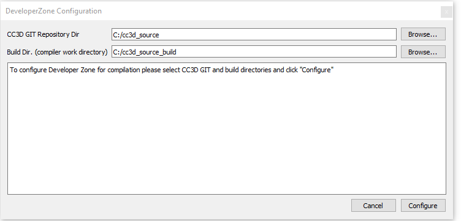
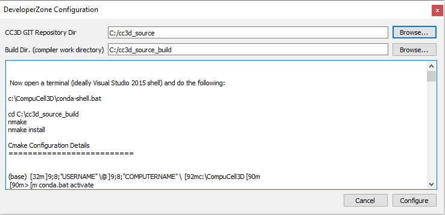
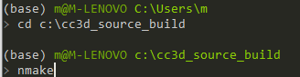
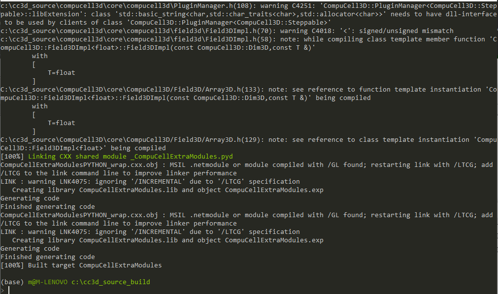
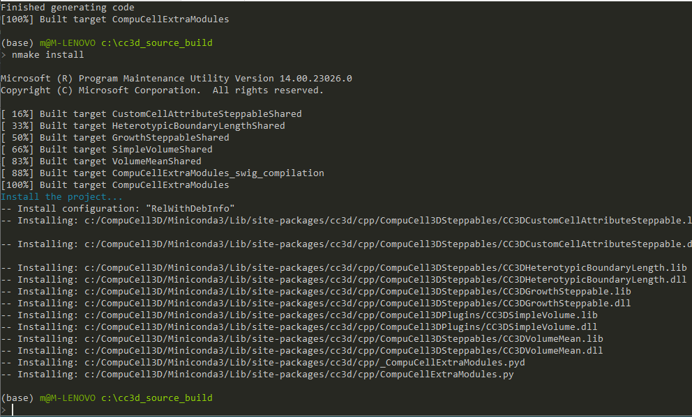

Configuring DeveloperZone Projects for compilation
==================================================

From technical viewpoint ``DeveloperZone`` is a folder that contains source code for additional plugins and steppables
written in C++. Depending on your needs, sometimes, you want to write high-performance CC3D module that runs much faster
than equivalent Python code. Up until version 4.3.0 of CC3D developing C++ modules was a little bit involved because
it required users to install and configure appropriate compilers that will work with provided binaries, performing
CMake configuration - the challenge here was to make sure that all Cmake variables point to appropriate directories,
that Python version identified by Cmake matches the one with which CC#D was compiled etc... In practice this process was
often perceived as quite error-prone.

Starting with version 4.3.0 of CC3D we provide one-click configurator for "DeveloperZone" All that is required from
the user is one time setup of compiler (on Windows you will install Visual Studio 2015 Community Edition, and on Mac
you need to install xcode-select package - all described in sections above. On linux you will likely not need any
additional setup).

Once you set up compilers (and install binaries for CC3D) open Twedit++ and go to ``CC3D C++ -> DeveloperZone ...`` .
This will open the following dialog:

|dz_001|

Before going any further, make sure you you have a working copy of the CC3D source code. The best way is to clone CC3D
source code repository. If you have git installed on your system you are ready to go. If not you can easily do it
by running ``conda-shell`` script from CC3D installation folder. Assuming your CC3D is installed
into ``c:\CompuCell3D`` (on Windows) you would run the following:

.. code-block:: console

    cd c:\
    c:\CompuCell3D\conda-shell.bat

then :

.. code-block:: console

    conda install -c conda-forge git

At this point you should have ``git`` installed within base environment of the miniconda distribution that
is bundled with CC3D. In general to make use of any conda tools you would first need to run ``conda-shell`` each time
you open new terminal.

Let's clone CC3D source code now. In the terminal where you previously ran ``conda-shell.bat``, do the following

.. code-block:: console

    cd c:\cc3d_source
    git clone https://github.com/CompuCell3D/CompuCell3D.git .

This will clone (download) CC3D source code and place it in ``c:\cc3d_source``

Now let's make build directory. This is a directory where compilers will place temporary compilation objects:

.. code-block:: console

    cd c:\
    mkdir cc3d_source_build

.. warning::

    It is important to create a fresh (empty) build directory before you can configure DeveloperZone configuration. CC3D cannot use build directory that is non empty

Now, fill in full path to CC3D repository (``c:\cc3d_source``) and to build folder (``c:\cc3d_source_build``) and  click
``Configure`` button in the bottom right corner of the dialog. Configuration process will start. After it is done
the dialog should display summary of what to do next:

|dz_002|

On Windows, we are asked to open a terminal (ideally Visual Studio 2015 64bit shell - search for VS2015 x64 native tools
in main search menu of Windows operating system, or simply open any terminal on windows) and run the

.. code-block:: console

    c:\CompuCell3D\conda-shell.ba

This, in addition to activating base miniconda environment will "preconfigure" the terminal for compilation using
Visual Studio 2015 Tools. You only need to run this ``conda=shell.bat`` command for "regular" terminal. If you opened
Visual Studio Terminal you may skip this step

Then you run the following:

.. code-block:: console

    cd C:\cc3d_source_build

    nmake
    nmake install

First command changes directory to the directory that we designated for storing temporary compilation files. This is
where the Makefile were generated to.
Next, we run windows version of ``make`` called ``nmake``.

|dz_003|

Once compilation finishes

|dz_004|

we install the compiled modules.

|dz_005|

If you look carefully at the output screen you will see that the modules we compiled will get installed into subfolders
of ``c:\CompuCell3D\Miniconda3`` which is Miniconda distribution that is part of CC3D installation.
This is exactly what we want. In other words, with one click and few simple command line commands we were able to
compile a set of demo extensions modules written in C++. This is significant because this simple procedure allows you
to easily add new C++ modules and significantly speedup your simulation. From now on you can focus on
coding rather than figuring out of how to set up compilation

