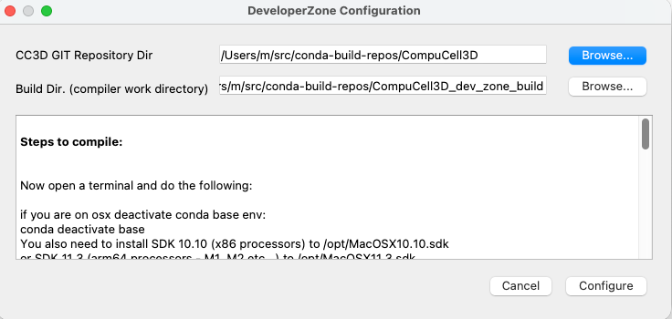

Configuring DeveloperZone Projects for compilation
==================================================

``DeveloperZone`` is a source tree for additional C++ plugins, steppables, and
Python bindings that extend CompuCell3D. Because DeveloperZone builds compiled
C++ code, the safest workflow is to compile CompuCell3D first and then build
DeveloperZone with the same compiler, Python, CMake, VTK, SWIG, and conda
environment. This keeps the C++ ABI, Python version, library paths, and Visual
Studio or Unix compiler setup consistent between the core CompuCell3D build and
your extension modules.

Prerequisite: compile CompuCell3D first
---------------------------------------

Before configuring DeveloperZone, complete the full CompuCell3D compilation
workflow for your platform:

* Linux: :doc:`building_core_cc3d_cpp_code_linux`
* macOS: :doc:`building_core_cc3d_cpp_code_mac`
* Windows: :doc:`building_core_cc3d_cpp_code_windows`

Those pages also describe how to clone the repositories. In this section we
assume the source code is under the same location used by the compilation
instructions:

* Linux and macOS: ``$HOME/src-cc3d``
* Windows: ``%USERPROFILE%\src-cc3d``

Launch Twedit++ from the compile environment
--------------------------------------------

For all platforms, start Twedit++ from a command line where the same conda
environment used to compile CompuCell3D is active. Do not start Twedit++ from a
different Python environment or from an unrelated desktop shortcut.

If your compile environment is named ``cc3d-compile``, use:

.. code-block:: console

    conda activate cc3d-compile
    python -m cc3d.twedit5

Some older Linux and macOS instructions use the environment name
``cc3d_compile`` instead. If that is the environment you used to compile
CompuCell3D, activate that exact environment:

.. code-block:: console

    conda activate cc3d_compile
    python -m cc3d.twedit5

Windows Visual Studio tools
---------------------------

On Windows, Visual Studio compiler tools must be active in the same console
session before launching Twedit++. Start from a regular ``cmd.exe`` console,
activate the x64 Visual Studio tools for the version you used to compile
CompuCell3D, then activate the conda environment and run Twedit++.

For Visual Studio 2015 x64:

.. code-block:: bat

    call "%ProgramFiles(x86)%\Microsoft Visual Studio 14.0\VC\vcvarsall.bat" x64
    conda activate cc3d-compile
    python -m cc3d.twedit5

For Visual Studio 2019 x64:

.. code-block:: bat

    call "%ProgramFiles(x86)%\Microsoft Visual Studio\2019\Community\VC\Auxiliary\Build\vcvars64.bat"
    conda activate cc3d-compile
    python -m cc3d.twedit5

For Visual Studio 2026 x64:

.. code-block:: bat

    call "%ProgramFiles%\Microsoft Visual Studio\2026\Community\VC\Auxiliary\Build\vcvars64.bat"
    conda activate cc3d-compile
    python -m cc3d.twedit5

If you installed a different Visual Studio edition, such as ``Professional``,
``Enterprise``, or ``BuildTools``, adjust the edition folder in the path.

Configure DeveloperZone in Twedit++
-----------------------------------

In Twedit++ choose ``CC3D C++ -> DeveloperZone ...``. This opens the
DeveloperZone configuration dialog:

|dz_001|

Set the fields as follows:

* ``CC3D GIT Repository Dir``: the CompuCell3D repository root.
* ``Build Dir.``: a new empty directory where CMake will generate build files - this will be prepopulated automatically but you can override it
* ``Windows CMake generator``: on Windows, select the Visual Studio generator
  matching the Visual Studio version used to compile CompuCell3D.

Example paths:

.. code-block:: console

    # Linux and macOS
    CC3D GIT Repository Dir: $HOME/src-cc3d/CompuCell3D
    Build Dir.:              $HOME/src-cc3d/CompuCell3D_dev_zone_build

.. code-block:: bat

    rem Windows
    CC3D GIT Repository Dir: %USERPROFILE%\src-cc3d\CompuCell3D
    Build Dir.:              %USERPROFILE%\src-cc3d\CompuCell3D_dev_zone_build

The build directory must be empty when DeveloperZone is configured. If you need
to reconfigure from scratch, remove the old build directory or choose a new one.

After filling in the dialog, click ``Configure``. Twedit++ runs CMake using the
active conda environment and writes the generated project files to the build
directory.

Build DeveloperZone on Linux and macOS
--------------------------------------

After configuration completes, build and install from the same conda
environment:

.. code-block:: console

    conda activate cc3d-compile
    cd $HOME/src-cc3d/CompuCell3D_dev_zone_build
    make
    make install

If your compile environment is named ``cc3d_compile``, activate
``cc3d_compile`` instead.

Build DeveloperZone on Windows
------------------------------

On Windows, use Visual Studio in ``Release`` mode.

Open the generated solution from the DeveloperZone build directory, for example:

.. code-block:: bat

    %USERPROFILE%\src-cc3d\CompuCell3D_dev_zone_build\DeveloperZone.sln or ``ALL_BUILD``

In Visual Studio:

* Select the ``Release`` configuration.
* Select the ``x64`` platform.
* Build ``ALL_BUILD``.
* Build ``INSTALL``.

You can also build from the same Visual Studio-enabled command prompt:

.. code-block:: bat

    cd %USERPROFILE%\src-cc3d\CompuCell3D_dev_zone_build
    cmake --build . --config Release --target ALL_BUILD
    cmake --build . --config Release --target INSTALL

The installed DeveloperZone modules are copied into the same conda environment
used for the core CompuCell3D build. This is the intended result: the extension
modules are compiled and installed against the same CompuCell3D libraries and
Python package that were produced by the main build.

