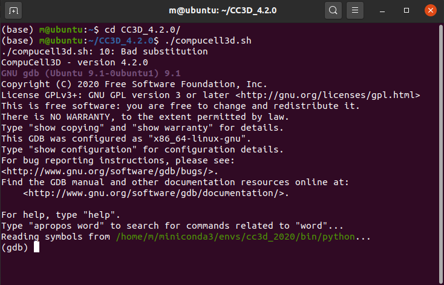
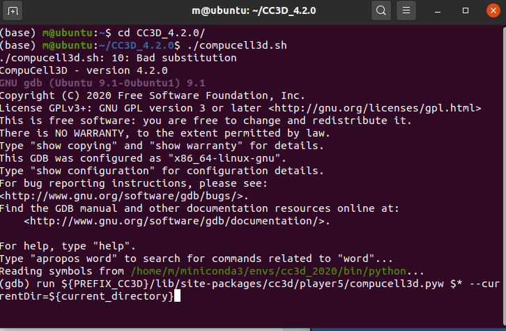
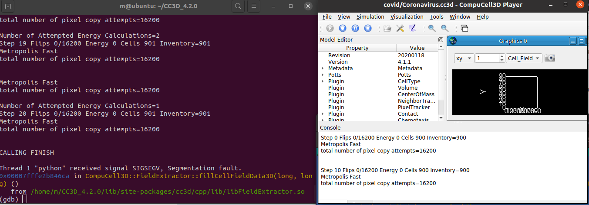
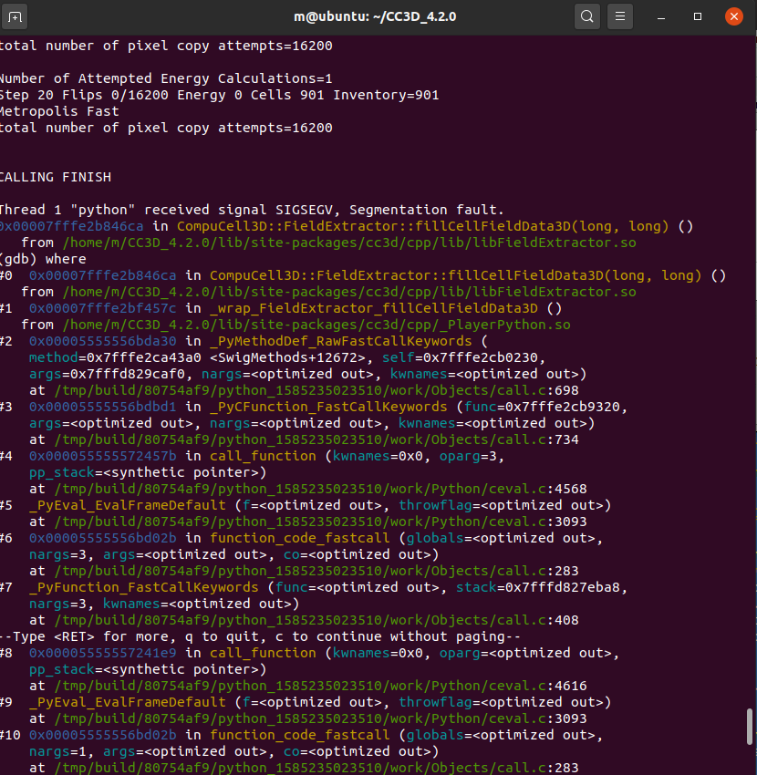

Debugging CC3D using GDB
========================

GDB is useful when a CC3D simulation crashes in compiled C++ code. It can
show the native call stack, the exact function where the crash happened,
and the sequence of C++ calls that led to the failure. This is different
from Python debugging: Python debuggers are useful for Python steppables
and UI code, while GDB is for crashes in compiled libraries.

This page focuses on Linux. The same general idea can work on macOS, but
modern macOS systems usually use ``lldb`` instead of ``gdb`` because of
code-signing restrictions around GDB.

GDB Prerequisites
-----------------

Before using GDB, make sure that:

* CC3D runs from the command line in the conda environment you want to
  debug.
* You are using the same compiled CC3D build that produced the crash.
* The simulation can be launched from the command line.
* GDB is installed in the active environment or available on your system.

For useful C++ source line information, build CC3D with debug symbols. A
``RelWithDebInfo`` build is usually a good compromise because it preserves
optimization while keeping debug information. A pure ``Debug`` build may
be slower and can expose different timing behavior.

Check that GDB is available:

.. code-block:: console

    gdb --version

If you are using a conda-based development environment and GDB is not
available, install it from conda-forge:

.. code-block:: console

    conda install -c conda-forge gdb

Start with a Command-Line Simulation
------------------------------------

The simplest debugging target is ``cc3d.run_script`` because it runs a
simulation without the Player GUI. First verify that the simulation runs
normally from the active environment:

.. code-block:: console

    python -m cc3d.run_script -i ~/src-cc3d/CompuCell3D/CompuCell3D/core/Demos/Models/cellsort/cellsort_2D/cellsort_2D.cc3d

If the crash happens only in Player, you can debug Player instead, but
starting with ``run_script`` usually gives a cleaner stack trace.

Run cc3d.run_script under GDB
-----------------------------

Start GDB with the Python interpreter from the active conda environment:

.. code-block:: console

    gdb --args python -m cc3d.run_script -i ~/src-cc3d/CompuCell3D/CompuCell3D/core/Demos/Models/cellsort/cellsort_2D/cellsort_2D.cc3d

At the GDB prompt, run the program:

.. code-block:: console

    (gdb) run

If the simulation crashes, GDB will stop at the crash site. Collect a
native stack trace:

.. code-block:: console

    (gdb) where

For crashes involving multiple threads, collect stacks from all threads:

.. code-block:: console

    (gdb) info threads
    (gdb) thread apply all bt

The ``where`` and ``bt`` commands both print backtraces. ``thread apply
all bt`` is often the most useful report to send to developers because
parallel Potts code and GUI code may involve more than one thread.

Debugging Player with GDB
-------------------------

If the crash requires the Player GUI, run Player under GDB instead:

.. code-block:: console

    gdb --args python -m cc3d.player5

Then start it from the GDB prompt:

.. code-block:: console

    (gdb) run

Open the simulation in Player and reproduce the crash. When GDB stops,
collect the same information:

.. code-block:: console

    (gdb) where
    (gdb) thread apply all bt

This approach avoids editing CC3D launcher scripts. It also makes it
clear which Python executable and conda environment GDB is using.

Setting Breakpoints
-------------------

You can set breakpoints before running the program. For example, to stop
when the fast Metropolis loop starts:

.. code-block:: console

    (gdb) break CompuCell3D::Potts3D::metropolisFast
    (gdb) run

If GDB cannot find the symbol before the CC3D libraries are loaded, allow
pending breakpoints:

.. code-block:: console

    (gdb) set breakpoint pending on
    (gdb) break CompuCell3D::Potts3D::metropolisFast
    (gdb) run

You can also break on a source file and line number if debug symbols are
available and the source paths match your build:

.. code-block:: console

    (gdb) break Potts3D.cpp:660
    (gdb) run

Useful GDB Commands
-------------------

Common commands during CC3D debugging are:

.. code-block:: console

    run                         # start the process
    where                       # show the current thread's backtrace
    bt                          # same idea as where
    info threads                # list threads
    thread apply all bt         # backtrace for every thread
    frame 3                     # select frame 3 from the backtrace
    list                        # show source around the current frame
    print variable_name          # print a C++ variable if available
    continue                    # resume after a breakpoint
    quit                        # exit GDB

When reporting a crash, include at least:

* the command used to start GDB,
* the simulation file used to reproduce the crash,
* the output of ``where`` or ``thread apply all bt``,
* the CC3D branch or commit you built,
* whether the build was ``Release``, ``RelWithDebInfo``, or ``Debug``.

When Source Lines Are Missing
-----------------------------

If the stack trace shows function names but no source lines, the binary
probably does not contain debug symbols or GDB cannot find the source
files. Rebuild with debug information, preferably ``RelWithDebInfo``, and
make sure you are debugging the same installed package that came from that
build.

If the stack trace contains mostly ``??`` frames, common causes are:

* stripped binaries,
* debugging a different CC3D installation than the one you built,
* missing debug symbols for system or conda libraries,
* optimized code in which some frames or variables were removed.

Even a partial native stack trace can still be useful, especially when it
shows the CC3D function where the crash occurred.

macOS Note
----------

On macOS, ``lldb`` is usually easier to use than ``gdb``. The equivalent
pattern is:

.. code-block:: console

    lldb -- python -m cc3d.run_script -i path/to/simulation.cc3d

Then run and collect a backtrace:

.. code-block:: console

    (lldb) run
    (lldb) bt all

The rest of the debugging idea is the same: start the active conda
Python, reproduce the crash, and collect the native backtrace.

Example Screenshots
-------------------

The screenshots below show an older workflow that launched GDB through a
modified CC3D shell script. The command-line workflow above is preferred
for new debugging sessions, but the screenshots still illustrate what a
GDB session and backtrace look like.

|debugging_gdb_00|

|debugging_gdb_01|

|debugging_gdb_02|

|debugging_gdb_03|

