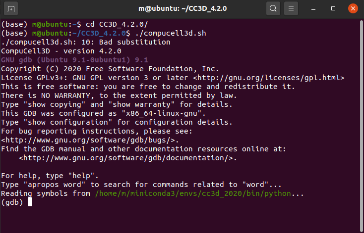

Debugging CC3D using GDB
========================

Sometimes when you execute simulation and encounter software crash it is useful to do a quick
introspection to see what went wrong. IN this section we will show you how to inspect CC3D call trace
using GDB.

.. note::

    Provided recipe works only on OSX and Linux

First it is useful to create a copy of CC3D run scripts because we will be modifying those. This way
you will have a copy to revert to after you are done with debugging. LEt us start with modifications to
``compucell3d.sh`` (on OSX ``compucell3d.command``) script. This script launches Player and allows
you to run simulation. When we open ``compucell3d.sh`` in editor, towards the end of the file
you will see a line that looks as follows:

.. code-block:: console

    ${PYTHON_EXEC} ${PREFIX_CC3D}/lib/site-packages/cc3d/player5/compucell3d.pyw $* --currentDir=${current_directory}

we will replace this line with

.. code-block:: console
    gdb ${PYTHON_EXEC}

Save the script and run it. As a result we will be dropped to gdb shell that is setup to debug Python
scripts (``${PYTHON_EXEC}`` points to Python interpreter)

|debugging_gdb_00|

Next, in Python shell we will run actual player by typing

.. code-block:: console

    run ${PREFIX_CC3D}/lib/site-packages/cc3d/player5/compucell3d.pyw $* --currentDir=${current_directory}

|debugging_gdb_01|

the ``run`` command tells gdb to start running the program that we passes to gdb when we invoked gdb shell.
In out case this program is a Python interpreter, exactly what we want. The remaining arguments of
the ``run`` line are the arguments we are passing to the program we are debugging. In our case we
pass ``${PREFIX_CC3D}/lib/site-packages/cc3d/player5/compucell3d.pyw $* --currentDir=${current_directory}``
which means that Python interpreter will run ``player5/compucell3d.pyw`` executable script that takes
``$* --currentDir=${current_directory}`` as arguments

After the payer pops up we load simulation and run it as if it were a normal CC3D run. This time
however we are running in the debubugger shell an as you can see in the left panel we are getting
debug output. In this case we see a crash occurring:

|debugging_gdb_02|

The crash happened at the end of the simulation (we turned off thread synchronization code to trigger crash)

As you can see, the crash happened in ``fillCellFieldData3D`` function. To get full call stack trace
we can type ``where`` in the gdb shell to get more information

|debugging_gdb_03|

When you experience CC3D crash it is useful to take this extra step and get more information to
figure out where the actual problem occurs. Sending this information to developers can fast-track
the software patch

.. |debugging_gdb_01| image:: images/debugging_gdb_01.png
   :width: 3.6in
   :height: 2.4in

.. |debugging_gdb_02| image:: images/debugging_gdb_02.png
   :width: 6.8in
   :height: 2.4in

