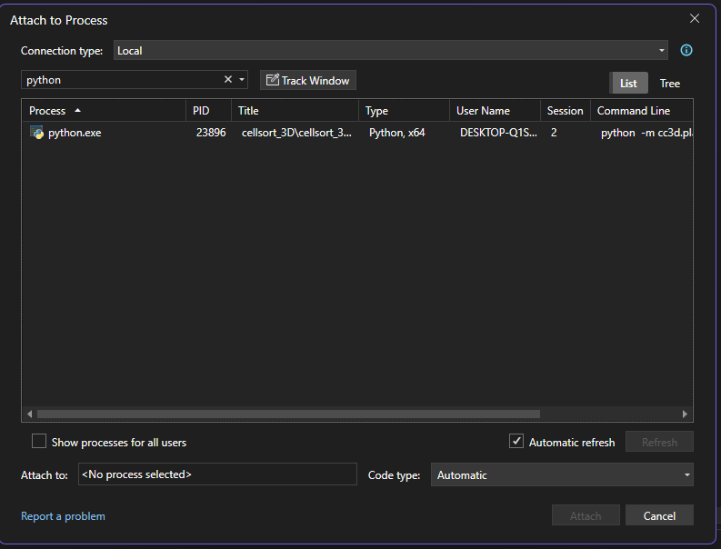

Debugging CC3D using Visual Studio
==============================================

This demonstrates how to debug compiled C++ code. 

.. note::

    This doc was written with Windows in mind. It might still work on other operating systems. 

First, run CompuCell3D Player from the command prompt of your choice, such as Miniforge Prompt. 

.. code-block:: console

    conda activate your-cc3d-env

    python -m cc3d.player5

Run Visual Studio as Administrator. From the navigation menu, select Debug -> Attach to Process...

In the window that appears, search for python.exe:

|debug_vs_attach_to_process|

Click "Attach." This should start debugging mode. 
If you have trouble finding the process, try checking the box for "Show processes for all users."

Add a breakpoint in Potts3D.cpp. At the time of writing, there is a line that is run every MCS that will be a good target for your first breakpoint. 

.. code-block:: cpp

    unsigned int Potts3D::metropolisFast(const unsigned int steps, const double temp) {
        // ...

        oss << "Metropolis Fast" << endl;
        oss << "total number of pixel copy attempts=" << numberOfAttempts;

        // ...
    }

Run a simulation in Player and ensure that the breakpoint is hit. 