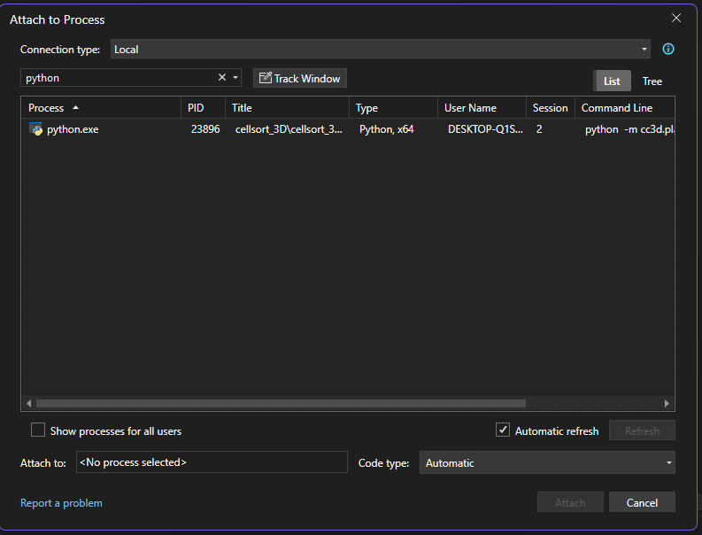

Debugging CC3D C++ Code Using Visual Studio
===========================================

Visual Studio is the most convenient debugger for CC3D native C++ code on Windows. Use it when you need to inspect objects such as ``Simulator``, ``Potts3D``, plugins, steppables, or field storage while a real simulation is running. For Python or Qt user-interface code, use :doc:`debugging_ui_in_pycharm`. For Linux command-line debugging, use :doc:`debugging_cc3d_using_gdb`.

This workflow attaches Visual Studio to the Python process that has loaded the compiled CC3D extension modules. Python starts the application, but Visual Studio debugs the native C++ code loaded into that process.

Visual Studio C++ Debugging Requirements
****************************************

Before attaching the debugger, make sure that the build and runtime environment match:

- Build CC3D with the same Visual Studio version that you will use for debugging.
- Prefer ``RelWithDebInfo``. It keeps the optimized build close to the normal runtime behavior while preserving enough debug information for source-level debugging.
- Run Player or the command-line simulation from the conda environment that contains the compiled CC3D package.
- Keep the build directory available. Visual Studio needs the generated binaries and symbol files to map loaded modules back to source code.

Debug builds may work for selected targets, but CC3D development on Windows is usually smoother with ``RelWithDebInfo``.

Start CC3D From The Compiled Environment
****************************************

Open a Miniforge Prompt, Anaconda Prompt, or ``cmd.exe`` window and activate the environment that contains your compiled CC3D package:

.. code-block:: console

    conda activate your-cc3d-env
    python -m cc3d.player5

You can also debug a simulation launched from the command line:

.. code-block:: console

    conda activate your-cc3d-env
    python -m cc3d.run_script -i path\to\your_simulation.cc3d

The important point is that the ``python.exe`` process must be the one that loads your compiled CC3D libraries. See also :ref:`How to run CC3D from the command line <running-newly-compiled-cc3d>`.

Attach Visual Studio To Python
******************************

Open the generated ``COMPUCELL3D.sln`` file from your CC3D build directory. If Windows permissions prevent Visual Studio from seeing the target process, start Visual Studio as Administrator.

From the Visual Studio menu, choose ``Debug`` -> ``Attach to Process...``. Search for ``python.exe``:

|debug_vs_attach_to_process|

If more than one Python process is running, use the process path or command-line column to choose the one started from your CC3D conda environment. If the process is missing, enable ``Show processes for all users`` and click ``Refresh``.

In the attach dialog, make sure that native code debugging is enabled. Depending on the Visual Studio version, this appears as ``Native code`` or as a code type selected through the ``Select...`` button. Click ``Attach``.

Set A C++ Breakpoint
********************

A good first breakpoint is inside the Potts update loop. Open ``CompuCell3D/core/CompuCell3D/Potts3D/Potts3D.cpp`` and place a breakpoint in ``Potts3D::metropolisFast``. This method is entered during Monte Carlo Step execution, so it is a useful place to confirm that the debugger is attached to the active simulation.

.. code-block:: cpp

    unsigned int Potts3D::metropolisFast(const unsigned int steps, const double temp) {
        // ...

        oss << "Metropolis Fast" << endl;
        oss << "total number of pixel copy attempts=" << numberOfAttempts;

        // ...
    }

Start or resume a simulation in Player. If Player is paused before the first step, run one or more steps. Visual Studio should stop at the breakpoint, and you can inspect local variables, object members, the call stack, and active threads.

Inspecting A Crash Or Unexpected Behavior
*****************************************

When CC3D stops at a breakpoint or exception, the most useful Visual Studio windows are:

- ``Call Stack``: shows how execution reached the current C++ function.
- ``Locals`` and ``Autos``: show variables in the current stack frame.
- ``Watch``: lets you pin expressions such as ``cell``, ``pt``, ``sim``, or plugin member variables.
- ``Threads``: helps identify whether execution is in the main simulation thread or a worker thread.
- ``Modules``: shows loaded DLLs and whether their symbols were loaded.

For bug reports or developer discussions, copy the call stack and note the simulation file, build type, and breakpoint or exception location.

Visual Studio C++ Debugging Troubleshooting
*******************************************

If a breakpoint is hollow or is never hit, first check that you attached to the correct ``python.exe`` process. Multiple conda environments often mean multiple Python processes.

If Visual Studio says that symbols are not loaded, open ``Debug`` -> ``Windows`` -> ``Modules`` and find the relevant CC3D DLL or Python extension module. The module path should point to your compiled environment or build output, not to an unrelated installed copy of CC3D.

If source lines do not match the code being executed, rebuild CC3D and restart Player. This usually means that the running binaries were built from a different source tree or an older build directory.

If native breakpoints never bind, confirm that the debugger is attached for native code. A Python-only debugging session will not stop inside C++ files.

