Debugging CC3D UI Code In PyCharm
=================================

PyCharm is the preferred debugger for CC3D Python code, including Twedit++ and Player user-interface code. It lets you stop at breakpoints, inspect Qt objects, evaluate expressions, and follow control flow through Python modules. This is different from native C++ debugging: use :doc:`debugging_cc3d_using_visual_studio` or :doc:`debugging_cc3d_using_gdb` when you need to debug compiled CC3D core code.

This section assumes that PyCharm can already launch Twedit++ or Player from the source tree. If you have not set that up yet, first follow :doc:`Running Player and Twedit++ from PyCharm <working_on_user_interface>`.

PyCharm UI Debugging Requirements
*********************************

Before starting a debug session, verify the following:

- The PyCharm interpreter is the conda environment that can import the CC3D package you want to test.
- The run configuration starts the correct entry point, usually ``cc3d/twedit5/__main__.py`` for Twedit++ or ``cc3d/player5/__main__.py`` for Player.
- PyCharm is using the source tree that you are editing, not a different installed copy of CC3D.

A quick way to verify the imported package is to evaluate this expression in the debugger:

.. code-block:: python

    import cc3d; cc3d.__file__

The path should point to the source checkout or development environment that you expect.

Start A Debug Session
*********************

In PyCharm, right-click the relevant ``__main__.py`` file and choose ``Debug`` instead of ``Run``.

|debug_001|

The application starts under the PyCharm debugger. At this point the UI behaves normally, but PyCharm is ready to stop execution when a breakpoint is reached.

Set The First Breakpoint
************************

For a simple Twedit++ example, open ``EditorWindow.py`` and set a breakpoint inside the ``open(self)`` method. Click in the gutter next to the line where you want execution to stop.

|debug_002|

Click the Debug button on the toolbar or start the existing debug configuration.

|debug_003|

Switch to Twedit++ and choose ``File`` -> ``Open``. When execution reaches the breakpoint, PyCharm brings the debug session to the foreground. You may need to manually switch focus back to PyCharm, depending on the operating system and window manager.

|debug_004|

Inspect Application State
*************************

Open ``Evaluate Expression`` from the debugger toolbar or press ``Alt-F8``.

|debug_005|

Type ``self`` and press ``Enter``. PyCharm displays the current ``EditorWindow`` instance and its members.

|debug_006|

One useful member is ``self.fileDict``. Before opening a file it is typically empty, which gives us a baseline for watching how Twedit++ updates editor state.

Step Through The File-Open Workflow
***********************************

To continue execution, use one of the debugger controls:

- ``Resume`` or ``F9`` runs until the next breakpoint.
- ``Step Over`` or ``F8`` executes the current line without entering called functions.
- ``Step Into`` or ``F7`` enters the function called on the current line.

|debug_007|

For this exercise, use ``F8`` to step through ``open(self)`` until the line that calls ``QtWidgets.QFileDialog.getOpenFileNames``.

|debug_008|

Step over that line. The file-open dialog appears. Select a Python file and click ``Open``.

|debug_009|

After the dialog closes, PyCharm returns to the code.

|debug_010|

At this point the file has been selected, but Twedit++ has not necessarily displayed it yet. You are still inside the method that coordinates the file-open operation.

|debug_011|

The debugger now shows the selected file path in ``file_names``.

|debug_012|

You can inspect ``file_names`` in the variables panel:

|debug_013|

You can also inspect the same value through ``Evaluate Expression``. Both approaches are useful; the variables panel is faster for browsing nearby state, while ``Evaluate Expression`` is better for targeted checks.

|debug_014|

Step Into Helper Functions
**************************

Continue with ``F8`` until execution reaches the call to ``self.loadFiles``.

|debug_015|

Press ``F7`` to step into ``loadFiles``. This moves from the high-level UI action into the helper function that actually loads the selected files.

|debug_016|

Notice that the selected file list has moved from the local variable ``file_names`` in ``open`` to the parameter used by ``loadFiles``.

|debug_017|

Use The Call Stack
******************

The left side of the debugger shows the call stack.

|debug_018|

The highlighted frame is the function where execution is currently stopped. In this example, that is ``loadFiles`` in ``EditorWindow.py``. The frame below it is ``open`` in the same module, which tells you that ``open`` called ``loadFiles``.

Click the ``open`` frame.

|debug_019|

PyCharm shows the caller's source location and variables for that stack frame. This is useful when you need to compare state across nested function calls. You can move up and down the call stack and use ``Evaluate Expression`` at each frame.

When you are done stepping line by line, click ``Resume Program`` to let Twedit++ finish loading the selected file.

|debug_020|

Switch back to Twedit++. The selected file should now be open in the editor.

|debug_021|

Watch State Change Across Actions
*********************************

To see how application state changes after a file is loaded, set another breakpoint after the code that reads file ``lines``.

|debug_022|

Open another file. If execution stops at the first breakpoint, click ``Resume Program`` to continue to the second breakpoint. Open ``Evaluate Expression`` with ``Alt-F8``, type ``self.fileDict``, and press ``Enter``.

|debug_023|

The dictionary that was empty earlier is now populated. This tells you that Twedit++ updated ``self.fileDict`` during the previous file-open operation. As an exercise, continue stepping through the code and find the exact location where Twedit++ inserts entries into ``self.fileDict``.

Debugging Player UI Code
************************

The same PyCharm tools work for Player. Start ``cc3d/player5/__main__.py`` under the debugger and place breakpoints in the Player modules you are changing. Useful starting points are code paths that respond to menu actions, simulation loading, scene updates, or configuration changes.

For Player debugging, make sure that the simulation you open is small enough to restart quickly. UI debugging is most effective when you can reproduce the same action several times while adjusting breakpoints.

PyCharm UI Debugging Troubleshooting
************************************

If a breakpoint is not hit, confirm that PyCharm is running the same file that you edited. Evaluate ``import cc3d; cc3d.__file__`` and check the path.

If PyCharm starts the wrong application, inspect the run configuration and confirm that the script path points to the intended ``__main__.py`` file.

If imports fail, the selected interpreter is usually not the environment that contains the CC3D dependencies. Update the project interpreter or recreate the run configuration.

If a Qt dialog appears behind PyCharm, switch focus manually to the application window. This is common when stepping through code that opens modal dialogs.

If stepping feels too slow, place a breakpoint closer to the code you care about and use ``Resume`` instead of stepping through every line.

Summary Of Useful PyCharm Debugger Controls
*******************************************

- Set or remove a breakpoint: click in the editor gutter.
- Evaluate an expression: ``Alt-F8``.
- Step over the current line: ``F8``.
- Step into a function call: ``F7``.
- Resume execution: ``F9``.
- Inspect callers and nested function calls: use the call stack panel.

These tools are useful both for developing new UI features and for learning how existing Twedit++ and Player code is organized.

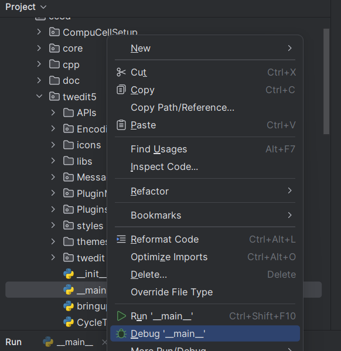

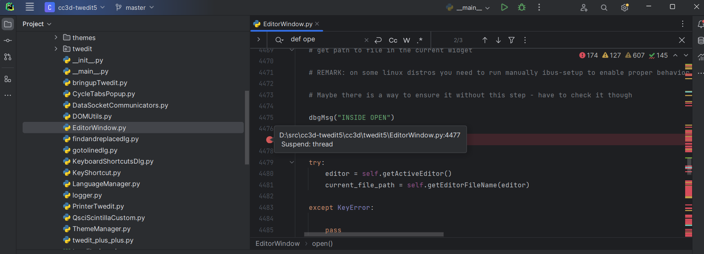

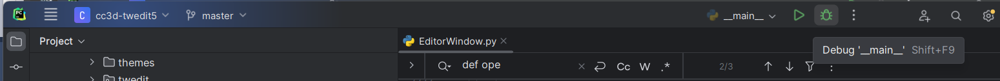

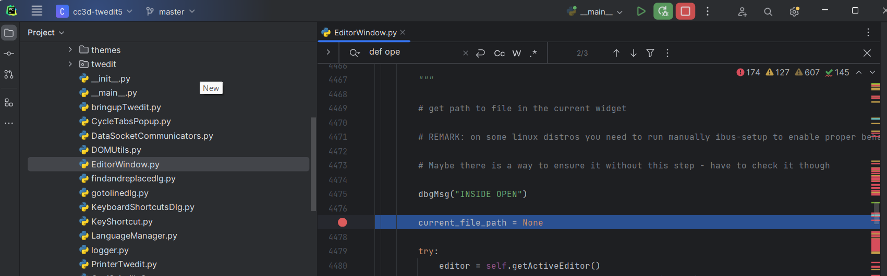

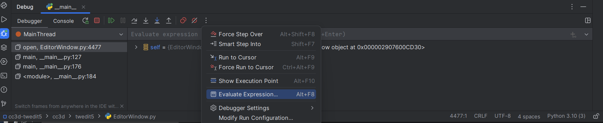

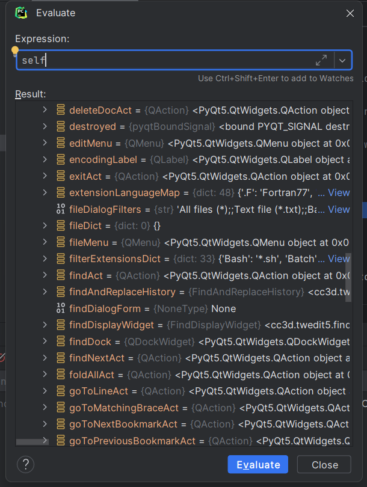

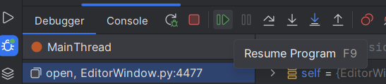

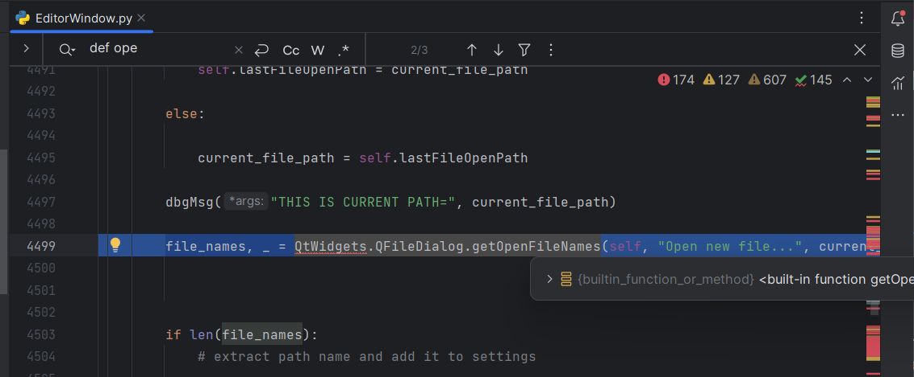

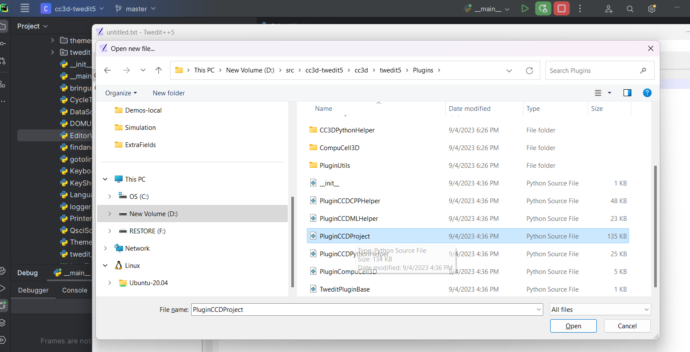

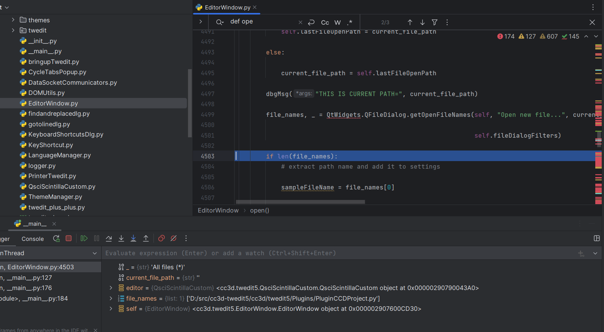

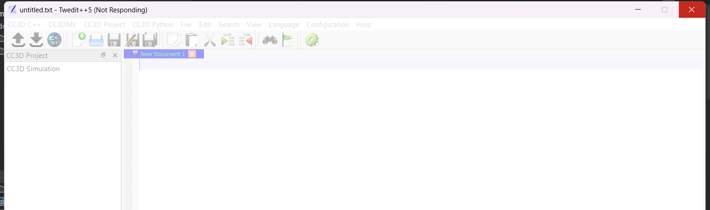

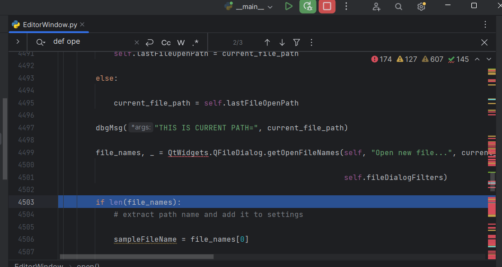

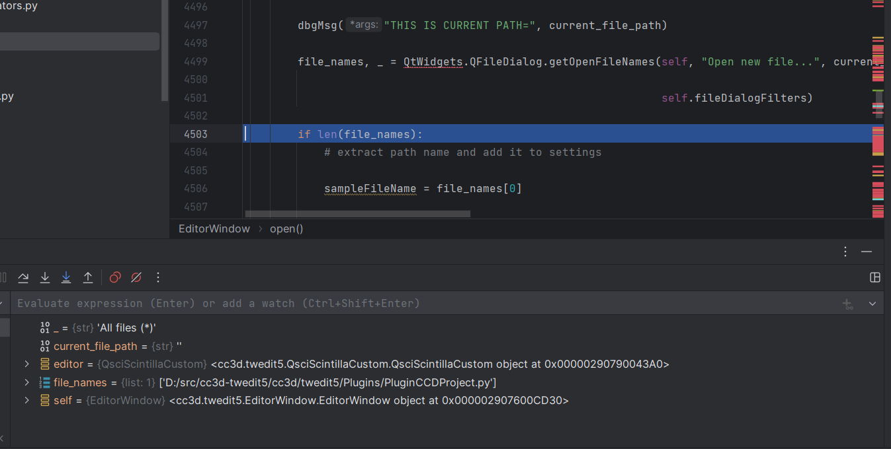

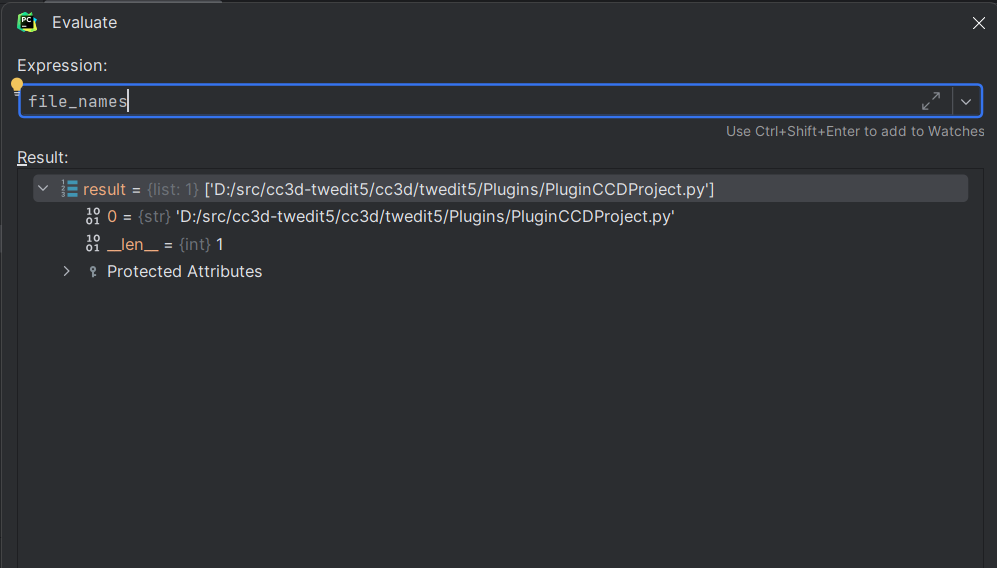

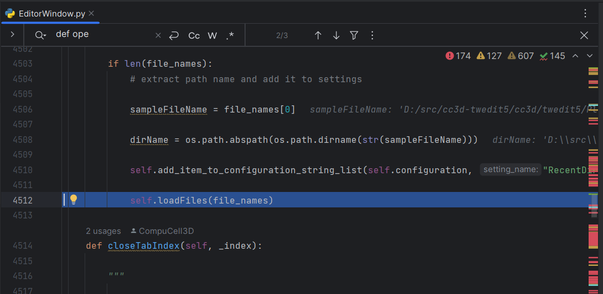

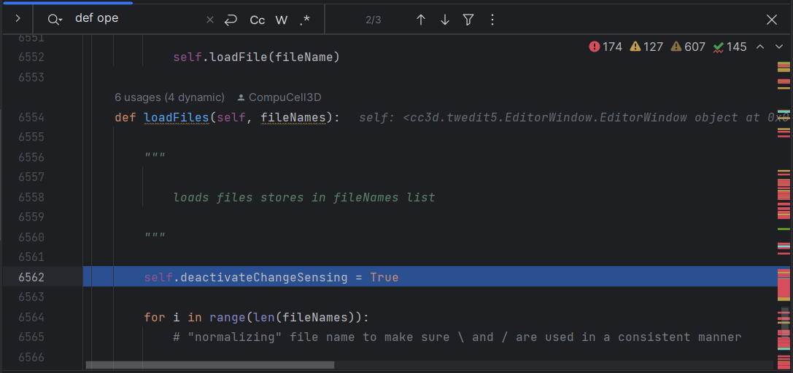

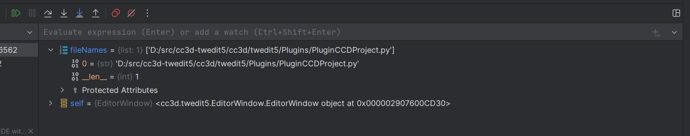

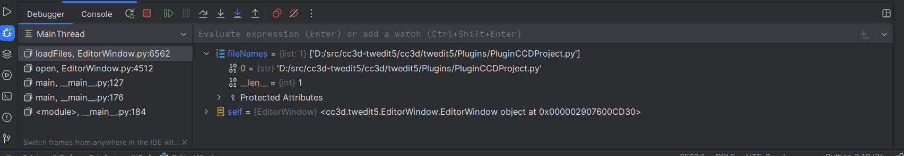

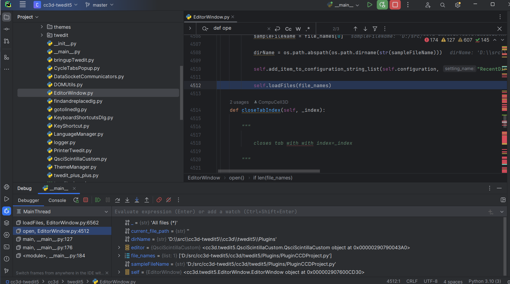

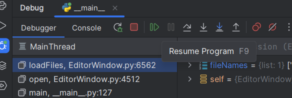

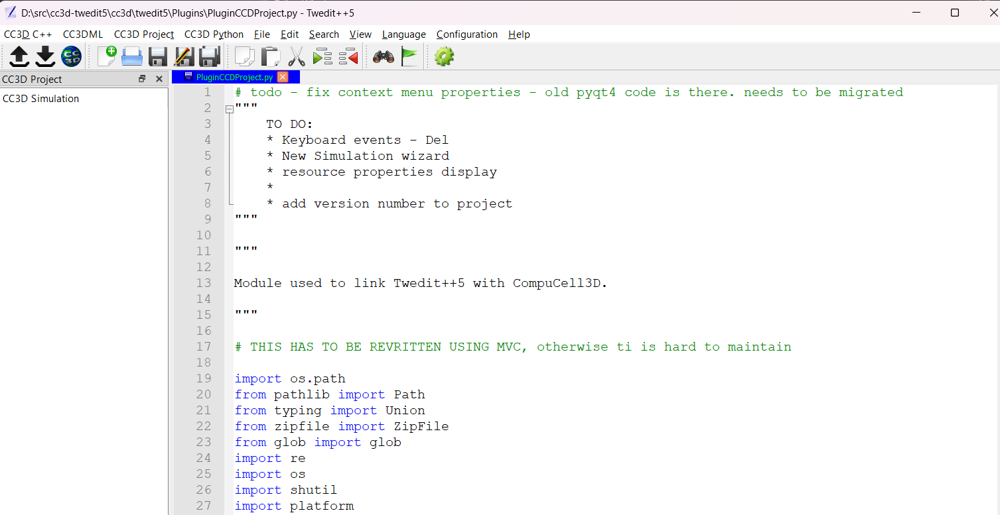

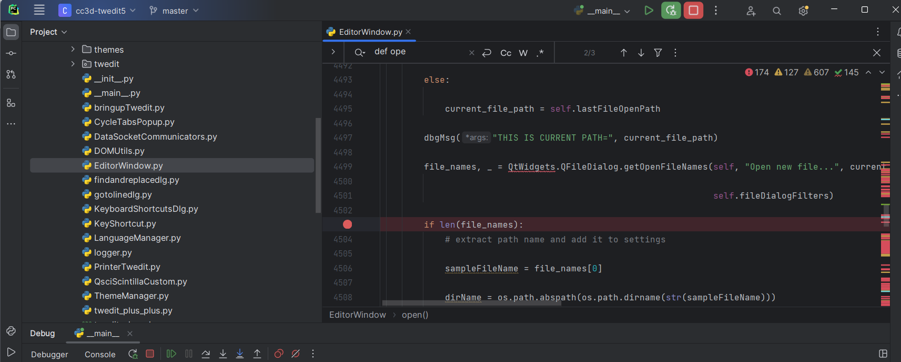

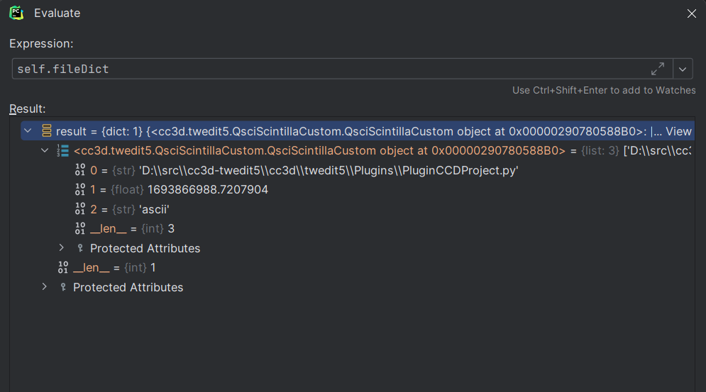
