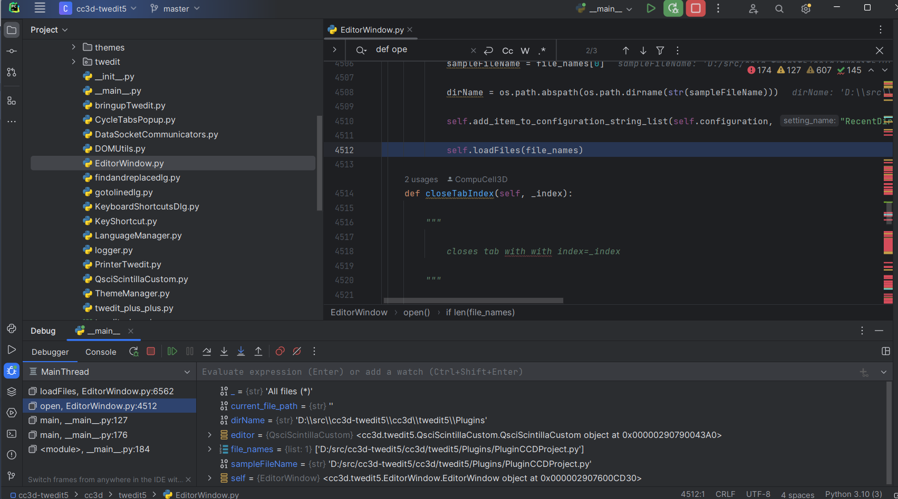
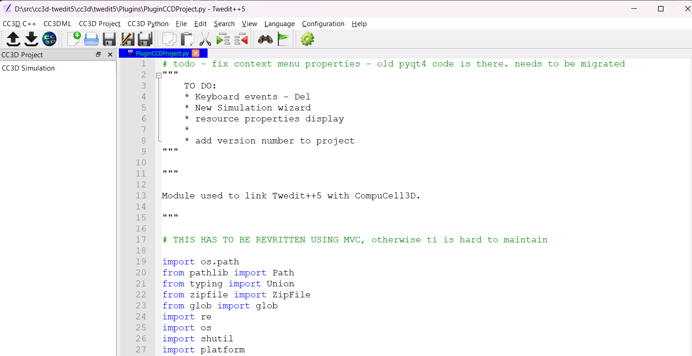

Debugging UI In PyCharm
=======================================

Once you set your PyCharm to launch Twedit++ or Player (see instructions in  :doc:`Running Player and Twedit++ from PyCharm <working_on_user_interface>`) it is a good time to ask a question why go through all this trouble? The answer is - debuggin capabilities. Sure you can use ``pdb`` but it is  not terribly efficient. PyCharm offers great debugging capabilities and in this section we will explore how to do do debugging in PyCharm. We will work with Twedit++ code but the same principles apply to Player , or for that matter to any other Python project.

You may want to look at the PyCharm documentation that teaches you about capabilities of the PyCharm debugger.
https://www.jetbrains.com/help/pycharm/debugging-your-first-python-application.html#where-is-the-problem

This section complements this tutorial and shows you how the debugging session may look like when working with Player or Twedit++.

Let us begin but instead of choosing ``Run`` option after right-clicking on ``__main__.py`` click ``Debug``

|debug_001|

now you are running the code in the debug mode. Not terribly interesting. So let's put a breakpoint inside ``EditorWindow.py`` (click on the margin where the code lines are displayed). Let's go inside the function ``open(self)``

|debug_002|

hit ``Debug`` from the toolbar

|debug_003|

Nothing will happen but when you try opening a document (``File->Open``) The cursor code execution will stop at the line at which you put a breakpoint. You may need to manually switch window focus so that PyCharm is on top.

|debug_004|

Click three dots and open ``Evaluate Expression..`` (or hit ``Alt-F8``)

|debug_005|

end in the top line of the popup window type ``self``, hit ``Enter`` and scroll down to see what members class ``EditorWindow`` has:

|debug_006|

Take a look at the ``fileDict`` member of ``EditorWindow`` class. It is empty now. so lets complete opening a document - to do that you need to move past the breakpoint. There are two ways: you can either click ``Resume`` button (or click ``F9``)

|debug_007|

or you can keep clicking ``F8`` and step through the code line by line. The second option might be useful when you want to see what really the code is doing. Let's keep clicking ``F8`` until we get to the line that starts with ``file_names, _ = QtWidgets.QFileDialog.getOpenFileNames``

|debug_008|

After we get through the line that we are parked now the ``File Open`` dialog will display and we can select a Python file

|debug_009|

If we and if we click Open on the ``File Open`` dialog we will be brought back to the code

|debug_010|

We are past the line that opened a dialog, and where we completed file selection. Interestingly, no text appeared in the editor yet.

|debug_011|

This is not a coincidence. We are in the middle of the process (method) that opens a file in the editor. So far we have completed file selection process but we have not yet "displayed" the content of the file in Twedit++. Let's see where we are in the code:

|debug_012|

We are just past the ``File Open`` dialog line and we already selected the file. Notice that the bottom panel displays variable ``file_names`` that contains the list of files selected in a ``File Open`` dialog (it was just one file)

|debug_013|

We can either exlpore the values in the bottom panel or we can use ``Evaluate Expression`` window - the results will be the same and it is a matter of preference which method of "code exploration" you choose:

|debug_014|

So far we have learned how to step-through "live" code and inspect application state (values of variables).

Let's continue clicking ``F8`` until we hit the line with ``self.loadFiles``

|debug_015|

If we hit ``F8`` again (do not do it yet) the actual files we selected will be loaded and their content will be displayed. Instead let's hit ``F7``. ``F7`` will step-into the function ``loadFiles`` and we will be able to inspect what is going on there:

|debug_016|

For example if we look at the bottom panel we see that the ``file_names`` were passed from function ``open`` to function ``loadFiles`` and it is now referred to as ``fileNames``

|debug_017|

Before we step through ``loadFiles`` function let's explore the call stack management panel (the left panel):

|debug_018|

Note that the line that is highlighted - it says ``loadFiles, EditorWindow.py`` which means that we are inside function ``loadFiles`` that is part of the ``EditorWindow.py`` module.
A line belo says ``open,EditorWindow.py`` which means that we got to function ``loadFiles`` from function ``open`` .

Let's click the line that says ``open,EditorWindow.py``.

|debug_019|

and notice that brings us back to the place from where we clicked ``F7``. In general you can leverage Call Stack panel and move up and down the call stack, and at each step you can use ``Evaluate Expression`` (``Alt-F8``) window to inspect the state of your app.

At this point if you are tired of clicking ``F8``  to step through the code let's click ``Program Resume`` and this will execute the rest of ``loadFiles`` function as well as the rest of ``open`` function that we were initially in.

|debug_020|

After you click ``Resume Programs`` you can switch to Twedit++ window and you will see that the file you selected is actually open now:

|debug_021|

Finally, let's do another round of opening. But let's place another breakpoint after ``lines``

|debug_022|

Select ``File->Open``, click ``Resume Program`` button to get past first breakpoint and we will get stopped at the second one . Open ``Evaluate Expression`` (``Alt-F8``) window and type ``self.fileDict`` in the entry line and hit ``Enter``:

|debug_023|

As you remember this variable was empty before we opened previous file. Now it is populated, the content is displayed above and we can conclude that it must have been populated during previous file open round. As an exercise you may want to find the place in the code where Twedit++ code inserts value into ``self.fileDict``

This brief tutorial is an intro to debugging teaches you how to start exploring CompuCell3D UI in the debugger. Those skills are very helpful when developing UI code and once you learn how to use debugger effectively you will be using it quite a lot when you develop new UI modules. There are few skills that are useful during debugging:
Setting up breakpoints, Evaluating expressions (``Alt-F8``), stepping over the code lines ``F8``,  stepping into the function ``F7`` and navigating the Call Stack. Once you learn those skills code development and learning what a given piece of code does will become a lot easier.

.. |debug_004| image:: debugging_images/debug_004.png
   :scale: 50%

.. |debug_007| image:: debugging_images/debug_007.png
   :scale: 50%

.. |debug_018| image:: debugging_images/debug_018.png
   :scale: 50%

