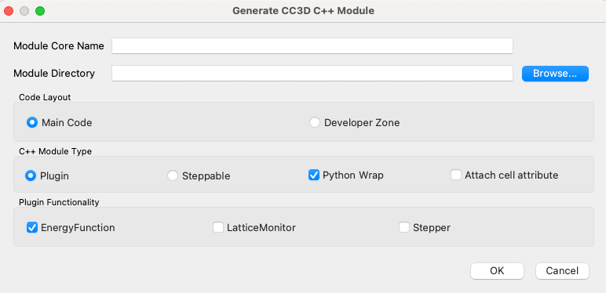
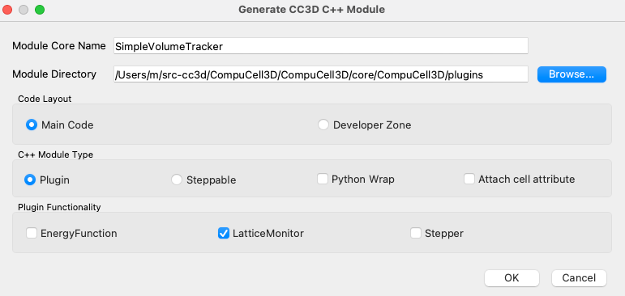
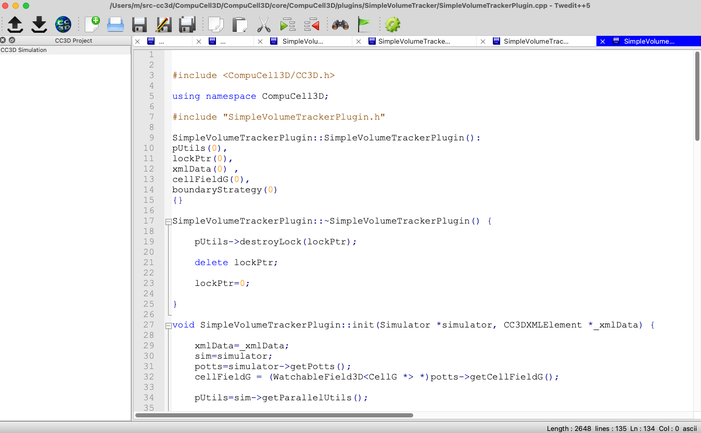

Simple Volume Tracker in C++
============================

The purpose of this tutorial is to show you a simplified version of the real Volume Tracker that is implemented in the CompuCell3D. We will guide you step by step how to develop the code. ANd later show you how to compile it and how to use it in a simulation.
Note that this will be rather a toy module because real VolumeTracker is loaded with every simulation we cannot have two modules incrementing and decrementing volumes . our version will only do printouts each time the cell's volume is incremented or decremented.  The reason we begin with this toy example is because it is probably the simples lattice monitor plugin one can write.

We assume that you cloned CompuCell3D repository to ``~/src-cc3d/CompuCell3D``

To begin, lets launch Twedit++. Then from CC3D C++ Menu lets select ``Generate New Module...`` and you should see the dialog:

|svp_001|

We need to fill module name, point to the directory where the code should be generated and select if the code should be
generated in Developer Zone or in the main code layout. We will pick main layout, call module ``SimpleVolumeTracker``
and pick ``/Users/m/src-cc3d/CompuCell3D/CompuCell3D/core/CompuCell3D/plugins`` as a module directory. The Module Type is ``Plugin`` and we pick ``LatticeMonitor`` as a Plugin functionality

|svp_002|

After, we click ``OK`` Twedit++ will generate code template that compiles out-of-the-box but does nothing interesting. The important thing is that Twedit++ generates a lot of boiler-plate code that we would need to write manually. This is a very tedious task and by using Twedit++ we saved ourselves a lot of work.

|svp_003|

It is our task to make this code useful. We will do it now. Here is the template of the core function (``field3DChange``) that Each Lattice Monitor needs to implement.

.. code-block:: cpp

    void SimpleVolumeTrackerPlugin::field3DChange(const Point3D &pt, CellG *newCell, CellG *oldCell)

    {
        //This function will be called after each successful pixel copy - field3DChange does usual housekeeping tasks to make sure state of cells, and state of the lattice is update

        if (newCell){
            //PUT YOUR CODE HERE
        }else{
            //PUT YOUR CODE HERE
        }

        if (oldCell){
            //PUT YOUR CODE HERE
        }else{
            //PUT YOUR CODE HERE
        }
    }

Here is how we can modify it:

.. code-block:: cpp

    void SimpleVolumeTrackerPlugin::field3DChange(const Point3D &pt, CellG *newCell, CellG *oldCell)

    {
        //This function will be called after each successful pixel copy - field3DChange does usual housekeeping tasks to make sure state of cells, and state of the lattice is update

        if (newCell){
            cerr<<"Cell id "<<newCell->id<<" increases volume by 1"<<endl;
        }else{
            cerr<<"Medium - source cell overwrites another cell's voxel"<<endl;
        }

        if (oldCell){
            cerr<<"Cell id "<<oldCell->id<<" decreases volume by 1"<<endl;
        }else{
            cerr<<"Medium - target cell's voxel gets overwritten by another cell"<<endl;
        }
    }

Here is how this code works:

1) ``field3DChange`` will be called after ``newCell`` overwrites pixel occupied by the ``oldCell``. This call is triggered automatically from the ``metropolisFast`` function. How does metropolisFast know which lattice monitory to call - we will cover it soon.

2) It may happen that pointer to ``newCell`` or ``oldCell`` may be NULL which corresponds to situation where either of these cells is Medium. We need to handle this case so that we do not attempt to access ``id`` or ``volume`` attribute of the NULL pointer.

3) Since ``newCell`` is the cell that overwrites another cell - it is the cell whose volume increases. By analogy, oldCell is the one that is overwritten, hence loses one pixel.

4) the else portion of the code handles situation where we are dealing with Medium. Medium is representd in CC3D as a ``null`` pointer and hence we need to handle it as such

After we compile this plugins (see materials on how to compile CC3D on your platform) we use it in our simulation:

