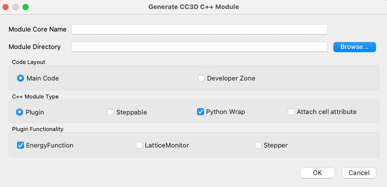
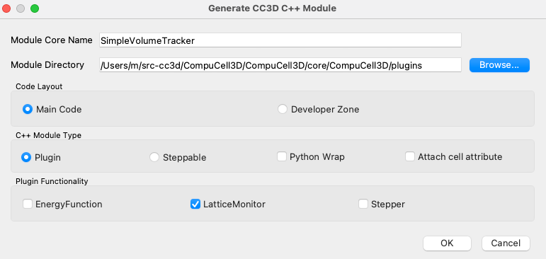
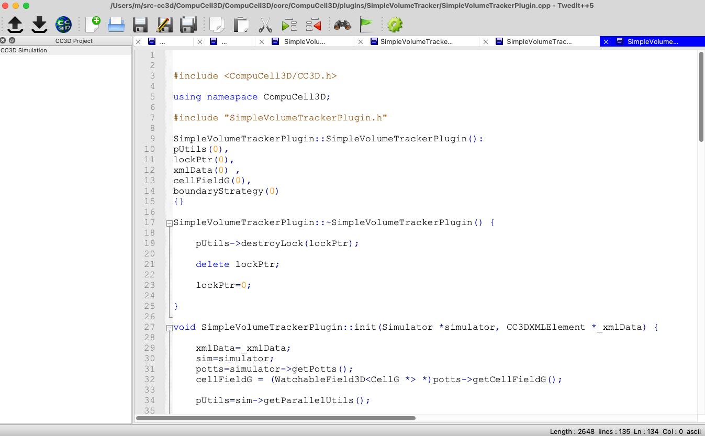

Simple Volume Tracker in C++
============================

This tutorial builds a deliberately small C++ plugin that reacts to
accepted Potts pixel copies. It is modeled after CC3D's real
``VolumeTracker`` plugin, but it does not replace it. The real
``VolumeTracker`` is loaded automatically by volume-related plugins and
is responsible for keeping ``CellG::volume`` correct. Loading a second
plugin that also changes volume would corrupt the simulation state.

For that reason, the first version of ``SimpleVolumeTracker`` only prints
what would happen to volume when a lattice site changes. This keeps the
example safe while introducing the most important plugin mechanism:
registering a lattice monitor with ``Potts3D``.

In this tutorial we generate the plugin directly inside the main CC3D
source tree, not in DeveloperZone. This keeps the example close to the
core plugin layout and makes it easier to compare with the built-in
``VolumeTracker`` plugin. DeveloperZone configuration is covered
separately in :doc:`configuring_developer_zone`.

What This Plugin Demonstrates
-----------------------------

A lattice monitor is a plugin that receives a callback whenever the cell
field changes. In CC3D, the cell field is a ``WatchableField3D<CellG*>``.
When ``Potts3D`` accepts a pixel copy, it calls ``cellFieldG->set(...)``.
The field then notifies registered watchers by calling their
``field3DChange`` method.

For an accepted pixel copy, the callback arguments have the following meaning:

* ``pt`` is the target lattice point of the copy.
* ``oldCell`` is the cell pointer currently occupying ``pt`` before the
  copy is applied.
* ``newCell`` is the cell pointer that will occupy ``pt`` after the
  accepted copy is applied.

If ``newCell`` is not ``nullptr``, that cell gains one pixel as the copy
is applied. If ``oldCell`` is not ``nullptr``, that cell loses one pixel.
A ``nullptr`` cell pointer represents Medium.

The real ``VolumeTracker`` uses the same idea:

.. code-block:: cpp

    void VolumeTrackerPlugin::field3DChange(
        const Point3D &pt,
        CellG *newCell,
        CellG *oldCell
    ) {
        if (newCell)
            newCell->volume++;

        if (oldCell)
            if ((--oldCell->volume) == 0)
                deadCellVec[pUtils->getCurrentWorkNodeNumber()] = oldCell;
    }

Our first version will observe the same event but will not mutate volume.

Tutorial Prerequisites
----------------------

This tutorial assumes that:

* you have cloned the CompuCell3D repository, for example to
  ``~/src-cc3d/CompuCell3D``;
* you can build CompuCell3D from source on your platform;
* you can launch Twedit++ from the same environment used for the build.

If you have not completed the build setup yet, follow the platform build
instructions first:

* Windows: :doc:`building_core_cc3d_cpp_code_windows`
* macOS: :doc:`building_core_cc3d_cpp_code_mac`
* Linux: :doc:`building_core_cc3d_cpp_code_linux`

Generate the Plugin Skeleton
----------------------------

Launch Twedit++. From the ``CC3D C++`` menu, select
``Generate New Module...``. Twedit++ opens the new-module dialog:

|svp_001|

Fill in the dialog as follows:

* ``Module Name``: ``SimpleVolumeTracker``
* ``Module Type``: ``Plugin``
* ``Plugin Functionality``: ``LatticeMonitor``
* ``Module Directory``: the CC3D plugin source directory, for example
  ``~/src-cc3d/CompuCell3D/CompuCell3D/core/CompuCell3D/plugins``

For this tutorial, choose the main CC3D source layout, not DeveloperZone.
DeveloperZone is often a better place for extension modules in normal
development, but here we intentionally work in the main source tree so the
example mirrors the built-in plugin layout.

|svp_002|

After you click ``OK``, Twedit++ generates boilerplate source files and
updates the build files. The generated code should compile, but it does
not yet implement useful behavior.

|svp_003|

The Important Generated Pieces
------------------------------

For a lattice-monitor plugin, the generated class should inherit from
``Plugin`` and ``CellGChangeWatcher``. The important method is:

.. code-block:: cpp

    void SimpleVolumeTrackerPlugin::field3DChange(
        const Point3D &pt,
        CellG *newCell,
        CellG *oldCell
    );

The plugin also needs to register itself with ``Potts3D`` during
``init``. The generated code should contain logic equivalent to this:

.. code-block:: cpp

    void SimpleVolumeTrackerPlugin::init(
        Simulator *simulator,
        CC3DXMLElement *_xmlData
    ) {
        potts = simulator->getPotts();
        potts->registerCellGChangeWatcher(this);
    }

This registration is what connects the plugin to lattice changes. Without
it, ``field3DChange`` will never be called.

Implement field3DChange
-----------------------

Replace the generated ``field3DChange`` body with a simple observer. This
version prints which cell gains a pixel and which cell loses a pixel:

.. code-block:: cpp

    void SimpleVolumeTrackerPlugin::field3DChange(
        const Point3D &pt,
        CellG *newCell,
        CellG *oldCell
    ) {
        if (newCell) {
            cerr << "Cell id " << newCell->id
                 << " gains one pixel at " << pt << endl;
        } else {
            cerr << "Medium gains one pixel at " << pt << endl;
        }

        if (oldCell) {
            cerr << "Cell id " << oldCell->id
                 << " loses one pixel at " << pt << endl;
        } else {
            cerr << "Medium loses one pixel at " << pt << endl;
        }
    }

This code checks both pointers before accessing ``id``. That check is not
optional. Medium is represented as a null pointer, so code such as
``oldCell->id`` is valid only when ``oldCell`` is not ``nullptr``.

What the Callback Means
-----------------------

The callback is part of applying an accepted lattice assignment. The
meaning is:

* ``pt`` is the target lattice site for the copy.
* ``oldCell`` is the cell currently occupying ``pt`` before the copy.
* ``newCell`` is the cell that will occupy ``pt`` after the accepted copy
  is applied.
* ``newCell`` gains one lattice site, unless it is Medium.
* ``oldCell`` loses one lattice site, unless it is Medium.

This callback is not called for rejected pixel-copy attempts because the
cell field does not change when a copy is rejected.

Build the Plugin
----------------

If the plugin was generated in the core source tree, rebuild and install
CompuCell3D from your existing build directory. On Linux and macOS this
usually looks like:

.. code-block:: console

    cd ~/src-cc3d/CompuCell3D_build
    make -j 8
    make install

If Twedit++ updated a ``CMakeLists.txt`` file while generating the
module, CMake may reconfigure automatically at the beginning of the next
build. That is expected. After the plugin has been added to the build
system, later edits to only the plugin ``.cpp`` or ``.h`` files should
rebuild just the affected target and its dependencies.

Some older macOS development workflows copied installed shared libraries
from the CC3D install directory into the active conda environment. Do
that only if it is part of the build workflow you used for your platform.
For normal plugin-only changes, rebuilding and installing the plugin is
the important step.

Use the Plugin in a Simulation
------------------------------

To load the plugin, add it to the simulation XML:

.. code-block:: xml

    <Plugin Name="SimpleVolumeTracker"/>

For example, in a simple cell-sorting simulation the plugin can be listed
with the other plugins:

.. code-block:: xml

    <CompuCell3D>
        <Potts>
            <Dimensions x="100" y="100" z="1"/>
            <Anneal>10</Anneal>
            <Steps>10000</Steps>
            <Temperature>10</Temperature>
            <Flip2DimRatio>1</Flip2DimRatio>
            <NeighborOrder>2</NeighborOrder>
        </Potts>

        <Plugin Name="Volume">
            <TargetVolume>25</TargetVolume>
            <LambdaVolume>2.0</LambdaVolume>
        </Plugin>

        <Plugin Name="CellType">
            <CellType TypeName="Medium" TypeId="0"/>
            <CellType TypeName="Condensing" TypeId="1"/>
            <CellType TypeName="NonCondensing" TypeId="2"/>
        </Plugin>

        <Plugin Name="Contact">
            <Energy Type1="Medium" Type2="Medium">0</Energy>
            <Energy Type1="NonCondensing" Type2="NonCondensing">16</Energy>
            <Energy Type1="Condensing" Type2="Condensing">2</Energy>
            <Energy Type1="NonCondensing" Type2="Condensing">11</Energy>
            <Energy Type1="NonCondensing" Type2="Medium">16</Energy>
            <Energy Type1="Condensing" Type2="Medium">16</Energy>
            <NeighborOrder>2</NeighborOrder>
        </Plugin>

        <Plugin Name="SimpleVolumeTracker"/>

        <Steppable Type="BlobInitializer">
            <Region>
                

                <Radius>40</Radius>
                <Gap>0</Gap>
                <Width>5</Width>
                <Types>Condensing,NonCondensing</Types>
            </Region>
        </Steppable>
    </CompuCell3D>

Then run the simulation from the environment where your newly built CC3D
is installed:

.. code-block:: console

    python -m cc3d.run_script -i ~/src-cc3d/CompuCell3D/CompuCell3D/core/Demos/Models/cellsort/cellsort_2D/cellsort_2D.cc3d

You should see output similar to:

.. code-block:: console

    Cell id 148 loses one pixel at (42, 57, 0)
    Cell id 149 gains one pixel at (42, 57, 0)
    Cell id 162 loses one pixel at (61, 44, 0)
    Cell id 83 gains one pixel at (61, 44, 0)

The exact cell ids and points will differ because Potts copy attempts are
stochastic.

What You Have Built
-------------------

This first version demonstrates the mechanics of a lattice-monitor
plugin:

* Twedit++ generated the plugin skeleton and build-system entries.
* The plugin registered itself with ``Potts3D`` as a
  ``CellGChangeWatcher``.
* ``Potts3D`` called ``field3DChange`` after accepted lattice changes.
* The plugin handled Medium safely by checking for null cell pointers.

In the next part, we will make the plugin more active by changing cell
state from inside ``field3DChange``. That is useful for learning, but it
also introduces ordering and correctness issues that plugin authors must
understand.

