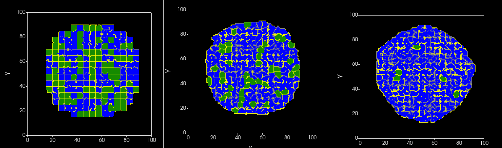

Simple Volume Tracker in C++ Part 2 - Changing Cell Type
=========================================================

Our previous example showed us how to do printouts from our newly written plugin. Now lets write code that alters cell state. We will implemement functionality that if any cell in simulation reaches volume ``27`` its type id (``cell->type`` in C++) will be changed to `1` . Because target volume of our simulation is ``25`` and we know that this volume subject to random fluctuations we should be able to turn quite a few of cells in our simulation into cells of type id `1`

.. note::

    During the course of the single MonteCarlo step a given cell may change its volume many times

We will only trigger cell type change when volume 27 or higher is reached when the cell increases its volume and therefore our code looks as follows:

.. code-block:: cpp

    void SimpleVolumeTrackerPlugin::field3DChange(const Point3D &pt, CellG *newCell, CellG *oldCell)

    {

        // note: we only care about cells that reach volume 27 when they grow
        if (newCell) {
            if (newCell->volume >= 27) {
                newCell->type = 1;
            }
        }

    }

After we compile it and run it we will see that relatively quickly most of the cells in the simulation will turn to cell type `1` (blue color)

|svp_004a|

This tiny code change concludes our next example.

Order in which plugins are called
---------------------------------

In general order in which plugins are called depends on the order in which they are listed in the XML. However certain plugins might require other plugins and in this case this order my get reshuffled. We ill come back to this issue later.

One thing you should remember here though that changing cell type in a plugin might not be very safe because what if after our ``SimpleVolumeTracker`` there is another plugin that actually relies on the type information and before it had a chance to be called our plugin messed up cell type configuration for given instance of the simulation? Fortunately in our case we did not have such an issue but it is a good idea to be aware of such situations and in general adjustments of cell parameters such as cell type, ``targetVolume``, ``lambdaVolumes`` are best handled in the Steppables. In subsequenc chapters we will show you how to build Steppables in C++.

There are more things to be are

