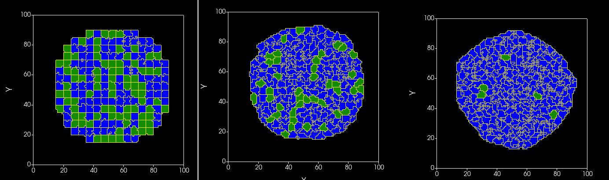

Simple Volume Tracker in C++ Part 2: Changing Cell State
=========================================================

In the first part, ``SimpleVolumeTracker`` only observed accepted pixel
copies and printed which cell gained or lost a pixel. In this part, we
make the plugin more active: it will change a cell's type when the cell
reaches a chosen volume threshold.

This is still a teaching example. In production code, changing cell type
from a lattice monitor should be done carefully because other plugins may
also react to the same lattice change. The example is useful precisely
because it shows where those ordering and consistency issues come from.

Goal
----

We will modify ``field3DChange`` so that when a growing cell reaches
volume ``27`` or larger, the plugin changes that cell's type to type id
``1``.

The example simulation from part 1 uses a target volume of ``25``. Potts
fluctuations will cause some cells to temporarily grow above that target,
so the threshold should be reached during the simulation.

.. note::

    A cell can gain and lose pixels many times during a single MCS.
    ``field3DChange`` is called for each accepted lattice change, not once
    per MCS.

A Minimal State-Changing Callback
---------------------------------

The smallest implementation is:

.. code-block:: cpp

    void SimpleVolumeTrackerPlugin::field3DChange(
        const Point3D &pt,
        CellG *newCell,
        CellG *oldCell
    ) {
        if (newCell && newCell->volume >= 27) {
            newCell->type = 1;
        }
    }

This code only checks ``newCell`` because the rule is about cells that
have just gained a pixel. The volume tracker has already updated the
cell's volume by the time this code runs, assuming the normal
``VolumeTracker`` watcher was registered before ``SimpleVolumeTracker``.

After recompiling and running the simulation, cells that reach the
threshold will change to type id ``1``. In the cell-sorting example from
part 1, type id ``1`` corresponds to ``Condensing``:

.. code-block:: xml

    <Plugin Name="CellType">
        <CellType TypeName="Medium" TypeId="0"/>
        <CellType TypeName="Condensing" TypeId="1"/>
        <CellType TypeName="NonCondensing" TypeId="2"/>
    </Plugin>

Visually, many cells should quickly become the color assigned to type id
``1``.

|svp_004a|

Why This Works
--------------

The key assumptions are:

* ``newCell`` is the cell that now occupies ``pt``.
* ``newCell`` has gained one pixel.
* The real ``VolumeTracker`` has already updated ``newCell->volume``.
* Type id ``1`` is a valid non-Medium cell type in the simulation.

If any of these assumptions are wrong, the plugin may behave differently
than expected. For example, if type id ``1`` is not defined by the
``CellType`` plugin, the simulation state will not match the XML model.

Avoid Repeating the Same Change
-------------------------------

The minimal callback assigns type id ``1`` every time a cell of any type
has volume ``27`` or larger. A slightly cleaner version avoids repeated
assignments and avoids changing Medium:

.. code-block:: cpp

    void SimpleVolumeTrackerPlugin::field3DChange(
        const Point3D &pt,
        CellG *newCell,
        CellG *oldCell
    ) {
        if (!newCell) {
            return;
        }

        const unsigned char thresholdType = 1;
        const int thresholdVolume = 27;

        if (newCell->type != thresholdType && newCell->volume >= thresholdVolume) {
            newCell->type = thresholdType;
        }
    }

This version is still simple, but it makes the intent clearer:

* Medium is ignored.
* The target type and threshold are named.
* Cells already converted to type id ``1`` are not rewritten.

A More Flexible Version with XML Parameters
-------------------------------------------

Hard-coding ``27`` and ``1`` is fine for a small tutorial, but real
plugins should usually read parameters from XML. For example, we can make
this plugin accept:

.. code-block:: xml

    <Plugin Name="SimpleVolumeTracker">
        <VolumeThreshold>27</VolumeThreshold>
        <TargetTypeId>1</TargetTypeId>
    </Plugin>

The plugin class would need member variables:

.. code-block:: cpp

    class SimpleVolumeTrackerPlugin : public Plugin, public CellGChangeWatcher {
        Potts3D *potts;
        int volumeThreshold;
        unsigned char targetTypeId;

    public:
        SimpleVolumeTrackerPlugin();
        virtual void init(Simulator *simulator, CC3DXMLElement *_xmlData);
        virtual void field3DChange(const Point3D &pt, CellG *newCell, CellG *oldCell);
    };

Initialize the defaults in the constructor:

.. code-block:: cpp

    SimpleVolumeTrackerPlugin::SimpleVolumeTrackerPlugin() :
        potts(0),
        volumeThreshold(27),
        targetTypeId(1) {
    }

Then read XML values during ``init``:

.. code-block:: cpp

    void SimpleVolumeTrackerPlugin::init(
        Simulator *simulator,
        CC3DXMLElement *_xmlData
    ) {
        potts = simulator->getPotts();
        potts->registerCellGChangeWatcher(this);

        if (_xmlData) {
            if (_xmlData->getFirstElement("VolumeThreshold")) {
                volumeThreshold = _xmlData->getFirstElement("VolumeThreshold")->getInt();
            }

            if (_xmlData->getFirstElement("TargetTypeId")) {
                targetTypeId = static_cast<unsigned char>(
                    _xmlData->getFirstElement("TargetTypeId")->getUInt()
                );
            }
        }
    }

Now the callback uses the configured values:

.. code-block:: cpp

    void SimpleVolumeTrackerPlugin::field3DChange(
        const Point3D &pt,
        CellG *newCell,
        CellG *oldCell
    ) {
        if (!newCell) {
            return;
        }

        if (newCell->type != targetTypeId && newCell->volume >= volumeThreshold) {
            newCell->type = targetTypeId;
        }
    }

This is a more realistic plugin pattern:

* default values are set in the constructor;
* XML overrides are read in ``init``;
* the callback avoids XML lookups because it runs frequently.

Why XML Lookups Do Not Belong in field3DChange
----------------------------------------------

``field3DChange`` may be called many times during one MCS. It should do
as little work as possible. Avoid parsing XML, allocating memory, opening
files, or scanning the lattice from this method.

A good pattern is:

* parse XML once in ``init`` or ``update``;
* cache pointers and numeric parameters as member variables;
* keep ``field3DChange`` focused on the single lattice change it was
  called for.

Plugin Ordering
---------------

Lattice monitors are called in the order in which they are registered
with ``WatchableField3D``. In many cases, registration order follows the
order in which plugins are loaded from XML. However, CC3D may load
required internal plugins automatically, and some plugins may request or
initialize other plugins during their own ``init`` method.

This matters here because our callback reads ``newCell->volume``. That
value is maintained by the real ``VolumeTracker``. If
``SimpleVolumeTracker`` were called before ``VolumeTracker``, it might see
the old volume value rather than the updated one.

The practical lesson is: be careful when a lattice monitor depends on
state maintained by another lattice monitor. If the order matters, make
that dependency explicit in the plugin design or move the logic to a
simulation-level steppable where the state has already settled for the
MCS.

Changing Cell Type from a Lattice Monitor
-----------------------------------------

Changing ``newCell->type`` inside ``field3DChange`` is legal C++, but it
is not always the best design. Other plugins may use cell type when they
compute energy, update cached data, or react to the same lattice change.
Changing type in the middle of lattice-monitor processing can therefore
make behavior order-dependent.

For many models, changing type from a steppable is easier to reason
about:

* Potts copy attempts for the MCS have already finished.
* Volume and other lattice-derived attributes have been updated.
* The type-change rule runs at a predictable MCS frequency.
* Other lattice monitors are not in the middle of processing the same
  pixel-copy event.

Use a lattice monitor for state that must be synchronized immediately
with each accepted copy. Use a steppable for model rules that can be
applied after an MCS.

Relation to the Real VolumeTracker
----------------------------------

The real ``VolumeTracker`` is more sophisticated than our example. It is
both a ``CellGChangeWatcher`` and a Potts ``Stepper``:

.. code-block:: cpp

    class VolumeTrackerPlugin :
        public Plugin,
        public CellGChangeWatcher,
        public Stepper {
        ...
    };

Its watcher updates volume immediately. If a cell's volume reaches zero,
it stores that cell in a per-thread ``deadCellVec``. The ``step`` method
then destroys the dead cell after the copy-attempt bookkeeping is done:

.. code-block:: cpp

    void VolumeTrackerPlugin::step() {
        CellG *deadCellPtr = deadCellVec[pUtils->getCurrentWorkNodeNumber()];
        if (deadCellPtr) {
            pUtils->setLock(lockPtr);
            potts->destroyCellG(deadCellPtr);
            deadCellVec[pUtils->getCurrentWorkNodeNumber()] = 0;
            pUtils->unsetLock(lockPtr);
        }
    }

This delayed destruction is important. A cell that lost its last pixel
may still be referenced by other code during the current copy-attempt
callback sequence. Destroying it immediately inside ``field3DChange``
would be unsafe.

What This Example Teaches
-------------------------

Part 2 adds three lessons to the watcher-only plugin from part 1:

* a lattice monitor can change cell state, not just observe lattice
  changes;
* frequently called callbacks should use cached configuration rather than
  repeated parsing or expensive work;
* changing model state from a lattice monitor can create ordering issues,
  so plugin authors should decide carefully whether the rule belongs in a
  monitor, an energy function, or a steppable.

This concludes the two-part ``SimpleVolumeTracker`` example. The next
step is to study a plugin that contributes a real energy term or to build
a steppable where model-level rules can be applied once per MCS.

