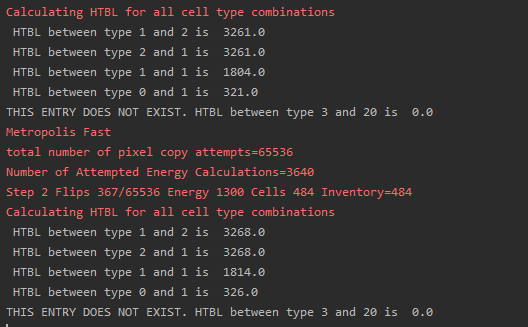

Computing Heterotypic Boundary Length
======================================

Heterotypic boundary surface (or length in 2D) is total surface of contact between all cells of two types. For example when you have 2
cells of type `1` and 100 cells of type `2` the heterotypic surface between thw two will be a sum of all contact
surfaces between the two types.
In this example we are not going to show every step how we generate the steppable using Twedit. We have shown this
earlier and here we will concentrate on the actual code.

This example is a bit more advanced but we will explain clearly every line of code.

The module that we generated is called ``HeterotypicBoundaryLength``. We then click ``Configure`` and ``Generate`` in
the CMake Gui and start writing actual code. We will first implement function that walks over entire lattice and
computes heterotypic surface (or length in 2D) between all cells of different types.

All C++ files can be found in ``DeveloperZone/Demos/HeterotypicBoundarySurface`` and Python bindings are , as usual in
``DeveloperZone/pyinterface/CompuCellExtraModules/CompuCellExtraModules.i``. The simulation example that uses our newly
created module is in ``DeveloperZone/Demos/HeterotypicBoundarySurface``

Here is the header file for our new steppable:

.. code-block:: c++

    #ifndef HETEROTYPICBOUNDARYLENGTHSTEPPABLE_H
    #define HETEROTYPICBOUNDARYLENGTHSTEPPABLE_H
    #include <CompuCell3D/CC3D.h>
    #include "HeterotypicBoundaryLengthDLLSpecifier.h"

    namespace CompuCell3D {

      template <class T> class Field3D;
      template <class T> class WatchableField3D;

        class Potts3D;
        class Automaton;
        class BoundaryStrategy;
        class CellInventory;
        class CellG;

      class HETEROTYPICBOUNDARYLENGTH_EXPORT HeterotypicBoundaryLength : public Steppable {

        WatchableField3D<CellG *> *cellFieldG;

        Simulator * sim;
        Potts3D *potts;
        CC3DXMLElement *xmlData;
        Automaton *automaton;
        BoundaryStrategy *boundaryStrategy;
        CellInventory * cellInventoryPtr;
        Dim3D fieldDim;

      public:

        HeterotypicBoundaryLength ();

        virtual ~HeterotypicBoundaryLength ();

        // new methods and members

        std::map<unsigned int, double> typePairHTSurfaceMap;

        unsigned int typePairIndex(unsigned int cellType1, unsigned int cellType2);
        void calculateHeterotypicSurface();
        double getHeterotypicSurface(unsigned int cellType1, unsigned int cellType2);

        // SimObject interface

        virtual void init(Simulator *simulator, CC3DXMLElement *_xmlData=0);

        virtual void extraInit(Simulator *simulator);

        //steppable interface

        virtual void start();

        virtual void step(const unsigned int currentStep);

        virtual void finish() {}

        //SteerableObject interface

        virtual void update(CC3DXMLElement *_xmlData, bool _fullInitFlag=false);

        virtual std::string steerableName();

         virtual std::string toString();

      };

    };

    #endif

we added few methods and one class member there:

.. code-block:: c++

    // new methods and members

    std::map<unsigned int, double> typePairHTSurfaceMap;

    unsigned int typePairIndex(unsigned int cellType1, unsigned int cellType2);
    void calculateHeterotypicSurface();
    double getHeterotypicSurface(unsigned int cellType1, unsigned int cellType2);

The typePairHTSurfaceMap is a dictionary (map) that will store heterotypic boundary surface between different cell
types. Notice that we will encode pair of cell types as a single unsigned integer (hence a key to the dictionary
is unsigned integer). To do this we will use convenience function
``unsigned int typePairIndex(unsigned int cellType1, unsigned int cellType2)`` that takes as its arguments two
unsigned integers that denote cell type 1 and cell type 2. Here is the implementation of this function:

.. code-block:: c++

    unsigned int HeterotypicBoundaryLength::typePairIndex(unsigned int cellType1, unsigned int cellType2) {
        return 256 * cellType2 + cellType1;
    }

we take advantage of the fact that the number of cell types in CC3D is limited to 256 and the index this function
returns looks analogous to the index you woudl use to access a matrix if you were to store a matrix as 1D array.

Next we have two functions ``calculateHeterotypicSurface()`` that computed actual total heterotypic surface between
all cell types and ``double getHeterotypicSurface(unsigned int cellType1, unsigned int cellType2)`` that given two types
it returns a boundary between them.

Let's start analyzing code for ``calculateHeterotypicSurface`` function:

.. code-block:: c++
    :linenos:

    void HeterotypicBoundaryLength::calculateHeterotypicSurface() {

        unsigned int maxNeighborIndex = this->boundaryStrategy->getMaxNeighborIndexFromNeighborOrder(1);
        Neighbor neighbor;

        CellG *nCell = 0;

        this->typePairHTSurfaceMap.clear();

        // note: unit surface is different on a hex lattice. if you are runnign
        // this steppable on hex lattice you need to adjust it. Remember that on hex lattice unit length and unit surface have different values
        double unit_surface = 1.0;

        cerr << "Calculating HTBL for all cell type combinations" << endl;

        for (unsigned int x = 0; x < fieldDim.x; ++x)
            for (unsigned int y = 0; y < fieldDim.y; ++y)
                for (unsigned int z = 0; z < fieldDim.z; ++z) {
                    Point3D pt(x, y, z);
                    CellG *cell = this->cellFieldG->get(pt);

                    unsigned int cell_type = 0;
                    if (cell) {
                        cell_type = (unsigned int)cell->type;
                    }

                    for (unsigned int nIdx = 0; nIdx <= maxNeighborIndex; ++nIdx) {
                        neighbor = boundaryStrategy->getNeighborDirect(const_cast<Point3D&>(pt), nIdx);
                        if (!neighbor.distance) {
                            //if distance is 0 then the neighbor returned is invalid
                            continue;
                        }

                        nCell = this->cellFieldG->get(neighbor.pt);
                        unsigned int n_cell_type = 0;
                        if (nCell) {
                            n_cell_type = (unsigned int)nCell->type;
                        }

                        if (nCell != cell) {
                            unsigned int pair_index_1 = typePairIndex(cell_type, n_cell_type);
                            unsigned int pair_index_2 = typePairIndex(n_cell_type, cell_type);
                            this->typePairHTSurfaceMap[pair_index_1] += unit_surface;
                            if (pair_index_1 != pair_index_2) {
                                this->typePairHTSurfaceMap[pair_index_2] += unit_surface;
                            }

                        }

                    }

                }

    }

We will be iterating over lattice pixels. Every lattice pixel has neighbors of different order but 1-st order neighbors
are simply adjacent pixels. ``BoundaryStrategy`` is an object that facilitates iteration over pixel neighbors and it
also keeps track of boundary conditions, pixels, adjacent to the boundary etc. so that you can write a simpler code. All
we need to do to iterate over 1-st order pixel neighbors is to know what is the maximum number of them and this is what
we do in this line:

.. code-block:: c++

    unsigned int maxNeighborIndex = this->boundaryStrategy->getMaxNeighborIndexFromNeighborOrder(1);

We get maximum index of a 1-st order pixel (``BoundaryStrategy`` keeps them in a vector and we are getting max index of
this vector). On 2D. cartesian lattice there could be up to 4 such neighbors hence the max vector index is 3 (we start
counting from 0).

We next clear the map where we store our results because each time we call this function it wil be incrementing
the values so if we did not clear we would be starting counting from different value that zero.

At line 16 we start triple loop where we iterate over all lattice pixels. This might not be the most efficient method
but it is the simplest to code.

In lines 19 and 20 we get a cell that resides at a given pixel. If the cell pointer returned is ``NULL`` we are dealing
with ``Medium`` and cell and this is why in lines 23-25 we check if the cell is different than ``NULL``
(``if (cell)``) before accessing its type. If it is null that we do not execute line 24 and the cell type is 0 as it
should be for the Medium.

At line 27 we start iterating over neighbors of the current pixel (``Point3D pt(x, y, z)``). This is where we do
actual calculations. Code in line 28 fetches one of the neighbor of pixel ``pt(x, y, z)``. In line 30 we check
if this neighbor is a valid one (e.g. if you are at the edge of the lattice we may get pixel that is outside of the
lattice and then if ``neighbor.distance`` is zero we know we are dealing with invalid pixel), hence in the line 31 we
skip the rest of the loop. If, however, the pixel is valid then we get a cell that resides at the neighboring pixel (
line 34):

.. code-block::

    nCell = this->cellFieldG->get(neighbor.pt);

In lines 35-38 we extract cell type of neighbor cell , again we have to be mindful of ``Medium`` as we did in
lines 22-25.

Finally, lines 41-45 contain actual code that increments boundary surface between two cell types. This code runs only
if ``nCell`` and ``cell`` *i.e.* cells belonging to adjacent pixels are different cells. In this case we
compute index for type of ``nCell`` and type of ``cell`` (
    ``unsigned int pair_index_1 = typePairIndex(cell_type, n_cell_type);``)

and increment appropriate entry in the ``this->typePairHTSurfaceMap`` - lines 43. Notice that we also permute
cell types in call to ``typePairIndex`` - line 44-45. so that when we access boundary length between cell type 1 and 2
it will give us the same value as between cell types 2 and 1. But we do this only when the two types are different

Obviously, we are double-counting and we correct this in the function that returns heterotypic surfaces:

.. code-block:: c++

    double HeterotypicBoundaryLength::getHeterotypicSurface(unsigned int cellType1, unsigned int cellType2) {
        unsigned int pair_index = typePairIndex(cellType1, cellType2);

        double heterotypic_surface = this->typePairHTSurfaceMap[pair_index]/2.0;

        return heterotypic_surface;
    }

Running the Simulation with Heterotypic Surface Calculator
----------------------------------------------------------

The simulation code is quite easy to write as it follows the same pattern that we encountered in the previous chapter
where we introduced Python bindings to the C++ steppable. We start with an XML file:

.. code-block:: xml
    :linenos:
    :emphasize-lines: 48

    <CompuCell3D Revision="20190604" Version="4.0.0">
       <Potts>
          <!-- Basic properties of CPM (GGH) algorithm -->
          <Dimensions x="256" y="256" z="1"/>
          <Steps>100000</Steps>
          <Temperature>10.0</Temperature>
          <NeighborOrder>1</NeighborOrder>
       </Potts>

       <Plugin Name="CellType">
          <!-- Listing all cell types in the simulation -->
          <CellType TypeId="0" TypeName="Medium"/>
          <CellType TypeId="1" TypeName="A"/>
          <CellType TypeId="2" TypeName="B"/>
       </Plugin>

       <Plugin Name="Volume">
          <VolumeEnergyParameters CellType="A" LambdaVolume="2.0" TargetVolume="50"/>
          <VolumeEnergyParameters CellType="B" LambdaVolume="2.0" TargetVolume="50"/>
       </Plugin>

       <Plugin Name="CenterOfMass">
          <!-- Module tracking center of mass of each cell -->
       </Plugin>

       <Plugin Name="Contact">
          <!-- Specification of adhesion energies -->
          <Energy Type1="Medium" Type2="Medium">10.0</Energy>
          <Energy Type1="Medium" Type2="A">10.0</Energy>
          <Energy Type1="Medium" Type2="B">10.0</Energy>
          <Energy Type1="A" Type2="A">10.0</Energy>
          <Energy Type1="A" Type2="B">10.0</Energy>
          <Energy Type1="B" Type2="B">10.0</Energy>
          <NeighborOrder>4</NeighborOrder>
       </Plugin>

       <Steppable Type="UniformInitializer">
          <!-- Initial layout of cells in the form of rectangular slab -->
          <Region>
             <BoxMin x="51" y="51" z="0"/>
             <BoxMax x="204" y="204" z="1"/>
             <Gap>0</Gap>
             <Width>7</Width>
             <Types>A,B</Types>
          </Region>
       </Steppable>

       <Steppable Type="HeterotypicBoundaryLength"/>

    </CompuCell3D>

It is Twedit-generated XML file that has basic energy terms (Volume and Contact Constraints) plus initializer and
at the end in line 48 we add our new ``HeterotypicBoundaryLength`` steppable. Notice that this is a one-line call
because we are not really passing any parameters to the steppable from the XML and our
``update(CC3DXMLElement *_xmlData, bool _fullInitFlag=false)`` method does not contain any code that parses XML.

.. note::

    It is important that every module (steppable, plugin) that you develop in C++ be instantiated in XML. Otherwise it will not be loaded and you will not be able to use it from Python. You can, however, write Python code that will properly load and initialize your module but this approach is way more complex than adding a simple line or lines in the XML.

In our example even if we add ``<Steppable Type="HeterotypicBoundaryLength"/>`` to the XML we will not see any
calculations being done. Why? Because ``start`` and ``step`` functions are empty:

.. code-block:: c++

    void HeterotypicBoundaryLength::start(){
    }

    void HeterotypicBoundaryLength::step(const unsigned int currentStep){
    }

    void HeterotypicBoundaryLength::update(CC3DXMLElement *_xmlData, bool _fullInitFlag){

        //PARSE XML IN THIS FUNCTION

        //For more information on XML parser function please see CC3D code or lookup XML utils API

        automaton = potts->getAutomaton();

        ASSERT_OR_THROW("CELL TYPE PLUGIN WAS NOT PROPERLY INITIALIZED YET. MAKE SURE THIS IS THE FIRST PLUGIN THAT YOU SET", automaton)

        //boundaryStrategy has information about pixel neighbors
        boundaryStrategy=BoundaryStrategy::getInstance();

    }

We left those implementations empty on purpose. We wanted to show you how you can use steppable to implement
functionality that gets called on-demand from Python code. Let us now look at the Python code:

.. code-block:: python
    :linenos:

    from cc3d.core.PySteppables import *
    from cc3d.cpp import CompuCellExtraModules

    class HeterotypicBoundarySurfaceSteppable(SteppableBasePy):

        def __init__(self, frequency=1):
            SteppableBasePy.__init__(self, frequency)
            self.htbl_steppable_cpp = None

        def start(self):
            self.htbl_steppable_cpp = CompuCellExtraModules.getHeterotypicBoundaryLength()

        def step(self, mcs):
            self.htbl_steppable_cpp.calculateHeterotypicSurface()

            print(' HTBL between type 1 and 2 is ',
                  self.htbl_steppable_cpp.getHeterotypicSurface(1, 2))

            print(' HTBL between type 2 and 1 is ',
                  self.htbl_steppable_cpp.getHeterotypicSurface(1, 2))

            print(' HTBL between type 1 and 1 is ',
                  self.htbl_steppable_cpp.getHeterotypicSurface(1, 1))

            print(' HTBL between type 0 and 1 is ',
                  self.htbl_steppable_cpp.getHeterotypicSurface(0, 1))

            print('THIS ENTRY DOES NOT EXIST. HTBL between type 3 and 20 is ',
                  self.htbl_steppable_cpp.getHeterotypicSurface(3, 20))

At the top we import ``CompuCellExtraModules`` that SWIG generates. This Python contains contains Python-wrapper
for our ``HeterotypicBoundaryLength`` C++ steppable. In line 12 we fetch a reference to the steppable and store it in
class-accessible ``self.htbl_steppable_cpp`` variable. In Python steppable ``step`` function we call C++ function
that calculates heterotypic surface (line 15). The next series of ``print`` statements fetches results fo the
calculations - see lines 18 21, *etc...* . The output looks as follows:

|htbl_output|

Note that heterotypic surface between types 1 and 2 is the same as between 2 and 1. This is why, earlier in the C++ code
we included two pair indexes:

.. code-block:: c++

    unsigned int pair_index_1 = typePairIndex(cell_type, n_cell_type);
    unsigned int pair_index_2 = typePairIndex(n_cell_type, cell_type);

Notice also that if we try to access heterotypic surface between types 3 and 20 (none of those types exist in our
simulation) we get back ``0.0``. Why? The answer has to do with the behavior of C++ ``std::map`` container.
If we try to use a key that does not exist in the map the C++ will add this key and initialize the value of the key
value-pair to the whatever default constructor of the value type is. In our case our map container has the following
type : ``std::map<unsigned int, double> typePairHTSurfaceMap`` so that key is of  ``unsigned int`` type and
value is of ``double`` type. Any modern C++ compiler will put ``0.0`` as a default value for objects of type ``double``.
If you are familiar with Python ``defaultdict`` class that is a member of standard ``collections`` package than you can
see similarities. C++ ``std::map`` behaves in similar way to the ``defaultdict``
Therefore when we access ``typePairHTSurfaceMap`` using key that does not exist C++ will insert this key into
``typePairHTSurfaceMap`` and set value to ``0.0``. This is also a reason why the following code works at all:

.. code-block:: c++

    this->typePairHTSurfaceMap[pair_index_1] += unit_surface

This brings us to the last remark we want to make regarding the C++ code. Why are we using ``unit_surface`` and not 1.0?
It has to do with various lattices that CC3D supports. For Cartesian 2D or 3D lattice unit surface has value 1.0.
However, hexagonal lattices are constructed in such a way that the volume of a voxel is constrained to be 1.0.
Therefore from geometry constraints it follows that in 2D on hex lattice unit surface (or length) is
``sqrt(2.0 / (3.0*sqrt(3.0)))`` which is approx equal to ``0.6204``  and in 3D it is
``8.0 / 12.0*sqrt(2.0)*pow(9.0 / (16.0*sqrt(3.0)), 1.0 / 3.0)*pow(9.0 / (16.0*sqrt(3.0)), 1.0 / 3.0)`` which is approx
equal to ``0.445``

For more information please see http://www.compucell3d.org/BinDoc/cc3d_binaries/Manuals/HexagonalLattice.pdf as well as
in the code of the BoundaryStrategy class method
``LatticeMultiplicativeFactors BoundaryStrategy::generateLatticeMultiplicativeFactors(LatticeType _latticeType, Dim3D dim)`` in ``CompuCell3D/core/CompuCell3D/Boundary/BoundaryStrategy.cpp``

For completeness we also show SWIG file that was used to generate the wrapper :

.. code-block:: c++

    %module ("threads"=1) CompuCellExtraModules

    %include "typemaps.i"

    %include <windows.i>

    %{

    #include "ParseData.h"
    #include "ParserStorage.h"
    #include <CompuCell3D/Simulator.h>
    #include <CompuCell3D/Potts3D/Potts3D.h>

    #include <BasicUtils/BasicClassAccessor.h>
    #include <BasicUtils/BasicClassGroup.h> //had to include it to avoid problems with template instantiation

    // ********************************************* PUT YOUR PLUGIN PARSE DATA AND PLUGIN FILES HERE *************************************************

    #include <SimpleVolume/SimpleVolumePlugin.h>
    #include <VolumeMean/VolumeMean.h>

    //AutogeneratedModules1 - DO NOT REMOVE THIS LINE IT IS USED BY TWEDIT TO LOCATE CODE INSERTION POINT
    //HeterotypicBoundaryLength_autogenerated

    #include <HeterotypicBoundaryLength/HeterotypicBoundaryLength.h>

    //GrowthSteppable_autogenerated

    #include <GrowthSteppable/GrowthSteppable.h>

    // ********************************************* END OF SECTION ********************************** ************************************************

    //have to include all  export definitions for modules which are arapped to avoid problems with interpreting by swig win32 specific c++ extensions...
    #define SIMPLEVOLUME_EXPORT
    #define VOLUMEMEAN_EXPORT
    //AutogeneratedModules2 - DO NOT REMOVE THIS LINE IT IS USED BY TWEDIT TO LOCATE CODE INSERTION POINT
    //HeterotypicBoundaryLength_autogenerated
    #define HETEROTYPICBOUNDARYLENGTH_EXPORT
    //GrowthSteppable_autogenerated
    #define GROWTHSTEPPABLE_EXPORT

    #include <iostream>

    using namespace std;
    using namespace CompuCell3D;

    %}

    // C++ std::string handling
    %include "std_string.i"

    // C++ std::map handling
    %include "std_map.i"

    // C++ std::map handling
    %include "std_set.i"

    // C++ std::vector handling
    %include "std_vector.i"

    //have to include all  export definitions for modules which are arapped to avoid problems with interpreting by swig win32 specific c++ extensions...
    #define SIMPLEVOLUME_EXPORT
    #define VOLUMEMEAN_EXPORT

    //AutogeneratedModules3 - DO NOT REMOVE THIS LINE IT IS USED BY TWEDIT TO LOCATE CODE INSERTION POINT
    //HeterotypicBoundaryLength_autogenerated
    #define HETEROTYPICBOUNDARYLENGTH_EXPORT
    //GrowthSteppable_autogenerated
    #define GROWTHSTEPPABLE_EXPORT

    %include <BasicUtils/BasicClassAccessor.h>
    %include <BasicUtils/BasicClassGroup.h> //had to include it to avoid problems with template instantiation
    %include "ParseData.h"
    %include "ParserStorage.h"

    // ********************************************* PUT YOUR PLUGIN PARSE DATA AND PLUGIN FILES HERE *************************************************
    // REMEMBER TO CHANGE #include to %include
    %include <SimpleVolume/SimpleVolumePlugin.h>
    // %include <SimpleVolume/SimpleVolumeParseData.h>
    // THIS IS VERY IMORTANT STETEMENT WITHOUT IT SWIG will produce incorrect wrapper code which will compile but will not work
    using namespace CompuCell3D;

    %inline %{
       SimpleVolumePlugin * reinterpretSimpleVolumePlugin(Plugin * _plugin){
          return (SimpleVolumePlugin *)_plugin;
       }

       SimpleVolumePlugin * getSimpleVolumePlugin(){
             return (SimpleVolumePlugin *)Simulator::pluginManager.get("SimpleVolume");
        }

    %}

    %include <VolumeMean/VolumeMean.h>

    %inline %{
       VolumeMean * reinterpretVolumeMean(Steppable * _steppable){
          return (VolumeMean *)_steppable;
       }

       VolumeMean * getVolumeMeanSteppable(){
             return (VolumeMean *)Simulator::steppableManager.get("VolumeMean");
        }
    %}

    //AutogeneratedModules4 - DO NOT REMOVE THIS LINE IT IS USED BY TWEDIT TO LOCATE CODE INSERTION POINT
    //HeterotypicBoundaryLength_autogenerated
    %include <HeterotypicBoundaryLength/HeterotypicBoundaryLength.h>
    %inline %{

     HeterotypicBoundaryLength * getHeterotypicBoundaryLength(){
          return (HeterotypicBoundaryLength *)Simulator::steppableManager.get("HeterotypicBoundaryLength");
       }
    %}

    //GrowthSteppable_autogenerated
    %include <GrowthSteppable/GrowthSteppable.h>
    %inline %{

     GrowthSteppable * getGrowthSteppable(){
          return (GrowthSteppable *)Simulator::steppableManager.get("GrowthSteppable");
       }
    %}

    // ********************************************* END OF SECTION ********************************** ************************************************

