Setting up your Mac for DeveloperZone compilation and developing new CC3D plugins and Steppables in C++
================================================================================================

Starting with CC3D 4.3.0 when you install CC3D it will come with most of the tools needed to compile C+++
plugins and steppables. The only thing that you need in addition to this is to install ``xcode-select`` package
To install this from the terminal run the following:

.. code-block::

    xcode-select --install

This is it and you should be ready to compile custom plugins and steppables written in C++

Setting up you Mac for CC3D compilation via conda
==================================================

Sometimes you may want to compile entire CC3D C++ code using conda build system. To do that on your Mac follow this
procedure:

1. Install ``xcode-select`` - see above
2. install miniconda3 with Python 3.7 - https://repo.anaconda.com/miniconda/Miniconda3-py37_4.11.0-MacOSX-x86_64.sh .
Once you install miniconda in the ``base`` environment of newly installed miniconda install ``conda-build`` package

.. code-block:: console

    conda install conda-build

3. Get MacOS SDK 10.10 - https://github.com/phracker/MacOSX-SDKs or directly from
https://github.com/phracker/MacOSX-SDKs/releases. Here is direct link to the actual compressed folder:
https://github.com/phracker/MacOSX-SDKs/releases/download/11.3/MacOSX10.10.sdk.tar.xz
Once you unpack move the content to ``/opt`` folder of your Mac. You need to be ``admin`` to do this.
4. Clone CC3D repository

.. code-block:: console

    git clone https://github.com/CompuCell3D/CompuCell3D.git

5. Go to CC3D repository's ``conda-recipes`` folder:

.. code-block:: console

    cd <CC3D repository dir>/conda=recipe

6. Start compilation by typing

.. code-block:: console

    conda build . -c conda-forge -c compucell3d

After a while you should have CC3D conda package ready

OSX Compiler Setup - Applies only to CompUCell3D 4.2.5 or lower!
================================================================

If you are on OSX machine in order to use developer zone modules you will need to use special compiler
that behaves properly in the presence of OpenMP extensions. It happened so that for whatever reason
standard gcc/g++ compilers shipped with Apple products had annoying bug that manifested itself when you tried
spawning OpenMP threads from secondary thread. Without going too much into details, it is sufficient to say that we
had to use a special version of gcc compiler that handled properly situations described above.

Therefore in order to compile your own C++ extensions on OSX (such as those bundled in DeveloperZone) you need
to set up the same compiler on your system as we have used in our compilations. The tasks required to do so
are fairly simple but the solution itself while not super elegant, it works. The solution consists of

1) Downloading compiler ``.tar.gz`` file and unpacking it
2) If they exist, temporarily renaming ``/usr/local/Cellar`` and ``/usr/local/opt`` directories
3) Copying ``/usr/local/Cellar`` and ``/usr/local/opt`` from provided compiler ``.tar.gz`` int your local
``usr/local`` folder
4) When you are done with ``DeveloperZone`` compilation , reversing the steps and restoring original content of
``/usr/local/Cellar`` and ``/usr/local/opt``

We will walk you through all those steps in detail and show you how to compile DeveloperZone C++ extensions on OSX

The good thing is that you do not need to recompile entire CC3D but rather use our binaries. This significantly
reduces effort required to develop custom C++ modules on OSX. Let's get started:

Cloning CC3D Source code repository
~~~~~~~~~~~~~~~~~~~~~~~~~~~~~~~~~~~~

To be able to build additional C++ modules for CC3D you need CC3D source code be on your machine. To do so, first create
a directory for the repository (we assume you are in your ``/Users/<your user name>`` folder):

.. code-block:: console

    mkdir CC3D_DEVELOP

    cd CC3D_DEVELOP

    git clone https://github.com/CompuCell3D/CompuCell3D.git .

|dev_zone_osx_002|

Setting up the compiler
~~~~~~~~~~~~~~~~~~~~~~~~
To set up compiler that is capable of compiling CC3D code you need to verify if ``/usr/local/Cellar`` and ``/usr/local/opt`` exist on your computer.
If they do you need to copy them to ``/usr/local/Cellar_orig`` and ``/usr/local/opt_orig`` respectively. To do so
do the following:

.. code-block:: console

    sudo mv /usr/local/Cellar /usr/local/Cellar_orig
    sudo mv /usr/local/opt /usr/local/opt_orig

See the picture below:

|dev_zone_osx_000|

Next, download ``gcc_4.8_osx_bundle.tar.gz`` from https://sourceforge.net/projects/cc3d/files/DeveloperZone_4.x.x/mac/
In my case , I downloaded it to ``/Users/m/gcc_bundle`` so if you download it to ``/Users/<your user name>/gcc_bundle``
folder you should be able to follow the rest of this chapter without much difficulty.

We go to ``/Users/m/gcc_bundle`` (``/Users/<your user name>/gcc_bundle`` on your machine) and unpack
``gcc_4.8_osx_bundle.tar.gz`` and print the content of ``gcc_bundle``:

.. code-block:: console:

    cd /Users/m/gcc_bundle

    tar -zxf gcc_4.8_osx_bundle.tar.gz

    ls

We should see there ``usr`` folder that comes from unpacking of ``gcc_4.8_osx_bundle.tar.gz``. We step into this folder:
and print its content

.. code-block:: console

    cd usr/local

    ls

We should see ``Cellar`` and ``opt`` folders. Next we copy those two local folders into machine's ``/usr/local`` folder:

.. code-block::

    sudo cp -R Cellar/ /usr/local/Cellar

    sudo cp -R opt/ /usr/local/opt

At this point you should have a functioning gcc compiler on your machine that can compile CC3D. The picture below
summarizes all the above steps. Make sure to replace ``/Users/m`` with the path to your actual user directory:

|dev_zone_osx_001|

Installing SWIG
~~~~~~~~~~~~~~~

SWIG is a tool that generates Python wrappers based on underlying C++ code. You might not need it in the your first
attempts to build C++ - only CC3D modules but you do need it to compile examples in DeveloperZone therefore let's
quickly review installation steps. The easiest way to install SWIG is via Miniconda3. Simply grab installer script
from https://docs.conda.io/en/latest/miniconda.html (make sure to get bash installer for Miniconda3 for OSX)
and follow installation steps outlined in this post:
https://docs.conda.io/projects/conda/en/latest/user-guide/install/macos.html

At the end of your installation you might reach a screen that asks you whether the installer script should initalize
python from Miniconda3 as your default Python when you open a new console window. Unless you have a good reason not
to do so we suggest you say "Yes":

|dev_zone_osx_003|

**Important**. After installation is finished, you need to open a new console window so that the changes you've made
are available to you.

Now we can install swig. All we have to do is to activate ``base`` conda environment (in modern conda installations
this step migh be redundant):

.. code-block:: console

    conda activate base

and then we type

.. code-block:: console

    conda install swig

|dev_zone_osx_004|

At this point you should swig installed on your system but as before you need to open new console for that changes
to take effect.

Installing CMake
~~~~~~~~~~~~~~~~

The last thing we need to accomplish is to install cmake. This task is easy and we will use graphical installer that
comes with CMake. First we go to https://cmake.org/download/ and grab OSX installation package for CMake 3.15.
We run this installer - make sure that you install CMake into /Applications by simply dragging CMake icon into
your Applications folder

After we are done we are ready to start configuring compilation of CC3D's DeveloperZone.

Configuring Compilation of DeveloperZone
~~~~~~~~~~~~~~~~~~~~~~~~~~~~~~~~~~~~~~~~

From the newly open command line we open up CMake application:

.. code-block::

    cd /Applications/CMake.app/Contents/bin
    ./cmake-gui

|dev_zone_osx_005|

After cmake-gui opens, at the top two lines we specify locations of the DeveloperZone root (in my case it is
``/Users/m/CC3D_DEVELOP/CompuCell3D/DeveloperZone``) and where we want to intermediate compilation files to be
placed (in my case it is ``/Users/m/CC3D_DEVELOP_build/CompuCell3D/DeveloperZone``). Here you may need to replace
``/Users/m`` with location of your home directory, or, if you placed CC3D git repository folder in
a completely different location make sure you put correct path to the ``DeveloperZone`` folder:

|dev_zone_osx_006|

Once you specified the paths. Click ``Configure`` and you will reach the following screen:

|dev_zone_osx_007|

Make sure to choose ``Specify Native Compilers`` and once you click ``OK`` you will see the dialog screen where we will
specify location of our newly installed gcc-4.8 compilers (see beginning sections of this chapter)

For C compiler we specify ``/usr/local/Cellar/gcc48/4.8.2/bin/gcc`` and for C++ ``/usr/local/Cellar/gcc48/4.8.2/bin/g++``
and click ``Done``

|dev_zone_osx_008|

The Cmake will run configuration steps and then it will give us a chance to tweak default configurations.
First let's fix paths to Python installation. Type ``Python`` in the Search box and chek ``Advanced`` box next to it.
CMake will display paths for Python include directory and library.

|dev_zone_osx_009|

Here we need to specify location of include directory and python library that is bundled with CC3D binary package
installation. Clearly, CMake has no way of knowing where this location is so it picks best Python location it can find.
Let's fix it. In my case my CC3D binaries are installed in ``/Users/m/cc3d_install/CC3D_4.1.0`` and therefore
I am putting as location of ``PYTHON_INCLUDE_DIR`` as ``/Users/m/cc3d_install/CC3D_4.1.0/python37/include/python3.7m``
and location of ``PYTHON`` library as ``/Users/m/cc3d_install/CC3D_4.1.0/python37/lib/libpython3.7m.dylib``

|dev_zone_osx_010|

Next, after clearing ``Search`` box and unchecking ``Advanced`` box we will get to the default CMake screen.
Here we specify ``CMAKE_INSTALL_PREFIX`` as the installation location of CC3D binaries (in my case it is
``/Users/m/cc3d_install/CC3D_4.1.0``). CMake will use this location to correctly place our newly built modules.
We also initialize to ``COMPUCELL3D_INSTALL_PATH`` to the same value (in my case ``/Users/m/cc3d_install/CC3D_4.1.0``).
It is also important to specify location of the CompuCell3D code ``/Users/m/CC3D_DEVELOP/CompuCell3D/core/CompuCell3D``
Finally, we make sure that ``CMAKE_BUILD_TYPE`` is set to ``Release`` to enable speed-optimization of compiled binaries

|dev_zone_osx_011|

At this point we click ``Configure`` once more time, and then assuming there were no errors, we click ``Generate`` and
we should be ready to compile DeveloperZone.

We go to the folder where we directed CMake to put intermediate compilation files (in my case it is
``/Users/m/CC3D_DEVELOP_build/CompuCell3D/DeveloperZone``) and start compilation by issuing ``make`` command

.. code-block::

    cd /Users/m/CC3D_DEVELOP_build/CompuCell3D/DeveloperZone
    make

|dev_zone_osx_012|

After compilation is finished:

|dev_zone_osx_013|

we install compiled modules into place where we installed CC3D binaries by typing ``make install``

|dev_zone_osx_014|

Running newly compiled modules
~~~~~~~~~~~~~~~~~~~~~~~~~~~~~~

At this point we are ready to run our newlu compiled CC3D C++ extension modules. It is best to copy
Demos folder from DeveloperZone to a CC3D installation folder. To do so we go to DeveloperZone folder
and execute copy command

.. code-block::

    cd /Users/m/CC3D_DEVELOP/CompuCell3D/DeveloperZone
    ls
    cp -R Demos/ /Users/m/cc3d_install/CC3D_4.1.0/DemosDeveloperZone

|dev_zone_osx_015|

Next we open CC3D and navigate to one of the demos that implements growth steppable in pure C++
(``DemosDeveloperZone/GrowthSteppable``):

|dev_zone_osx_016|

click Play

We will get a simulation screenshot that looks as follows:

|dev_zone_osx_017|

Restoring original content of /usr/local/Cellar and /usr/local/opt
~~~~~~~~~~~~~~~~~~~~~~~~~~~~~~~~~~~~~~~~~~~~~~~~~~~~~~~~~~~~~~~~~~~

.. warning::

    Be careful executing commands from this step. In particular make sure you have backed up your original folders ``/usr/local/Cellar`` to ``/usr/local/Cellar_orig`` and ``/usr/local/opt`` to ``/usr/local/opt_orig``

If you had content in the ``/usr/local/Cellar`` you probably would likek to get it restored. The following steps
undo the changes we made to those two folders.

.. code-block:: console
    cd /usr/local
    sudo rm -rf Cellar
    sudo rm -rf opt
    sudo mv Cellar_orig Cellar
    sudo mv opt_orig opt

|dev_zone_osx_018|

Summary
-------

Compiling C++ extensions on OSX takes a little bit extra effort associated with setting up a compiler that can
properly handle OpenMP code on OSX> But once you are doen with this step the compilation of C++ extension modules
takes no more effort than on other platforms. The importan thign here is that we do not need to recompile entire
CC3D code. We simply download binaries and add one or few C++ modules that make our simulations run much faster.
This performance gain is certainly worth the effort

.. |dev_zone_osx_000| image:: images/dev_zone_osx_000.png
   :width: 5.8in
   :height: 1.8in

.. |dev_zone_osx_001| image:: images/dev_zone_osx_001.png
   :width: 7.8in
   :height: 2.7in

.. |dev_zone_osx_002| image:: images/dev_zone_osx_002.png
   :width: 7.8in
   :height: 2.4in

.. |dev_zone_osx_003| image:: images/dev_zone_osx_003.png
   :width: 6.7in
   :height: 4.2in

.. |dev_zone_osx_004| image:: images/dev_zone_osx_004.png
   :width: 6.7in
   :height: 0.5in

.. |dev_zone_osx_005| image:: images/dev_zone_osx_005.png
   :width: 6.7in
   :height: 0.65in

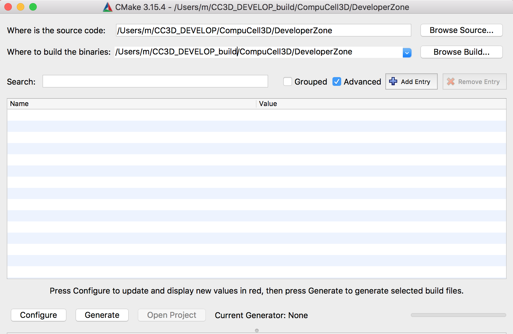

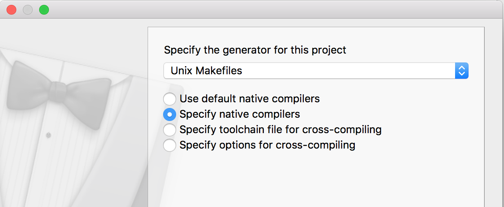

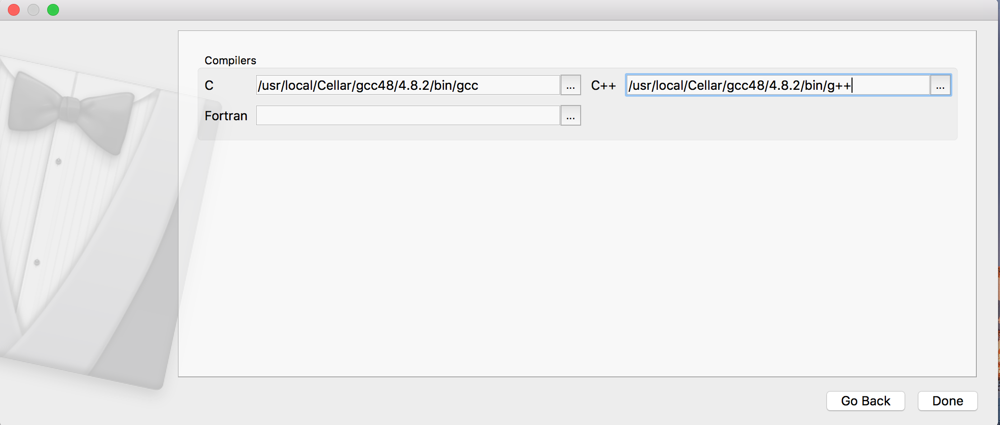

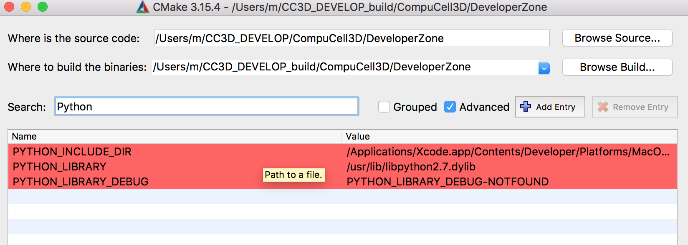

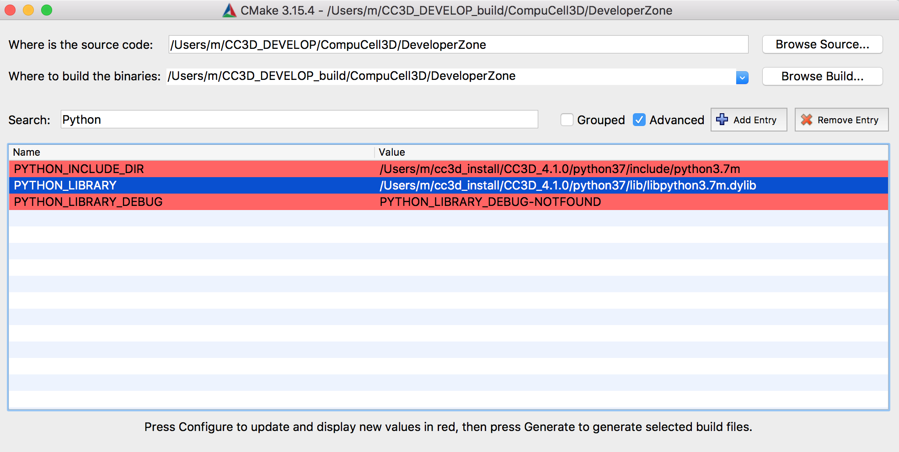

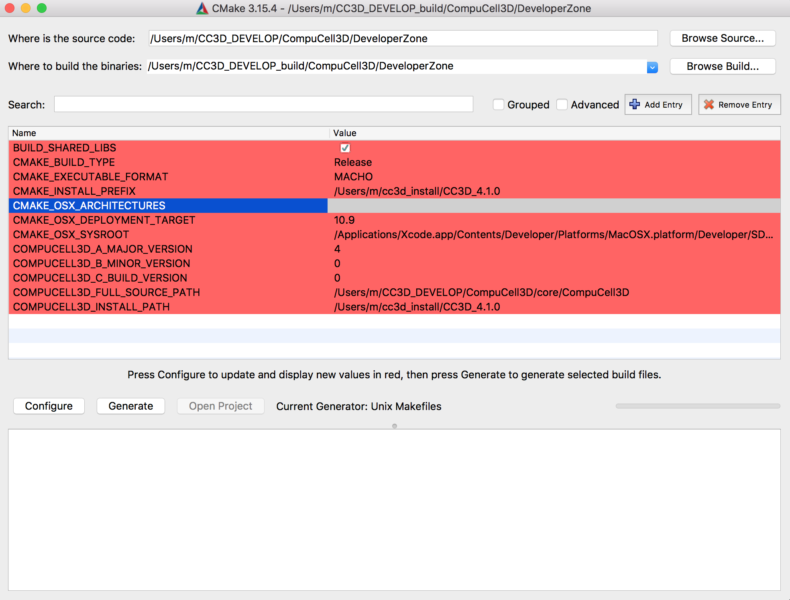

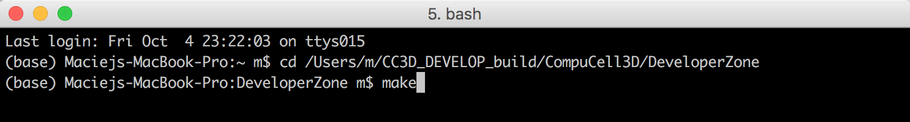

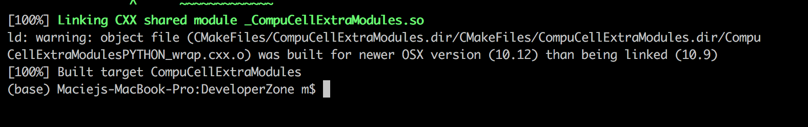

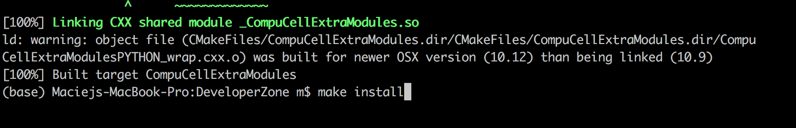

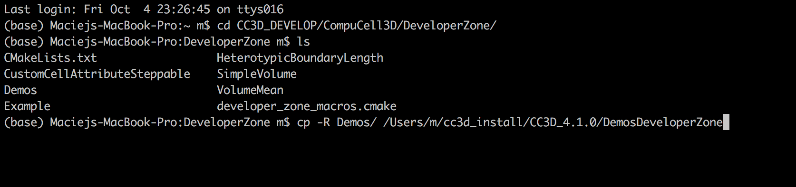

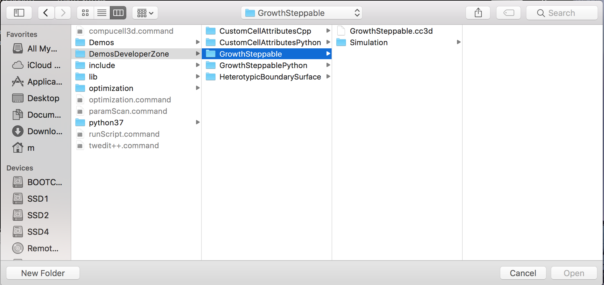

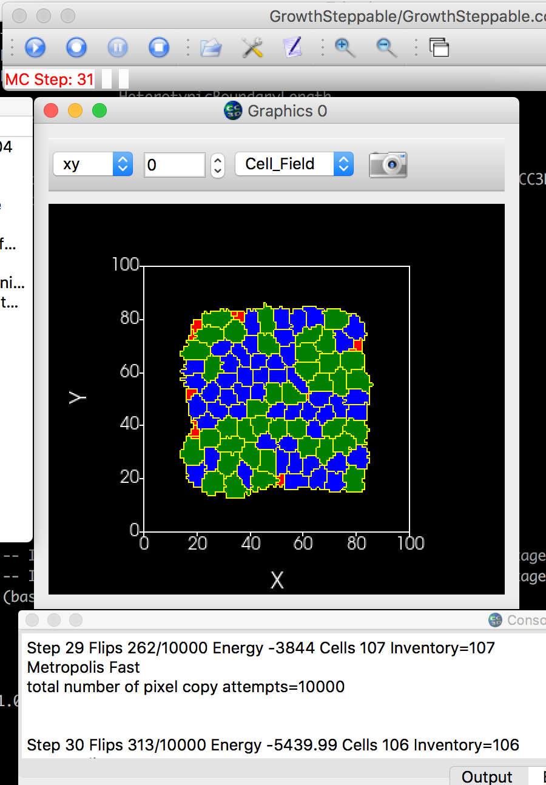

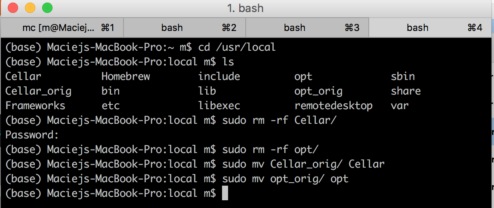

