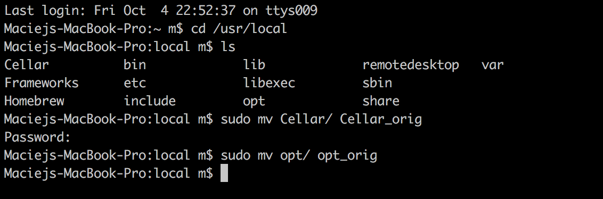
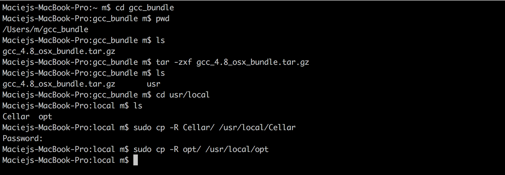
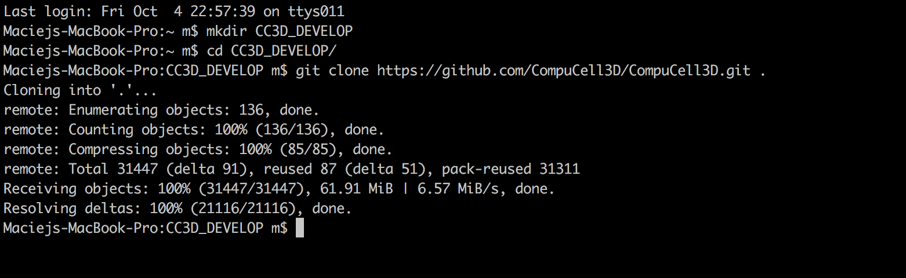
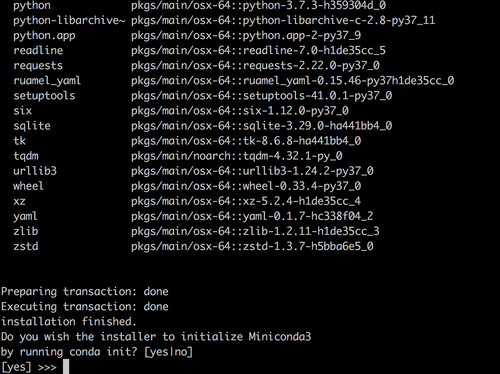
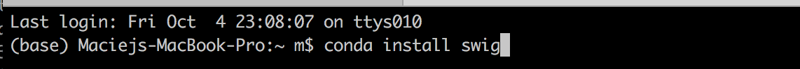
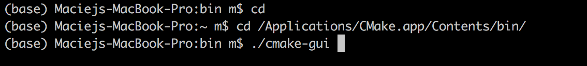

OSX Compiler Setup
==================

If you are on OSX machine in order to use developer zone modules you will need to use special compiler
that behaves properly in the presence of OpenMP extensions. It happened so that for whatever reason
standard gcc/g++ compilers shipped with Apple products had annoying bug that manifested itself when you tried
spawning OpenMP threads from secondary thread. Without going too much into details, it is sufficient to say that we
had to use a special version of gcc compiler that handled properly situations described above.

Therefore in order to compile your own C++ extensions on OSX (such as those bundled in DeveloperZone) you need
to set up the same compiler on your system as we have used in our compilations. The tasks required to do so
are fairly simple but the solution itself while not super elegant, it works. The solution consists of

1) Downloading compiler ``.tar.gz`` file and unpacking it
2) If they exist, temporarily renaming ``/usr/local/Cellar`` and ``/usr/local/opt`` directories
3) Copying ``/usr/local/Cellar`` and ``/usr/local/opt`` from provided compiler ``.tar.gz`` int your local
``usr/local`` folder
4) When you are done with ``DeveloperZone`` compilation , reversing the steps and restoring original content of
``/usr/local/Cellar`` and ``/usr/local/opt``

We will walk you through all those steps in detail and show you how to compile DeveloperZone C++ extensions on OSX

The good thing is that you do not need to recompile entire CC3D but rather use our binaries. This significantly
reduces effort required to develop custom C++ modules on OSX. Let's get started:

Cloning CC3D Source code repository
~~~~~~~~~~~~~~~~~~~~~~~~~~~~~~~~~~~~

To be able to build additional C++ modules for CC3D you need CC3D source code be on your machine. To do so, first create
a directory for the repository (we assume you are in your ``/Users/<your user name>`` folder):

.. code-block:: console

    mkdir CC3D_DEVELOP

    cd CC3D_DEVELOP

    git clone https://github.com/CompuCell3D/CompuCell3D.git .

|dev_zone_osx_002|

Setting up the compiler
~~~~~~~~~~~~~~~~~~~~~~~~
To set up compiler that is capable of compiling CC3D code you need to verify if ``/usr/local/Cellar`` and ``/usr/local/opt`` exist on your computer.
If they do you need to copy them to ``/usr/local/Cellar_orig`` and ``/usr/local/opt_orig`` respectively. To do so
do the following:

.. code-block:: console

    sudo mv /usr/local/Cellar /usr/local/Cellar_orig
    sudo mv /usr/local/opt /usr/local/opt_orig

See the picture below:

|dev_zone_osx_000|

Next, download ``gcc_4.8_osx_bundle.tar.gz`` from https://sourceforge.net/projects/cc3d/files/DeveloperZone_4.x.x/mac/
In my case , I downloaded it to ``/Users/m/gcc_bundle`` so if you download it to ``/Users/<your user name>/gcc_bundle``
folder you should be able to follow the rest of this chapter without much difficulty.

We go to ``/Users/m/gcc_bundle`` (``/Users/<your user name>/gcc_bundle`` on your machine) and unpack
``gcc_4.8_osx_bundle.tar.gz`` and print the content of ``gcc_bundle``:

.. code-block:: console:

    cd /Users/m/gcc_bundle

    tar -zxf gcc_4.8_osx_bundle.tar.gz

    ls

We should see there ``usr`` folder that comes from unpacking of ``gcc_4.8_osx_bundle.tar.gz``. We step into this folder:
and print its content

.. code-block:: console

    cd usr/local

    ls

We should see ``Cellar`` and ``opt`` folders. Next we copy those two local folders into machine's ``/usr/local`` folder:

.. code-block::

    sudo cp -R Cellar/ /usr/local/Cellar

    sudo cp -R opt/ /usr/local/opt

At this point you should have a functioning gcc compiler on your machine that can compile CC3D. The picture below
summarizes all the above steps. Make sure to replace ``/Users/m`` with the path to your actual user directory:

|dev_zone_osx_001|

Installing SWIG
~~~~~~~~~~~~~~~

SWIG is a tool that generates Python wrappers based on underlying C++ code. You might not need it in the your first
attempts to build C++ - only CC3D modules but you do need it to compile examples in DeveloperZone therefore let's
quickly review installation steps. The easiest way to install SWIG is via Miniconda3. Simply grab installer script
from https://docs.conda.io/en/latest/miniconda.html (make sure to get bash installer for Miniconda3 for OSX)
and follow installation steps outlined in this post:
https://docs.conda.io/projects/conda/en/latest/user-guide/install/macos.html

At the end of your installation you might reach a screen that asks you whether the installer script should initalize
python from Miniconda3 as your default Python when you open a new console window. Unless you have a good reason not
to do so we suggest you say "Yes":

|dev_zone_osx_003|

**Important**. After installation is finished, you need to open a new console window so that the changes you've made
are available to you.

Now we can install swig. All we have to do is to activate ``base`` conda environment (in modern conda installations
this step migh be redundant):

.. code-block:: console

    conda activate base

and then we type

.. code-block:: console

    conda install swig

|dev_zone_osx_004|

At this point you should swig installed on your system but as before you need to open new console for that changes
to take effect.

Installing CMake
~~~~~~~~~~~~~~~~

The last thing we need to accomplish is to install cmake. This task is easy and we will use graphical installer that
comes with CMake. First we go to https://cmake.org/download/ and grab OSX installation package for CMake 3.15.
We run this installer - make sure that you install CMake into /Applications by simply dragging CMake icon into
your Applications folder

After we are done we are ready to start configuring compilation of CC3D's DeveloperZone.

Configuring Compilation of DeveloperZone
~~~~~~~~~~~~~~~~~~~~~~~~~~~~~~~~~~~~~~~~

From the newly open command line we open up CMake application:

.. code-block::

    cd /Applications/CMake.app/Contents/bin
    ./cmake-gui

|dev_zone_osx_005|

