Getting Started with CC3D GUI Code
=======================================

Working on the GUI code for CC3D requires some knowledge about PyQt5, access to a decent Python IDE (e.g. PyCharm) and a bit of setup. In this section we will show you how to get started working on either Player of Twedit++ code.

First thing you will need to do is to fork Player or Twedit repository. To do that, log in to your github.com account and fork e.g. Twedit code - https://github.com/CompuCell3D/cc3d-twedit5.:

|ui_development_001|

Once you forked the code, go ahead and clone it from your repository (not from CompuCell3D repository).

To clone repository you follow command pattern below:

.. code-block:: console

    cd d:\src\
    git clone git@github.com:<your_github_name>/cc3d-twedit5.git

or if you want to clone Player

.. code-block:: console

    cd d:\src\
    git clone git@github.com:<your_github_name>/cc3d-player5.git

The reason it is important that you first fork repository to your own account instead of cloning it directly from CompuC3ll3D account is that if you for you will be able to push changes to the forked version of Player or Twedit++ whereas if you cloned directly from our repository you will not be able to store your code edits on the github server.

Installing IDE
--------------

While there are many IDEs we recommend PyCharm Community Edition. This is an excellent Python tool that you can use free of charge. Please google the download link for for this software and install it on your machine. Make sure to use community Edition, not the professional one if you do not want to pay for the software

Running CompuCell3D User interface code in PyCharm
--------------------------------------------------
.. warning::

    The following instructions are for Windows. If you are on OSX or Linux there should not be much of a difference except that when you copy directories you may us soft links and the layout of the Python environment is slightly different on OSX/Linux than it is on Windows. We will point out the differences later in the text.

As you may know by now, CompuCell3D is distributed in the form of conda packages. Typically, you would use a binary installer that under the hood installs distribution of Miniconda, then installs mamba (python package manager that os much faster than conda package manager) and then uses
mamba to install CompuCell3D. Now, as a developer you will need to do those steps manually. First, let's install conda - here is tha link and installation instructions:

https://docs.conda.io/projects/miniconda/en/latest/index.html

Once you install the latest version of Miniconda for your operating system you should install mamba into `base` conda environment:

.. code-block:: console

    conda install -c conda-forge mamba

Note, `-c conda-forge` points to `conda-forge` channel that is one of the most reliable repositories of conda packages.

Once mamba is installed you should create new conda environment for the latest version of CC3D. As of this writing, this version is 4.4.1.3. Hence we do the following:

.. code-block:: console

    conda create -n cc3d_4413_310 python=3.10

Next, we activate this environment:

.. code-block:: console

    conda activate cc3d_4413_310

and install latest version of CompuCell3D:

.. code-block:: console

    mamba install -c conda-forge -c compucell3d compucell3d=4.4.1

It may take few minutes for all packages to download. Notice, we are now sourcing our packages from two conda package repositories: `conda-forge` and `compucell3d`.

Once CompuCell3d is installed, verify that you can run Player:

.. code-block:: console

    python -m cc3d.player5

If this command works and the Player UI opens, try running one of the demo simulations to make sure everything works and if there are no errors, we should be ready for the next step - configuring your IDE so that you can run either Player or Twedit++ from PyCharm

Configuring IDE to run Twedit++
--------------------------------

Even though we will show how to run Twedit++ using PyCharm, the steps for Player ara analogous.

First thing we need to do is to open cc3d-twedit5 repository in PyCharm:

If you see a prompt (dialog) to setup Python interpreter, choose **Cancel**

|ui_development_002|

We will use different configuration dialog to configure Python Interpreter for cc3d-twedit5. Simply, got to File->Settings and the following configuration dialog will open up:

|ui_development_003|

Type interpreter in the search bar above and click Python Interpreter option from the left panel of the popup dialog:

|ui_development_004|

Click Add Interpreter (top right blue button on the dialog), choose "Add Local Interrpreter"

|ui_development_005|

Choose "System Interpreter"

|ui_development_006|

and navigate to the place where your newly created conda environment is):

|ui_development_007|

In my case it was installed to `c:\miniconda3\envs\cc3d_4413_310\python.exe`

After this Click OK on all open dialogs and your newly-created interpreter will be added to the list of Python interpreters available to PyCharm

.. _running-ui-from-pycharm:

Finalizing the setup
~~~~~~~~~~~~~~~~~~~~

To finalize the setup you need to do few other things:

1. Copy `__init__.py` and `config.py` from  `c:\miniconda3\envs\cc3d_4413_310\Lib\site-packages\cc3d`

.. note::

    If you are on OSX or Linux your cc3d package will be located in `/Users/m/miniconda3/envs/cc3d_4412_310/lib/python3.10/site-packages/cc3d`.

to  `cc3d` folder inside the folder into which you cloned your  cc3d-twedit5 repository:

|ui_development_008|

Comment out line 76 and 77 in `__init__.py`

|ui_development_009|

Copy the following directories: `CompuCellSetup`, `core`, `cpp`, `doc` `from c:\miniconda3\envs\cc3d_4413_310\Lib\site-packages\cc3d` to
`cc3d` folder inside the folder into which you cloned your  cc3d-twedit5 repository:

|ui_development_010|

.. note::

    If you are on OSX or Linux instead of copying directories you may make soft-links from those directories in the conda environment to appropriate destination within your cloned repo folder

Finally, rename `c:\miniconda3\envs\cc3d_4413_310\Lib\site-packages\cc3d\twedit5` to `c:\miniconda3\envs\cc3d_4413_310\Lib\site-packages\cc3d\twedit5_1`.

This last step is to make sure that when you run twedit5 from PyCharm it will be the code from your repository that is run, and not the code that got installed with CompuCell3D.

Now you should run the Twedit++ (cc3d.twedit5) from your PyCharm:

In the left panel of PyCharm "unfold" folders until you reach `cc3d-twedit5\cc3d\twedit5\__main__.py`

|ui_development_011|

Right-click on this file and choose, "Run" (or "Debug" if you want to start debugging session - somthing we will cover next):

|ui_development_012|

Twedit++ should open up:

|ui_development_013|

At this point you are ready to do UI development using PyCharm

Making Changes
--------------------------------

Your local Player repository and your Miniconda version of Player can either remain two separate directories, or you can soft-link the files you would change.
We focus on Windows here since it requires a small workaround. 

On Windows, you can copy over the changes each time you need to test Player. 
If you edited files in the ``Configuration`` directory, for instance, run this command to test that.
Be careful about where you copy to. 
It may be wise to create a backup of your Miniconda CC3D Player directory if you are not sure.  

.. console::

   cp -fr C:\Users\Me\cc3d\cc3d-player5\cc3d\player5\Configuration\* C:\ProgramData\miniconda3\envs\name-of-your-environment\Lib\site-packages\cc3d\player5\Configuration\ && python -m cc3d.player5

Other commands besides ``cp`` should work, too, like ``robocopy`` or ``rsync`` if you prefer. 

**How to Edit .ui (PyQt) Files**:

   #. First, install Qt Designer. 

   #. Next, open the ``.ui`` file you want to edit from the command line. Adjust the path as necessary. ``designer C:\Users\Me\cc3d\player5\Configuration\cc3D_prefs.ui``

   #. Nearly every PyQt component we use is inside of a layout. If you can't move something right away, select it or its parent component and use the 'Break Layout 🚫' button. When you have things roughly well-positioned, select everything that lacks a layout and assign it one (usually either Horizontal Layout or Vertical Layout) to align the components. 

   #. After you saving your changes, you should use the following command to translate the ``.ui`` file into a ``.py`` file. Since these Python files need to be auto-generated each time we make changes in Designer, you should never edit them manually. Note that we use a ``cp`` command before the ``pyuic`` command if we're on Windows since the local repository and Miniconda files need to be synched. Again, adjust the directory name if you are editing something outside of ``player5\Configuration``.

.. code-block:: console

   cp -fr C:\Users\Me\cc3d\cc3d-player5\cc3d\player5\Configuration\* C:\ProgramData\miniconda3\envs\name-of-your-environment\Lib\site-packages\cc3d\player5\Configuration\ && pyuic5 c:\ProgramData\miniconda3\envs\cc3d_4413_310\Lib\site-packages\cc3d\player5\Configuration\cc3D_prefs.ui -o c:\ProgramData\miniconda3\envs\cc3d_4413_310\Lib\site-packages\cc3d\player5\Configuration\ui_configurationdlg.py 

Finally, view your changes with ``python -m cc3d.player5``.
Commit and push both the ``.ui`` and ``.py`` files to the Player5 repos.

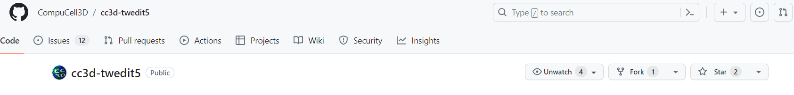

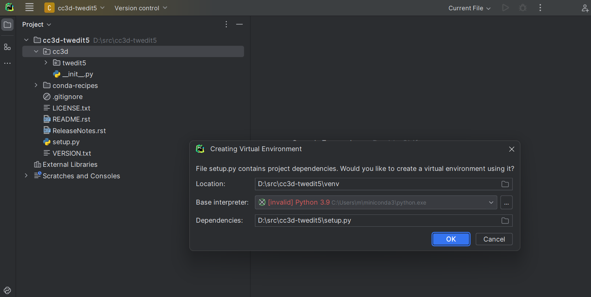

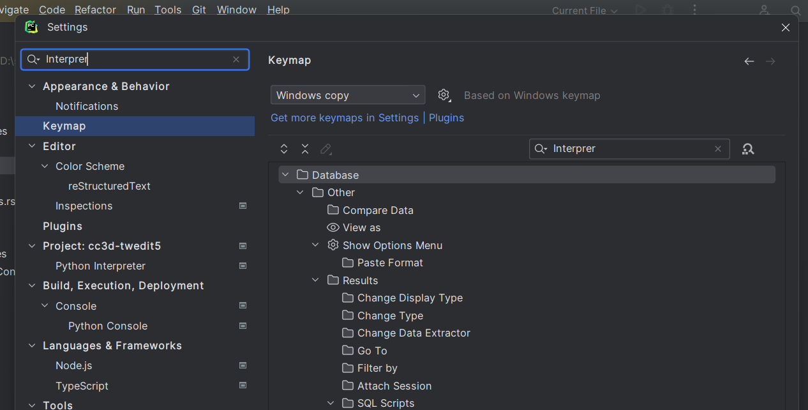

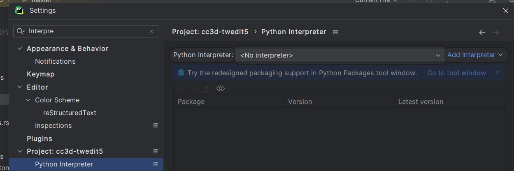

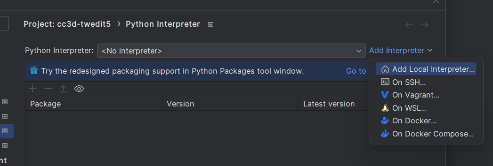

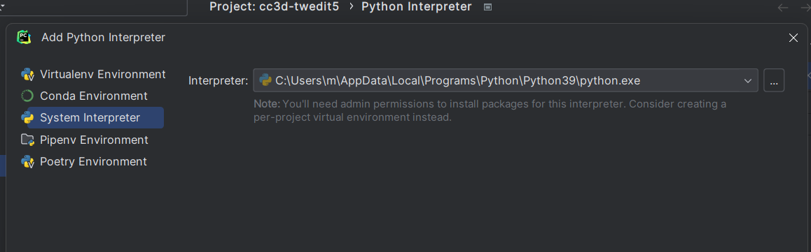

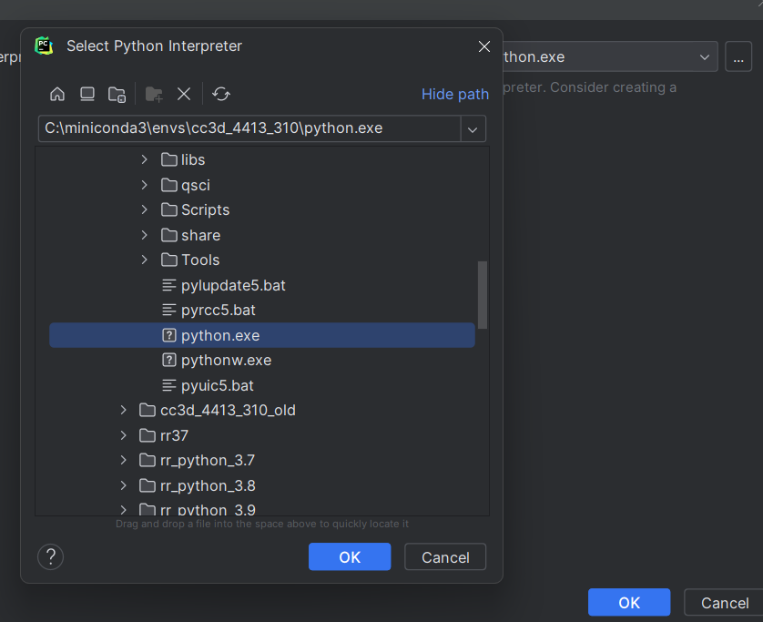

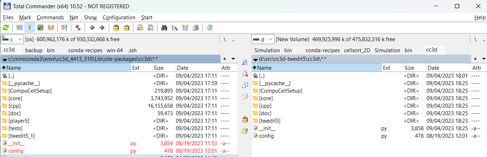

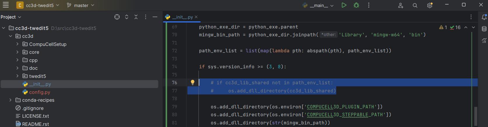

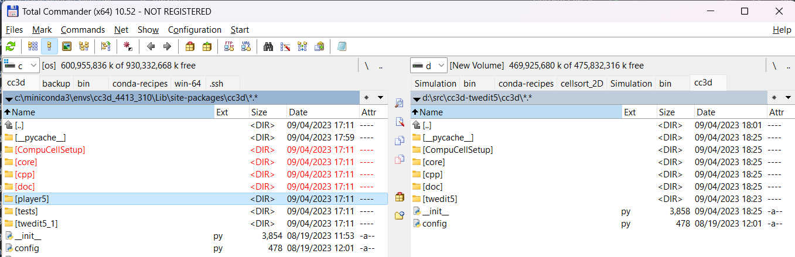

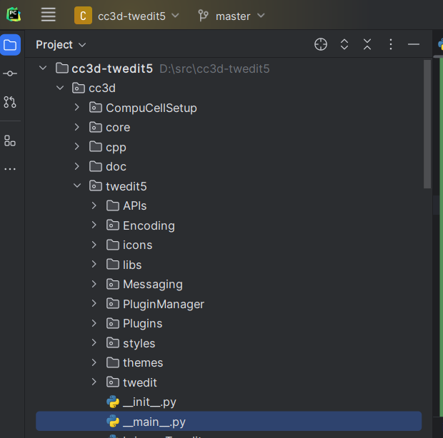

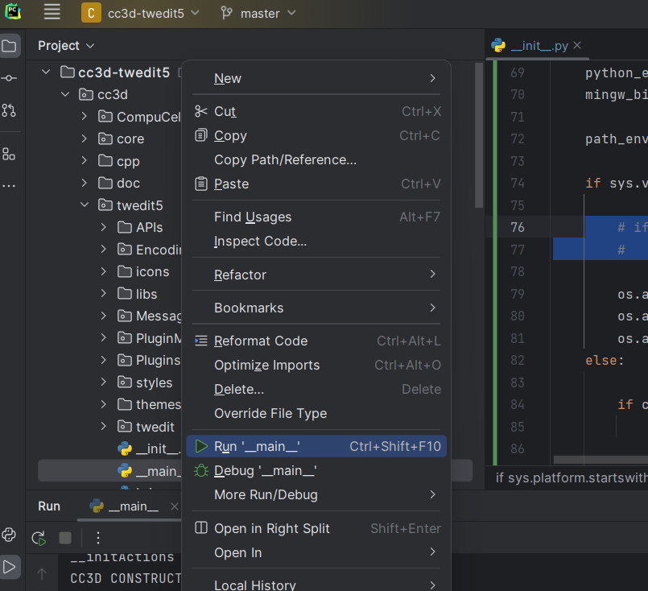

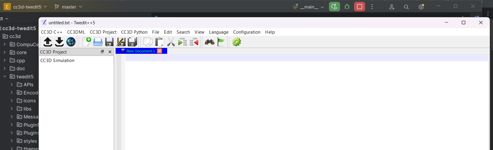